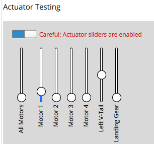

# Actuator Configuration and Testing

:::note
The *Actuators* view is only displayed if dynamic control allocation is enabled using the [SYS_CTRL_ALLOC](../advanced_config/parameter_reference.md#SYS_CTRL_ALLOC) parameter.
This replaces geometry and mixer configuration files with configuration using parameters.
You should also ensure that the appropriate airframe type is selected using [CA_AIRFRAME](../advanced_config/parameter_reference.md#CA_AIRFRAME).

The easiest way to try this out in simulation is to use the following make target, which has control allocation pre-enabled:
```
make px4_sitl gazebo_iris_ctrlalloc
```
:::

After selecting an [airframe](../config/airframe.md) you will generally need to configure the specific geometry, assign actuators to outputs, and test the actuator response.
This can be done in *QGroundControl*, under the **Vehicle Setup > Actuators** tab.

The multicopter configuration screen looks like this.


Note that some settings are hidden unless you select the **Advanced** checkbox in the top right corner.

## Geometry

The geometry section is used to configure any additional geometry-related settings for the selected [airframe](../config/airframe.md).
The UI displays a customised view for the selected type; if there are no configurable options this may display a static image of the frame geometry, or nothing at all.

The screenshot below shows the geometry screen for a multicopter frame, which allows you to select the number of motors, their relative positions on the frame, and their expected spin directions (select "**Direction CCW**" for counter-clockwise motors).
This particular frame also includes an image showing the motor positions, which dynamically updates as the motors settings are changed.


A fixed wing airframe would instead display the parameters that define control surfaces, while a VTOL airframe could display both motors and control surfaces.


### Position Coordinate system

The coordinate system is FRD (in body frame), where the X axis points forward, the Y axis to the right and the Z axis down.

:::note
**Positions are relative to the Center of Gravity of the vehicle, and NOT the Autopilot location!**
:::


### Control Surface direction (Conceptual)

:::note
It is extremely important that we decouple the concept of Control Surface, Servo and Motor Tilt directions in Control Allocation from the actual Servo output / connections in the physical vehicle.

That means that the Control Allocation Control Surface & Servo settings are physical vehicle independent. Therefore when we think about the Surface Movements, we imagine the ideal vehicle as shown below that moves actuators in the given direction!
:::


Control surfaces use the following deflection direction convention:

#### Horizontal Control Surface (e.g. Aileron)
> Upwards movement equals Positive deflection

'Pitch UP' control input should command positive deflection to both ailerons

* Example : To pitch in positive direction (pitching skywards), 'Both Ailerons (Right & Left)' need a positive deflection.

'Roll RIGHT' control input should command positive deflection to right aileron and negative deflection to left aileron

* Example : To roll in positive direction (banking to the right), the 'Right Aileron' needs a positive deflection.

#### Vertical Control Surface (e.g. Rudder)
> Rightwards movement equals Positive Deflection

'Yaw RIGHT' control input should command positive deflection.

* Example : To yaw in positive direction (clockwise rotation), conventional rudder airplane needs a positive deflection.

#### Mixed Control Surface (e.g. V-Tail)
> Upwards movement equals Positive deflection

'Pitch UP' control input should command positive deflection to both V-tails

* Example : To pitch in positive direction (pitching upwards),  'Both V-tail surfaces' need a positive deflection.

> Rightwards movement equals Positive Deflection
'Yaw RIGHT' control input should command positive deflection to both V-tails.

* Example : Having a V or A shaped tail in the back, positive deflection in Rightwards direction will Yaw the vehicle to the right.


### Motor Tilt Servos (Conceptual)

Similar to the Control Surfaces, Servos can also rotate the motors themselves! This is often the case in a VTOL like [Tiltrotors](/en/frames_vtol/tiltrotor.md). 


* The reference direction is upwards, indicating that a positive commanded motor thrust will point upwards (negative Z direction).
* Tilting **Front** means the servo tilts towards Front (Positive X direction).
* Tilting **Right** means the servo tilts towards Right (Positive Y direction).
* **Minimum and maximum tilt angles** specify the physical limits in degrees of the tilt at minimum & maximum control.
  :::note
  Negative angles are possible. For example tiltable multirotors have symmetrical limits and one could specify -30 as minimum and 30 degrees as maximum.
  :::
  :::note
  If a motor/tilt points downwards and tilts towards the back it is logically equivalent to a motor pointing upwards and tilting towards the front.
  :::
* **Tilt servos can be used to control torque** on one or more axis (it's possible to only use a subset of the available tilts for a certain torque control):
  * Yaw: the tilts are used to control yaw (generally desired).
    If four or more motors are used, the motors can be used instead.
  * Pitch: typically differential motor thrust is used to control pitch, but some airframes require pitch to be controlled by the tilt servos (Example: [Bicopter](https://www.youtube.com/watch?v=hfss7nCN40A))
* Tiltable motors get assigned to one of the tilt servos in the setup screen.


### Bidirectional Motors

Some vehicles may use bidirectional motors (i.e. motor spins in direction 1 for lower output range and in direction 2 for the upper half).
For example, ground vehicles that want to move forwards and backwards, or VTOL vehicles that have pusher motors that go in either direction.

If bidiectional motors are used, make sure to select the **Reversible** checkbox for those motors (the checkbox is displayed as an "advanced" option).


Note that you will need to also ensure that the ESC associated with bidirectional motors is configured appropriately (e.g. 3D mode enabled for DShot ESCs, which can be achieved via [DShot commands](../peripherals/dshot.md#commands)).


## Actuator Outputs

The actuators and any other output function can be assigned to any of the physical outputs.
Each output has its own tab, e.g. the PWM MAIN or AUX output pins, or UAVCAN.

PWM outputs are grouped according to the hardware groups of the autopilot.
Each group allows to configure the PWM rate or DShot/Oneshot (if supported).

:::note
For boards with MAIN and AUX, prefer the AUX pins over the MAIN pins for motors, as they have lower latency.
:::

The AUX pins have additional configuration options for camera capture/triggering.
Selecting these requires a reboot before they are applied.


## Actuator Testing

### Identifying & Assign Motors
:::note
This is only supported for Multirotors currently, as it requires a GUI interface
:::

### Slider testing


> Slider testing example with a VTOL Tiltrotor setup

Sliders can be used to verify the following:

1. Motors spin at the **minimum command**
2. Motors give **positive thrust** in the expected direction
3. **Control Surface** moves in the direction as defined in the [Convention](#control-surface-direction-conceptual)
4. **Motor Tilt Servos** move in the direction as defined in the [Convention](#motor-tilt-servos-conceptual)

To do so, follow the following instructions:
1. Pull the Motor slider down, and it will snap in lower end, where it will command **disarmed** value to the motors, verify that it doesn't spin
   1. For PWM output, adjust the Disarmed value in case the motor spins at the disarmed command
2. Slowly move the Motor slider up, and it will snap in at the '**minimum** command'. Verify that the motor is spinning at the minimum speed.
   1. For **PWM output, adjust the minimum output** value in the 'Actuator Outputs' tab on the right such that the motors barely spin
    
   2. For DShot output, this is not required
3. Move the Control Surface Slider upwards (positive command) and verify that it moves the surfaces in the direction defined in the [convention](#control-surface-direction-conceptual).
   1. 

Note the following behavior:
- If a safety button is used, it must be pressed before actuator testing is allowed.
- The kill-switch can still be used to stop motors immediately.
- Servos do not actually move until the corresponding slider is changed.
- The parameter [COM_MOT_TEST_EN](../advanced_config/parameter_reference.md#COM_MOT_TEST_EN) can be used to completely disable actuator testing.
- On the shell, [actuator_test](../modules/modules_command.md#actuator-test) can be used as well.

:::note
  VTOLs will automatically turn off motors pointing upwards during fixed-wing flight.
  For Standard VTOLs these are the motors defined as multicopter motors.
  For Tiltrotors these are the motors that have no associated tilt servo.
  Tailsitters use all motors in fixed-wing flight.
  :::

### Reversing Motors

The motors must turn in the direction defined in configured geometry ("**Direction CCW**" checkboxes).
If any motors do not turn in the correct direction they must be reversed.

There are several options:
- If the ESCs are configured as [DShot](../peripherals/dshot.md) you can reverse the direction via UI (**Set Spin Direction** buttons).
  Note that the current direction cannot be queried, so you might have to try both options.
- Swap 2 of the 3 motor cables (it does not matter which ones).

  :::note
  If motors are not connected via bullet-connectors, re-soldering is required (this is a reason, among others, to prefer DShot ESCs).
  :::
