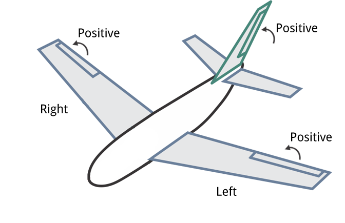

# Actuator Configuration and Testing

After the airframe is setup you should configure the geometry, assign actuators to outputs, and test the actuator response.
This can be done in *QGroundControl*, under the **Vehicle Setup > Actuators** tab.

:::note
This view is only enabled if dynamic control allocation is enabled via [SYS_CTRL_ALLOC](../advanced_config/parameter_reference.md#SYS_CTRL_ALLOC), which will become the default in future.
If you enable it, also make sure to select the airframe with [CA_AIRFRAME](../advanced_config/parameter_reference.md#CA_AIRFRAME).
It replaces the existing mixer files and allows configuration via parameters instead.
:::

This is a screenshot for a multicotor:

:::note
If you find a setting missing (e.g. reversable motors), make sure to enable the **advanced** checkbox in the top right corner.
:::

## Geometry
The airframe pre-selects the geometry type, which can provide additional configuration options, such as the motors positions on a multicotor, or the control surface types on a plane.
The UI reflects that and displays a customized view for each type.

### Conventions
The following sections contain the conventions and explanations for configuring the geometry.

#### Coordinate system
The coordinate system is NED (in body frame), where the X axis points forward, the Y axis to the right and the Z axis down.
Positions are relative to the center of gravity (in meters).

#### Control Surfaces and Servo Direction
Control surfaces use the following deflection direction convention:
- horizontal (e.g. Aileron): up = positive deflection
- vertical (e.g. Rudder): right = positive deflection
- mixed (e.g. V-Tail): up = positive deflection

:::note
If a servo does not move into the expected direction, reverse it via checkbox on the Actuator Output.
:::

### Motor Tilt Servos
Tilt servos are configured as following:
- The reference direction is upwards (negative Z direction).
- Tilt direction: **Towards Front** means the servo tilts towards positive X direction, whereas **Towards Right** means towards positive Y direction.
- Minimum and maximum tilt angles: specify the physical limits in degrees of the tilt at minimum control and maximum respectively.
  An angle of 0° means to point upwards, then increases towards the tilt direction.
  :::note
  Negative angles are possible. For example tiltable multirotors have symmetrical limits and one could specify -30 as minimum and 30 degrees as maximum.
  :::
  :::note
  If a motor/tilt points downwards and tilts towards the back it is logically equivalent to a motor pointing upwards and tilting towards the front.
  :::
- Control: depending on the airframe, tilt servos can be used to control torque on one or more axis (it's possible to only use a subset of the available tilts for a certain torque control):
  - Yaw: the tilts are used to control yaw (generally desired).
    If four or more motors are used, the motors can be used instead.
  - Pitch: typically differential motor thrust is used to control pitch, but some airframes require pitch to be controlled by the tilt servos.
    Bicopters are among those.
- Tiltable motors are then assigned to one of the tilt servos.

### Reversible Motors

If reversible motor(s) are used (i.e. motor spins in direction 1 for lower output range and in direction 2 for the upper half), make sure to select the **Reversible** checkbox for those motor(s).
Also ensure the ESC is configured appropriately (e.g. 3D mode enabled for DShot ESCs, which can be achieved via [DShot commands](../peripherals/dshot.md#commands)).

## Actuator Outputs

The actuators and any other output function can be assigned to any of the physical outputs.
Each output has its own tab, e.g. the PWM MAIN or AUX output pins.

PWM outputs are grouped according to the hardware groups of the autopilot.
Each group allows to configure the PWM rate or DShot/Oneshot (if supported).

:::note
For boards with MAIN and AUX, prefer the AUX pins over the MAIN pins for motors, as they have lower latency.
:::

The AUX pins have additional configuration options for camera capture/triggering.
Selecting these requires a reboot before they are applied.

## Actuator Testing

When testing actuators, make sure that:
- Motors spin at the minimum. The sliders snap into place at the lower end: at the bottom, the motor is turned off (disarmed), whereas the next slider position commands the minimum thrust.
  Adjust the minimum output value such that the motors spin at that slider position.
  :::note
  VTOLs will automatically turn off motors pointing upwards during fixed-wing flight.
  For Standard VTOLs these are the motors defined as multicopter motors.
  For Tiltrotors these are the motors that have no associated tilt servo.
  Tailsitters use all motors in fixed-wing flight.
  :::
- Servos move into the direction of the convention described above.
  :::note
  A trim value can be configured for control surfaces, which is also applied to the test slider.
  :::

Note the following behaviour:
- If a safety button is used, it must be pressed before actuator testing is allowed.
- The kill-switch can still be used to stop motors immediately.
- Servos do not actually move until the corresponding slider is changed.
- The parameter [COM_MOT_TEST_EN](../advanced_config/parameter_reference.md#COM_MOT_TEST_EN) can be used to completely disable actuator testing.
- On the shell, [actuator_test](../modules/modules_command.md#actuator-test) can be used as well.

### Reversing Motors

:::note
The *spin direction* checkbox for the geometry must be set to reflect the actual spin direction of the motor (it does not change the motor spin direction).
:::

If one or more of the motors do not turn in the correct direction according to the configured geometry, they must be reversed.
There are several options:
- If the ESCs are configured as [DShot](../peripherals/dshot.md) you can reverse the direction via UI (**Set Spin Direction** buttons).
  Note that the current direction cannot be queried, so you might have to try both options.
- Swap 2 of the 3 motor cables (it does not matter which ones).

  :::note
  If motors are not connected via bullet-connectors, re-soldering is required (this is a reason, among others, to prefer DShot ESCs).
  :::

