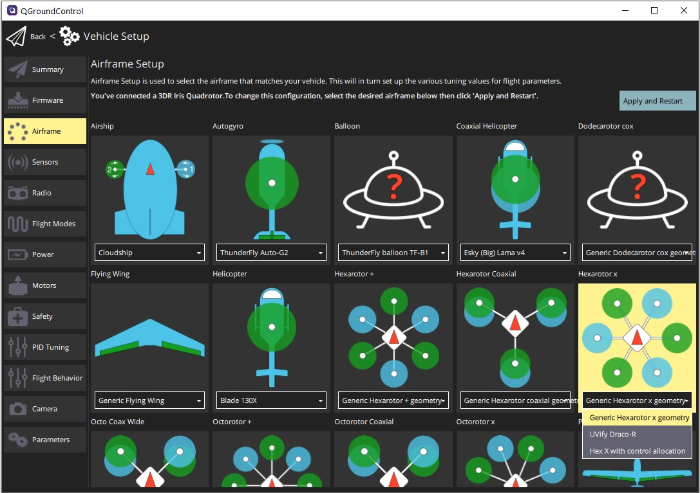
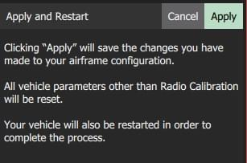

# Airframe Setup

After installing firmware you need to select the [airframe configuration](../airframes/airframe_reference.md) that best matches your vehicle.

:::note
Select the airframe configuration for your vehicle brand and model, if one exists, as this should be tuned well enough to fly following standard configuration.
Otherwise select the closest "Generic" frame option.
:::

## Set the Airframe

To set the airframe:

1. Start *QGroundControl* and connect the vehicle.
1. Select **"Q" icon > Vehicle Setup > Airframe** (sidebar) to open *Airframe Setup*.
1. Select the broad vehicle group/type that matches your airframe and then use the dropdown within the group to choose the airframe that best matches your vehicle.
   
   

   The example above shows *Generic Hexarotor X geometry* selected from the *Hexarotor X* group.

1. Click **Apply and Restart**.
   Click **Apply** in the following prompt to save the settings and restart the vehicle.

   

## Further Information

* [QGroundControl User Guide > Airframe](https://docs.qgroundcontrol.com/en/SetupView/Airframe.html)
* [PX4 Setup Video - @37s](https://youtu.be/91VGmdSlbo4?t=35s) (Youtube)