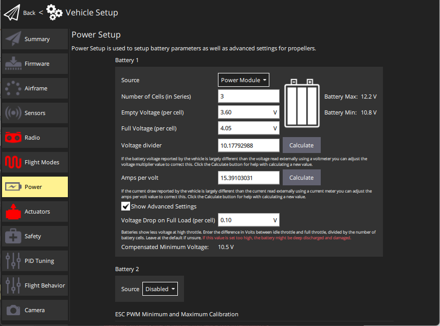

# Battery Estimation Tuning (Power Setup)

This topic explains how to configure power settings so that PX4 can estimate the available battery capacity.

:::note
These instructions require that the vehicle has a [Power Module (PM)](../power_module/README.md), or other hardware that can measure the battery voltage and (optionally) the current.

This tuning is not needed for [Smart/MAVLink Batteries](../smart_batteries/README.md).
:::

## Overview

Battery Estimation Tuning uses the measured voltage and current (if available) to estimate the remaining battery capacity.
This is important because it allows PX4 to take action when the vehicle is close to running out of power and crashing (and also to prevent battery damage due to deep-discharge).

PX4 provides a number of (progressively more effective) methods that can be used to estimate the capacity:

1. [Basic Battery Settings](#basic_settings) (default): raw measured voltage is compared to the range between "empty" and "full" voltages.
   This results in coarse estimates because measured voltage (and its corresponding capacity) will fluctuate under load.
1. [Voltage-based Estimation with Load Compensation](#load_compensation): Counteracts the effects of loading on the capacity calculation.
1. [Voltage-based Estimation with Current Integration](#current_integration): Fuses the load-compensated voltage-based estimate for the available capacity with a current-based estimate of the charge that has been consumed.
   This results in a capacity estimate that is comparable to that of a smart battery.

Later methods build on preceding methods.
The approach you use will depend on whether the vehicle's power module can measure current.

:::note
The instructions below refer to battery 1 calibration parameters: `BAT1_*`.
Other batteries use the `BATx_*` parameters, where `x` is the battery number.
All battery calibration parameters [are listed here](../advanced_config/parameter_reference.md#battery-calibration).
:::

:::tip
In addition to PX4 configuration discussed here, you should ensure that the ESC's low voltage cutoff is either disabled or set below the expected minimum voltage.
This ensures that the battery failsafe behaviour is managed by PX4, and that ESCs will not cut out while the battery still has charge (according to the "empty-battery" setting that you have chosen).
:::

:::tip
[Battery-Type Comparison](#battery-chemistry-comparison) below explains the difference between the main battery types, and how that impacts the battery settings.
:::

## Basic Battery Settings (default)

The basic battery settings configure PX4 to use the default method for capacity estimate.
This method compares the measured raw battery voltage to the range between cell voltages for "empty" and "full" cells (scaled by the number of cells).

:::note
This approach results in relatively coarse estimations due to fluctuations in the estimated charge as the measured voltage changes under load.
:::

To configure the basic settings for battery 1:

1. Start _QGroundControl_ and connect the vehicle.
1. Select **"Q" icon > Vehicle Setup > Power** (sidebar) to open _Power Setup_.

You are presented with the basic settings that characterize the battery.
The sections below explain what values to set for each field.

:::note
At time of writing _QGroundControl_ only allows you to set values for battery 1 in this view.
For vehicles with multiple batteries you'll need to directly [set the parameters](../advanced_config/parameters.md) for battery 2 (`BAT2_*`), as described in the following sections.
:::

### Number of Cells (in Series)

This sets the number of cells connected in series in the battery.
Typically this will be written on the battery as a number followed by "S" (e.g "3S", "5S").

:::note
The voltage across a single galvanic battery cell is dependent on the chemical properties of the battery type.
Lithium-Polymer (LiPo) batteries and Lithium-Ion batteries both have the same _nominal_ cell voltage of 3.7V.
In order to achieve higher voltages (which will more efficiently power a vehicle), multiple cells are connected in _series_.
The battery voltage at the terminals is then a multiple of the cell voltage.
:::

If the number of cells is not supplied you can calculate it by dividing the battery voltage by the nominal voltage for a single cell.
The table below shows the voltage-to-cell relationship for these batteries:

| Cells | LiPo (V) | LiIon (V) |
| ----- | -------- | --------- |
| 1S    | 3.7      | 3.7       |
| 2S    | 7.4      | 7.4       |
| 3S    | 11.1     | 11.1      |
| 4S    | 14.8     | 14.8      |
| 5S    | 18.5     | 18.5      |
| 6S    | 22.2     | 22.2      |

:::note
This setting corresponds to [parameters](../advanced_config/parameters.md): [BAT1_N_CELLS](../advanced_config/parameter_reference.md#BAT1_N_CELLS) and [BAT2_N_CELLS](../advanced_config/parameter_reference.md#BAT2_N_CELLS).
:::

### Full Voltage (per cell)

This sets the _nominal_ maximum voltage of each cell (the lowest voltage at which the cell will be considered "full").

The value should be set slightly lower that the nominal maximum cell voltage for the battery, but not so low that the estimated capacity is still 100% after a few minutes of flight.

Appropriate values to use are:

- **LiPo:** 4.05V (default in _QGroundControl_)
- **LiIon:** 4.05V

:::note
The voltage of a full battery may drop a small amount over time after charging.
Setting a slightly-lower than maximum value compensates for this drop.
:::

:::note
This setting corresponds to [parameters](../advanced_config/parameters.md): [BAT1_V_CHARGED](../advanced_config/parameter_reference.md#BAT1_V_CHARGED) and [BAT2_V_CHARGED](../advanced_config/parameter_reference.md#BAT2_V_CHARGED).
:::

### Empty Voltage (per cell)

This sets the nominal minimum safe voltage of each cell (using below this voltage may damage the battery).

:::note
There is no single value at which a battery is said to be empty.
If you choose a value that is too low the battery may be damaged due to deep discharge (and/or the vehicle may crash).
If you choose a value that is too high you may unnecessarily curtail your flight.
:::

A rule of thumb for minimum per-cell voltages:

| Level                                            | LiPo (V) | LiIon (V) |
| ------------------------------------------------ | -------- | --------- |
| Conservative (voltage under no-load)             | 3.7      | 3         |
| "Real" minimum (voltage under load/while flying) | 3.5      | 2.7       |
| Damage battery (voltage under load)              | 3.0      | 2.5       |

:::tip
Below the conservative range, the sooner you recharge the battery the better - it will last longer and lose capacity slower.
:::

:::note
This setting corresponds to [parameter](../advanced_config/parameters.md): [BAT1_V_EMPTY](../advanced_config/parameter_reference.md#BAT1_V_EMPTY) and [BAT2_V_EMPTY](../advanced_config/parameter_reference.md#BAT2_V_EMPTY).
:::

### Voltage Divider

If you have a vehicle that measures voltage through a power module and the ADC of the flight controller then you should check and calibrate the measurements once per board. To calibrate you'll need a multimeter.

The easiest way to calibrate the divider is by using _QGroundControl_ and following the step-by-step guide on [Setup > Power Setup](https://docs.qgroundcontrol.com/master/en/qgc-user-guide/setup_view/power.html) (QGroundControl User Guide).

:::note
This setting corresponds to parameters: [BAT1_V_DIV](../advanced_config/parameter_reference.md#BAT1_V_DIV) and [BAT2_V_DIV](../advanced_config/parameter_reference.md#BAT2_V_DIV).
:::

### Amps per volt

:::tip
This setting is not needed if you are using the basic configuration (without load compensation etc.)
:::

If you are using [Current-based Load Compensation](#current_based_load_compensation) or [Current Integration](#current_integration) the amps per volt divider must be calibrated.

The easiest way to calibrate the dividers is by using _QGroundControl_ and following the step-by-step guide on [Setup > Power Setup](https://docs.qgroundcontrol.com/master/en/qgc-user-guide/setup_view/power.html) (QGroundControl User Guide).

:::note
This setting corresponds to parameter(s): [BAT1_A_PER_V](../advanced_config/parameter_reference.md#BAT1_A_PER_V) and [BAT2_A_PER_V](../advanced_config/parameter_reference.md#BAT2_A_PER_V).
:::

## Voltage-based Estimation with Load Compensation

:::note
With well configured load compensation the voltage used for battery capacity estimation is much more stable, varying far less when flying up and down.
:::

Load compensation attempts to counteract the fluctuation in measured voltage/estimated capacity under load that occur when using the [basic configuration](#basic_settings). This works by estimating what the voltage would be for the _unloaded_ battery, and using that voltage (instead of the measured voltage) for estimating the remaining capacity.

:::note
To use the load compensation you will still need to set the [basic configuration](#basic_settings). The _Empty Voltage_ ([BAT_V_EMPTY](../advanced_config/parameter_reference.md#BAT_V_EMPTY)) should be set higher (than without compensation) because the compensated voltage gets used for the estimation (typically set a bit below the expected rest cell voltage when empty after use).
:::

PX4 supports two load compensation methods, which are enabled by [setting](../advanced_config/parameters.md) either of the two parameters below:

- [BAT1_R_INTERNAL](../advanced_config/parameter_reference.md#BAT1_R_INTERNAL) - [Current-based Load Compensation](#current_based_load_compensation) (recommended).
- [BAT1_V_LOAD_DROP](../advanced_config/parameter_reference.md#BAT1_V_LOAD_DROP) - [Thrust-based Load Compensation](#thrust_based_load_compensation).

### Current-based Load Compensation (recommended)

This load compensation method relies on current measurement to determine load.
It is far more accurate than [Thrust-based Load Compensation](#thrust_based_load_compensation) but requires that you have a current sensor.

To enable this feature:

1. Set the parameter [BAT1_R_INTERNAL](../advanced_config/parameter_reference.md#BAT1_R_INTERNAL) to the internal resistance of battery 1 (and repeat for other batteries).

   :::tip
   There are LiPo chargers out there which can measure the internal resistance of your battery.
   A typical value is 5mΩ per cell but this can vary with discharge current rating, age and health of the cells.
   :::

1. You should also calibrate the [Amps per volt divider](#current_divider) in the basic settings screen.

### Thrust-based Load Compensation

This load compensation method estimates the load based on the total thrust that gets commanded to the motors.

:::warning
This method is not particularly accurate because there's a delay between thrust command and current, and because the thrust in not linearly proportional to the current.
Use [Current-based Load Compensation](#current_based_load_compensation) instead if your vehicle has a current sensor.
:::

To enable this feature:

1. Set the parameter [BAT1_V_LOAD_DROP](../advanced_config/parameter_reference.md#BAT1_V_LOAD_DROP) to how much voltage drop a cell shows under the load of full throttle.

## Voltage-based Estimation Fused with Current Integration

:::note
This is the most accurate way to measure relative battery consumption.
If set up correctly with a healthy and fresh charged battery on every boot, then the estimation quality will be comparable to that from a smart battery (and theoretically allow for accurate remaining flight time estimation).
:::

This method evaluates the remaining battery capacity by _fusing_ the voltage-based estimate for the available capacity with a current-based estimate of the charge that has been consumed.
It requires hardware that can accurately measure current.

To enable this feature:

1. First set up accurate voltage estimation using [current-based load compensation](#current_based_load_compensation).

   :::tip
   Including calibrating the [Amps per volt divider](#current_divider) setting.
   :::

1. Set the parameter [BAT1_CAPACITY](../advanced_config/parameter_reference.md#BAT1_CAPACITY) to around 90% of the advertised battery capacity (usually printed on the battery label).

   :::note
   Do not set this value too high as this may result in a poor estimation or sudden drops in estimated capacity.
   :::

---

**Additional information**

The estimate of the charge that has been consumed over time is produced by mathematically integrating the measured current (this approach provides very accurate energy consumption estimates).

At system startup PX4 first uses a voltage-based estimate to determine the initial battery charge. This estimate is then fused with the value from current integration to provide a combined better estimate.
The relative value placed on each estimate in the fused result depends on the battery state.
The emptier the battery gets, the more of the voltage based estimate gets fused in. This prevents deep discharge (e.g. because it was configured with the wrong capacity or the start value was wrong).

If you always start with a healthy full battery, this approach is similar to that used by a smart battery.

:::note
Current integration cannot be used on its own (without voltage-based estimation) because it has no way to determine the _initial_ capacity.
Voltage-estimation allows you to estimate the initial capacity and provides ongoing feedback of possible errors (e.g. if the battery is faulty, or if there is a mismatch between capacity calculated using different methods).
:::

## Battery-Chemistry Comparison

This section provides a comparative overview of several different battery types (in particular LiPo and Li-Ion).

### Overview

- Li-Ion batteries have a higher energy density than Lipo battery packs but that comes at the expense of lower discharge rates and increased battery cost.
- LiPo batteries are readily available and can withstand higher discharge rates that are common in multi-rotor aircraft.
- The choice needs to be made based on the vehicle and the mission being flown.
  If absolute endurance is the aim then there is more of a benefit to flying to a Li-Ion battery but similarly, more caution needs to be taken.
  As such, the decision should be made based on the factors surrounding the flight.

### Advantages

LiPo

- Very common
- Wide range of sizes, capacities and voltages
- Inexpensive
- High discharge rates relative to capacity (high C ratings)
- Higher charge rates

Li-Ion

- Much higher energy density (up to 60% higher)

### Disadvantages:

LiPo

- Low (relative) energy density
- Quality can vary given abundance of suppliers

Li-Ion

- Not as common
- Much more expensive
- Not as widely available in large sizes and configurations
- All cells are relatively small so larger packs are made up of many cells tied in series and parallel to create the required voltage and capacity
- Lower discharge rates relative to battery size (C rating)
- More difficult to adapt to vehicles that require high currents
- Lower charging rates (relative to capacity)
- Requires more stringent temperature monitoring during charge and discharge
- Requires settings changes on the ESC to utilize max capacity ("standard" ESC low voltage settings are too high).
- At close-to-empty the voltage of the battery is such that a ~3V difference is possible between a Lipo to Li-ion (while using a 6S battery).
  This could have implications on thrust expectations.

### C Ratings

- A C rating is simply a multiple of the stated capacity of any battery type.
- A C rating is relevant (and differs) for both charge and discharge rates.
  - For example, a 2000 mAh battery (irrespective of voltage) with a 10C discharge rate can safely and continuously discharge 20 amps of current (2000/1000=2Ah x 10C = 20 amps).
- C Ratings are always given by the manufacturer (often on the outside of the battery pack).
  While they can actually be calculated, you need several pieces of information, and to measure the internal resistance of the cells.
- LiPo batteries will always have a higher C rating than a Li-Ion battery.
  This is due to chemistry type but also to the internal resistance per cell (which is due to the chemistry type) leading to higher discharge rates for LiPo batteries.
- Following manufacturer guidelines for both charge and discharge C ratings is very important for the health of your battery and to operate your vehicle safely (i.e. reduce fires, “puffing” packs and other suboptimal states during charging and discharging).

### Energy Density

- Energy density is how much energy is able to be stored relative to battery weight.
  It is generally measured and compared in Watt Hour per Kilogram (Wh/Kg).
  - Watt-hours are simply calculated by taking the nominal (i.e. not the fully charged voltage) multiplied by the capacity, e.g. 3.7v X 5 Ah = 18.5Wh.
    If you had a 3 cell battery pack your pack would be 18.5Wh X 3 = 55 Wh of stored energy.
- When you take battery weight into account you calculate energy density by taking the watt-hours and dividing them by weight.
  - E.g. 55 Wh divided by (battery weight in grams divided by 1000).
    Assuming this battery weighed 300 grams then 55/(300/1000)=185 Wh/Kg.
- This number 185 Wh/Kg would be on the very high-end for a LiPo battery.
  A Li-Ion battery on the other hand can reach 260 Wh/Kg, meaning per kilogram of battery onboard you can carry 75 more watt-hours.
  - If you know how many watts your vehicle takes to fly (which a battery current module can show you), you can equate this increased storage at no additional weight into increased flight time.
