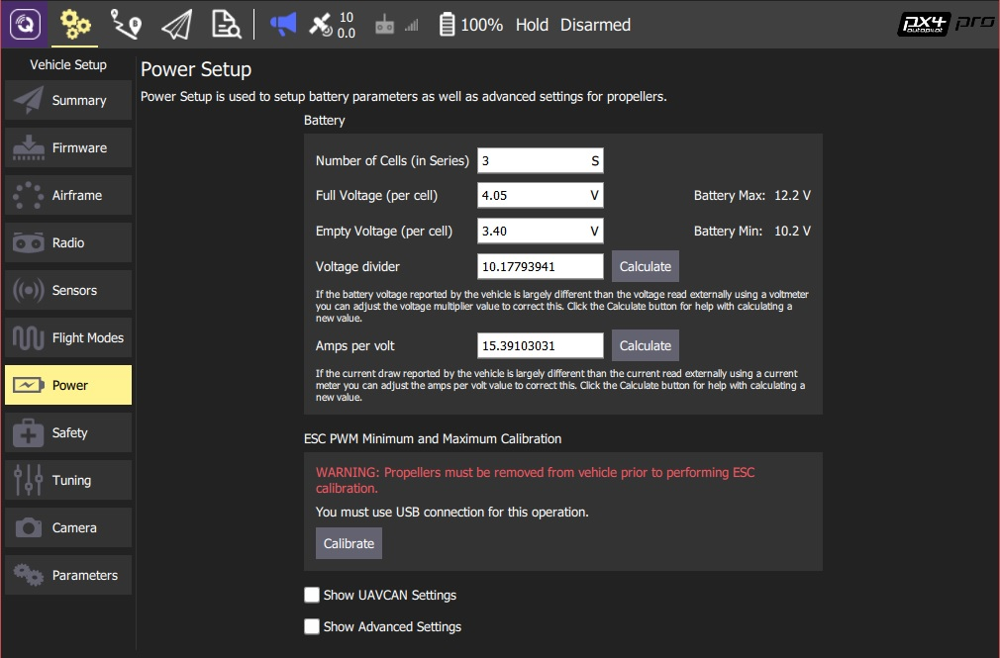

# Battery and Power Module Setup

This topic explains how to configure power settings.

> **Note** The battery monitoring features of PX4 can only be used if you have compatible hardware. In most cases this means a power module that measures the battery voltage, and may also measure the current between battery and vehicle.

## Overview

The goal of the power setup is to provide a good estimate of remaining battery capacity, so that the vehicle is not used to the point that it runs out of power and crashes (or the battery is damaged due to deep-discharge).

PX4 provides a number of (progressively more effective) methods that can be used to estimate the capacity:

1. [Basic Battery Settings](#basic_settings) (default): raw measured voltage is compared to the range between "empty" and "full" voltages. This results in "course" estimates because measured voltage (and its corresponding capacity) will fluctuate under load.
1. [Voltage-based Estimation with Load Compensation](#load_compensation): Counteracts the effects of loading on the capacity calculation.
1. [Voltage-based Estimation with Current Integration](#current_integration): Fuses the load-compensated voltage-based estimate for the available capacity with a current-based estimate of the charge that has been consumed. This results in a capacity estimate that is comparable to that of a smart battery.

Later methods build on preceding methods. The approach you use will depend on whether the vehicle's power module can measure current.

## Basic Battery Settings (default) {#basic_settings}

> **Note** This default/basic power configuration results in relatively course estimations due to fluctuations in the estimated charge as the measured voltage changes under load.

The basic battery settings configure PX4 to use the default method for capacity estimate. 
This method compares the measured raw battery voltage to the range between cell voltages for "empty" and "full" cells (scaled by the number of cells). 

To configure the basic settings:

1. Start *QGroundControl* and connect the vehicle.
1. Select the **Gear** icon (Vehicle Setup) in the top toolbar and then **Power** in the sidebar.

You are presented with the basic settings that characterize your battery. The sections below explain what values to set for each field.

> **Note** The basic settings below correspond to [parameters](../advanced_config/parameters.md): [BAT_N_CELLS](../advanced_config/parameter_reference.md#BAT_N_CELLS), [BAT_V_EMPTY](../advanced_config/parameter_reference.md#BAT_V_EMPTY), [BAT_V_CHARGED](../advanced_config/parameter_reference.md#BAT_V_CHARGED). 

### Number of Cells (in Series)

This sets the number of cells connected in series in the battery. Typically this will be written on the battery as a number followed by "S" (e.g "3S", "5s").

> **Note** The voltage across a single galvanic battery cell is dependent on the chemical properties of the battery type. The most common drone battery type (Lithium-Polymer - LiPo) has a nominal cell voltage of 3.7V. In order to achieve higher voltages (which will more efficiently power a vehicle), multiple cells are connected in *series*. The battery voltage at the terminals is then a multiple of the cell voltage.

If the number of cells is not supplied you can calculate it by dividing the battery voltage by the nominal voltage for a single cell. The table below shows the voltage-to-cell relationship for LiPo batteries:
* 1S - 3.7V
* 2S - 7.4V
* 3S - 11.1V
* 4S - 14.8V
* 5S - 18.5V
* 6S - 22.2V

### Full Voltage (per cell)

This sets the *nominal* maximum voltage of each cell (the lowest voltage at which the cell will be considered "full").

The value should be set slightly lower that the nominal maximum cell voltage for the battery (4.2V for LiPo), but not so low that the estimated capacity is still 100% after a few minutes of flight. The default value is usually appropriate for LiPo batteries. 

> **Note**  The voltage of a full battery may drop a small amount over time after charging. Setting a slightly-lower than maximum value compensates for this drop.

### Empty Voltage (per cell)

This sets the nominal minimum safe voltage of each cell (use below this voltage may damage the battery).

> **Note** There is no single value at which a battery is said to be empty. If you choose a value that is too low the battery may be damaged due to deep discharge (and/or the vehicle may crash). If you choose a value that is too high you may unnecessarily curtail your flight.

A rule of thumb for LiPo batteries:
- 3.7V without load is a conservative minimum value.
- 3.5 V under load (while flying) is closer to the true minimum. At this voltage you should land immediately. 
- 3.2V under load will cause damage to the battery. 

> **Tip** Below the conservative range, the sooner you recharge the battery the better - it will last longer and lose capacity slower.

### Voltage divider

If you have a vehicle that measures voltage through a power module and the ADC of the flight controller then you should check and calibrate the measurements once per board. To calibrate you'll need a multimeter.

The easiest way to calibrate the divider is by using *QGroundControl* and following the step-by-step guide on [Setup > Power Setup](https://docs.qgroundcontrol.com/en/SetupView/Power.html) (QGroundControl User Guide).

### Amps per volt {#current_divider}

> **Tip** This setting is not needed if you are using the basic configuration (without load compensation etc.)

If you are using [Current-based Load Compensation](#current_based_load_compensation) or [Current Integration](#current_integration) the APMs per volt needs to be calibrated. 

The easiest way to calibrate the dividers is by using *QGroundControl* and following the step-by-step guide on [Setup > Power Setup](https://docs.qgroundcontrol.com/en/SetupView/Power.html) (QGroundControl User Guide).

## Voltage-based Estimation with Load Compensation {#load_compensation}

> **Note** With well configured load compensation the voltage used for battery capacity estimation is much more stable, varying far less when flying up and down.

Load compensation attempts to counteract the fluctuation in measured voltage/estimated capacity under load that occur when using the [basic configuration](#basic_settings). This works by estimating what the voltage would be for the *unloaded* battery, and using that voltage (instead of the measured voltage) for estimating the remaining capacity. 

> **Note** To use the load compensation you will still need to set the [basic configuration](#basic_settings). The *Empty Voltage* ([BAT_V_EMPTY](../advanced_config/parameter_reference.md#BAT_V_EMPTY)) should be set higher than because the compensated voltage gets used for the estimation (typically set a bit below the expected rest cell voltage when empty after use).

PX4 supports two load compensation methods, which are enabled by  [setting](../advanced_config/parameters.md) either of the two parameters below:
* [BAT_R_INTERNAL](../advanced_config/parameter_reference.md#BAT_R_INTERNAL) - [Current-based Load Compensation](#current_based_load_compensation) (recommended).
* [BAT_V_LOAD_DROP](../advanced_config/parameter_reference.md#BAT_V_LOAD_DROP) - [Thrust-based Load Compensation](#thrust_based_load_compensation).

### Current-based Load Compensation (recommended) {#current_based_load_compensation}

This load compensation method relies on current measurement to determine load. It is far more accurate than [Thrust-based Load Compensation](#thrust_based_load_compensation) but requires that you have a current sensor.

To enable this feature:

1. Set the parameter [BAT_R_INTERNAL](../advanced_config/parameter_reference.md#BAT_R_INTERNAL) to to the internal resistance of your battery. 
   > **Tip** There are LiPo chargers out there which can measure the internal resistance of your battery. A typical value is 5mΩ but this can vary with discharge current rating, age and health of the cells.
1. You should also calibrate the [Amps per volt divider](#current_divider) in the basic settings screen.

### Thrust-based Load Compensation {#thrust_based_load_compensation}

This load compensation method estimates the load based on the total thrust that gets commanded to the motors. 

> **Caution** This method is not particularly accurate because there's a delay between thrust command and current, and because the thrust in not linearly proportional to the current. Use  [Current-based Load Compensation](#current_based_load_compensation) instead if your vehicle has a current sensor.

To enable this feature:

1. Set the parameter [BAT_V_LOAD_DROP](../advanced_config/parameter_reference.md#BAT_V_LOAD_DROP) to how much voltage drop a cell shows under the load of full throttle.

## Voltage-based Estimation with Current Integration {#current_integration}

> **Note** This is the most accurate way to measure relative battery consumption. If set up correctly with a healthy and fresh charged battery on every boot, then the estimation quality will be comparable to that from a smart battery (and theoretically allow for accurate remaining flight time estimation).

This method evaluates the remaining battery capacity by *fusing* the voltage-based estimate for the available capacity with a current-based estimate of the charge that has been consumed. It requires hardware that can accurately measure current.

To enable this feature:

1. First set up accurate voltage estimation using [current-based load compensation](#current_based_load_compensation).
   > **Tip** Including calibrating the [Amps per volt divider](#current_divider) setting.
   
1. Set the parameter [BAT_CAPACITY](../advanced_config/parameter_reference.md#BAT_CAPACITY) to around 90% of the advertised battery capacity (usually printed on the battery label).
   > **Note** Do not set this value too high as this may result in a poor estimation or sudden drops in estimated capacity.
   
---
**Additional information**

The estimate of the charge that has been consumed over time is produced by mathematically integrating the measured current (this approach provides very accurate energy consumption estimates).

At system startup PX4 first does uses a voltage-based estimate to determine the initial battery charge. This estimate is then fused with the value from current integration to provide a combined better estimate.
The relative value placed on each estimate in the fused result depends on the battery state.
The emptier the battery gets, the more of the voltage based estimate gets fused in. This prevents deep discharge (e.g. because it was configured with the wrong capacity or the start value was wrong). 

If you always start with a healthy full battery, this approach is similar to that used by a smart battery.

> **Note** Current integration cannot be used on its own (without voltage-based estimation) because it has no way to determine the *initial* capacity. Voltage-estimation allows you to estimate the initial capacity and provides ongoing feedback of possible errors (e.g. if the battery is faulty, or if there is a mismatch between capacity calculated using different methods).
