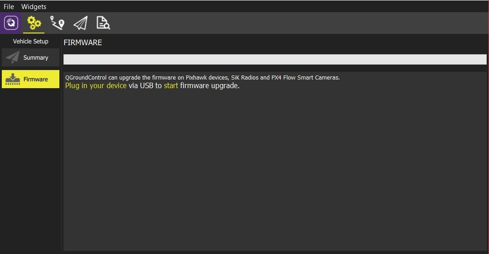
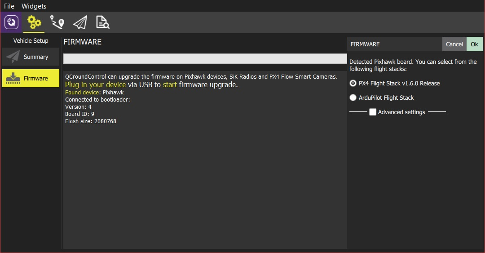
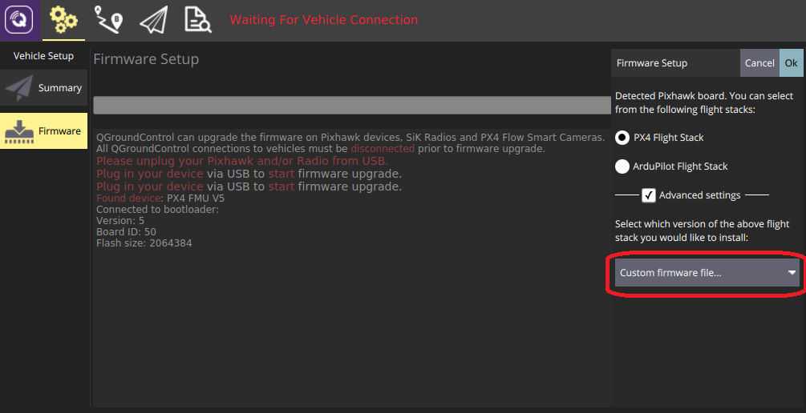

# Loading Firmware

*QGroundControl* **desktop** versions can be used to install PX4 firmware onto [Pixhawk-series](../getting_started/flight_controller_selection.md) flight-controller boards. 

> **Caution** **Before you start installing Firmware** all USB connections to you vehicle must be *disconnected* (both direct or through a telemetry radio). The vehicle must *not be* powered by a battery.

## Default Firmware

To install the latest firmware update:

1. First select the **Gear** icon (*Vehicle Setup*) in the top toolbar and then **Firmware** in the sidebar. 

  

1. Connect the flight controller directly to your computer via USB. 

   > **Note** Connect directly to a powered USB port on your machine (do not connect through a USB hub).

1. Once the controller is connected you can choose which firmware to load (*QGroundControl* presents sensible options based on the connected hardware). Accept the default setting to install the latest stable version of PX4.
   
   
   
   > **Tip** If another autopilot is pre-installed, select the **PX4 Flight Stack ... Release** option to select PX4.

1. Click the **OK** button to start the update.

   The firmware will then proceed through a number of upgrade steps (downloading new firmware, erasing old firmware etc.). Each step is printed to the screen and overall progress is displayed on a progress bar.
   
   
   
   Once the firmware has completed loading, the device/vehicle will reboot and reconnect.

Next you will need to specify the [vehicle airframe](../config/airframe.md) (and then sensors, radio, etc.)

> **Tip** *QGroundControl* will install the current stable version of PX4, but you can also choose to install beta builds, daily builds, or custom firmware files. 

> **Tip** If *QGroundControl* installs the FMUv2 target (see console during installation) and you have a newer board, you may need to update the bootloader in order to access all the memory on your flight controller. See [Bootloader Update](../advanced_config/bootloader_update.md) for more information.

## Custom Firmware

[Developers](https://dev.px4.io/en/) can also install firmware from a *custom* build of PX4:

1. Make a clean build ([Building the Code](https://dev.px4.io/en/setup/building_px4.html)).
1. Open QGC and select **Custom firmware file...** as shown below:

  
  
  You will be asked to choose the **.px4** firmware file to flash (this file is a zipped JSON file and contains the airframe metadata). 
1. Navigate to the build folder and select the firmware file (e.g. **Firmware/build/nuttx_px4fmu-v5_default/px4fmu-v5_default.px4**).
1. Press **OK** to start flashing the firmware.
1. Restart *QGroundControl*.

## Further Information

* [QGroundControl User Guide > Firmware](https://docs.qgroundcontrol.com/en/SetupView/Firmware.html).
* [PX4 Setup Video](https://youtu.be/91VGmdSlbo4) (Youtube)

