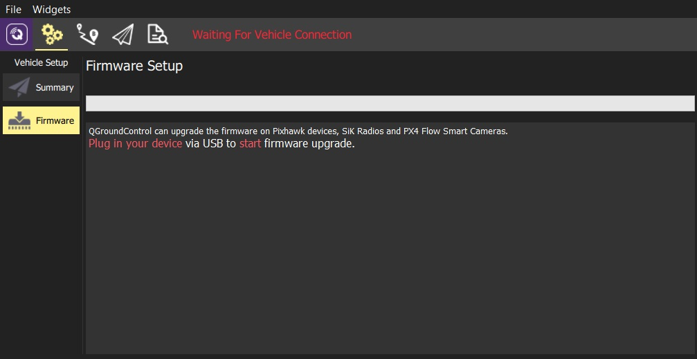
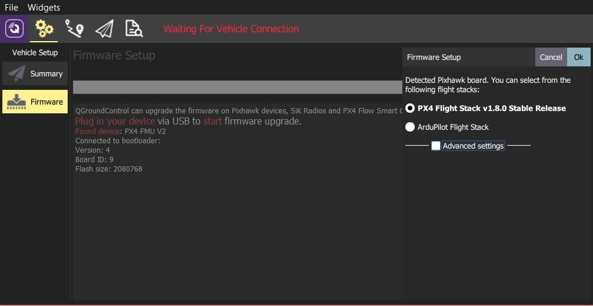
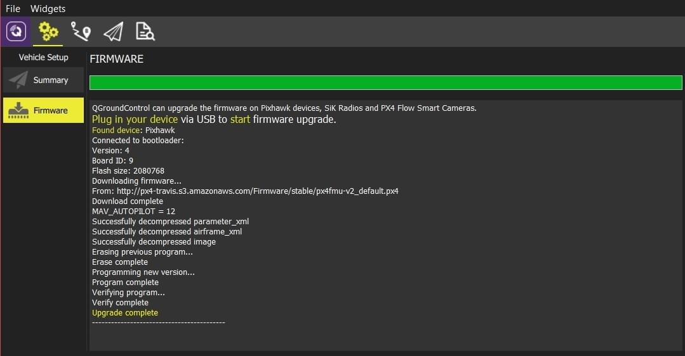
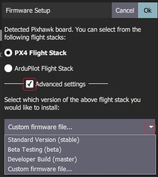
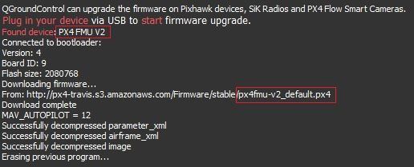
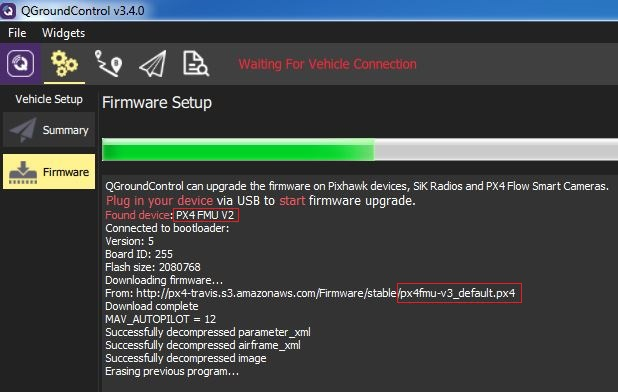

# Loading Firmware

*QGroundControl* **desktop** versions can be used to install PX4 firmware onto [Pixhawk-series](../getting_started/flight_controller_selection.md) flight-controller boards. 

:::warning
**Before you start installing Firmware** all USB connections to the vehicle must be *disconnected* (both direct or through a telemetry radio). 
The vehicle must *not be* powered by a battery.
:::

## Install Stable PX4

Generally you should use the most recent *released* version of PX4, in order to benefit from bug fixes and get the latest and greatest features.
 
:::tip
This is the version that is installed by default.
:::

To install PX4:

1. First select the **Gear** icon (*Vehicle Setup*) in the top toolbar and then **Firmware** in the sidebar. 

  

1. Connect the flight controller directly to your computer via USB.

   :::note
   Connect directly to a powered USB port on your machine (do not connect through a USB hub).
   :::

1. Select the **PX4 Flight Stack X.x.x Release** option to install the latest stable version of PX4 *for your hardware* (autodetected).

   

1. Click the **OK** button to start the update.

   The firmware will then proceed through a number of upgrade steps (downloading new firmware, erasing old firmware etc.). 
   Each step is printed to the screen and overall progress is displayed on a progress bar.
   
   
   
   Once the firmware has completed loading, the device/vehicle will reboot and reconnect.
   
   :::tip
   If *QGroundControl* installs the FMUv2 target (see console during installation) and you have a newer board, you may need to [update the bootloader](#bootloader) in order to access all the memory on your flight controller.
   :::

Next you will need to specify the [vehicle airframe](../config/airframe.md) (and then sensors, radio, etc.)

## Installing PX4 Master, Beta or Custom Firmware

To install a different version of PX4:
1. Connect the vehicle as above, and select **PX4 Flight Stack vX.x.x Stable Release**
   
1. Check **Advanced settings** and select the version from the dropdown list:
   - **Standard Version (stable):** The default version (i.e. no need to use advanced settings to install this!)
   - **Beta Testing (beta):** A beta/candidate release.
     Only available when a new release is being prepared.
   - **Developer Build (master):** The latest build of PX4/PX4-Autopilot.
   - **Custom Firmware file...:** A custom firmware file (e.g. that you have built locally).
     If you select this you will have to choose the custom firmware from the file system in the next step.

Firmware update then continues as before.

## FMUv2 Bootloader Update

If *QGroundControl* installs the FMUv2 target (see console during installation), and you have a newer board, you may need to update the bootloader in order to access all the memory on your flight controller.

:::note
Early FMUv2 [Pixhawk-series](../flight_controller/pixhawk_series.md#fmu_versions) flight controllers had a [hardware issue](../flight_controller/silicon_errata.md#fmuv2-pixhawk-silicon-errata) that restricted them to using 1MB of flash memory.
The problem is fixed on newer boards, but you may need to update the factory-provided bootloader in order to install FMUv3 Firmware and access all 2MB available memory.
:::

To update the bootloader:

1. Insert an SD card (enables boot logging to debug any problems).
1. [Update the Firmware](../config/firmware.md) to PX4 *master* version (when updating the firmware, check **Advanced settings** and then select **Developer Build (master)** from the dropdown list).
   *QGroundControl* will automatically detect that the hardware supports FMUv2 and install the appropriate Firmware.
   
   
   
   Wait for the vehicle to reboot.
1. [Find and enable](../advanced_config/parameters.md) the parameter [SYS_BL_UPDATE](../advanced_config/parameter_reference.md#SYS_BL_UPDATE).
1. Reboot (disconnect/reconnect the board). 
   The bootloader update will only take a few seconds.
1. Then [Update the Firmware](../config/firmware.md) again. 
   This time *QGroundControl* should autodetect the hardware as FMUv3 and update the Firmware appropriately.

   

   :::note
   If the hardware has the *Silicon Errata* it will still be detected as FMUv2 and you will see that FMUv2 was re-installed (in console). 
   In this case you will not be able to install FMUv3 hardware.
   :::

:::tip
For more information see [Bootloader Update](../advanced_config/bootloader_update.md).
:::

## Further Information

* [QGroundControl User Guide > Firmware](https://docs.qgroundcontrol.com/en/SetupView/Firmware.html).
* [PX4 Setup Video](https://youtu.be/91VGmdSlbo4) (Youtube)
