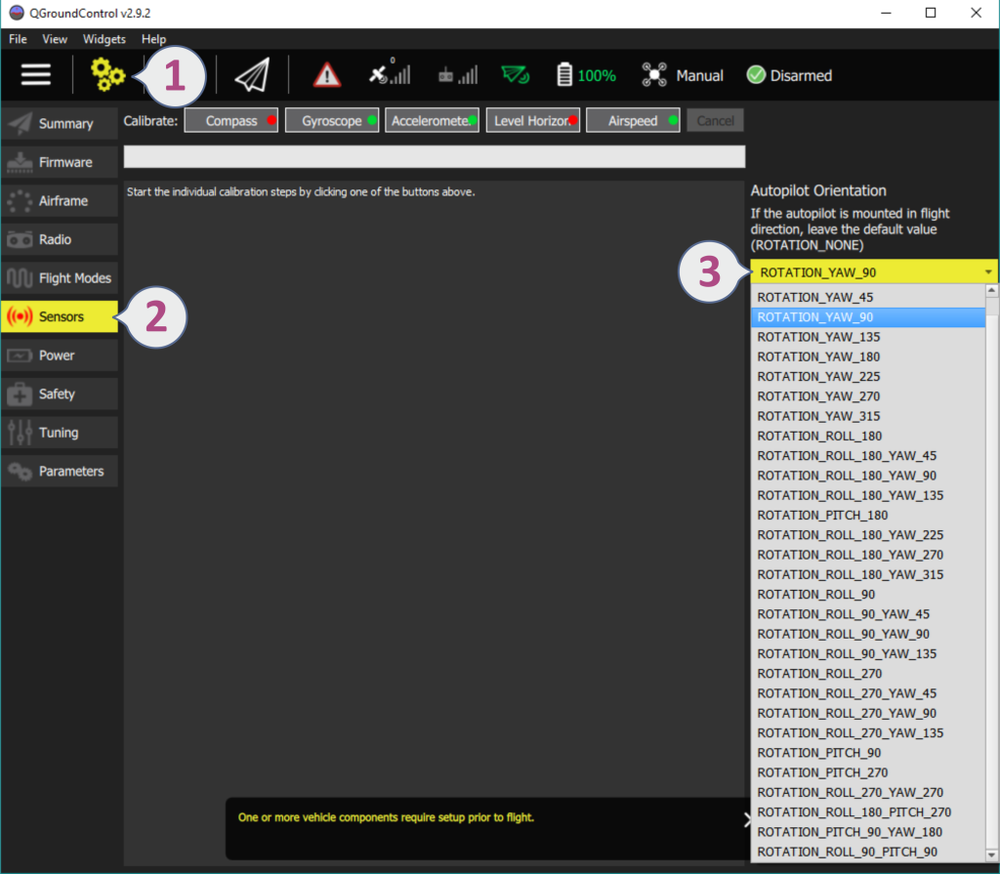

# Flight Controller Orientation Configuration

By default the flight controller should be placed on the frame top-side up, oriented so that the arrow points towards the front of the vehicle. If the board is mounted in another orientation (upside down, on its side, perpendicular to the heading direction etc) then you will need configure this in the firmware.

## Setting the Orientation

1. Start *QGroundControl* and connect the vehicle.
2. Open the menu: **Settings > Sensors**.
3. Choose the *Autopilot Orientation* value that matches your vehicle. 

### Calculating Orientation

The default setting (**ROTATION_NONE**) assumes that your flight controller is mounted upright on the vehicle facing the front. YAW, PITCH and ROLL offsets are calculated relative to this orientation as CW (clock-wise) rotation around the **Z**, **Y** and **X** axis, respectively.

Some different yaw offsets are shown below.

## Fine Tuning

You can use [Level Horizon Calibration](config/level_horizon_calibration.md) to compensate for small miss-alignments in controller orientation and to level the horizon in flight view.

After the orientation is set and level-horizon calibration is complete, check in the flight view that the heading in the compass shows a value around 0 when you point the vehicle towards north and that the horizon is level (blue on top and green on bottom).

## Further information

* [Advanced Orientation Tuning](../advanced_config/advanced_flight_controller_orientation_leveling.md) (advanced users only).