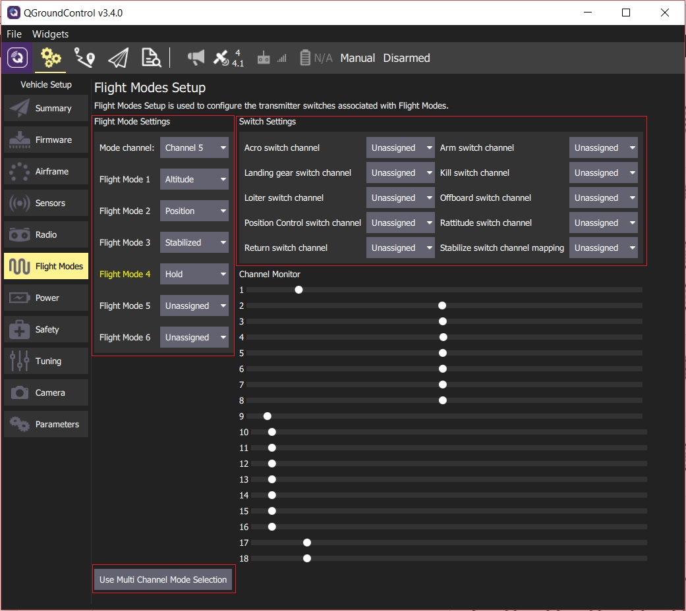

# Flight Mode Configuration

[Flight Modes](../flight_modes/README.md) provide different types of *autopilot-assisted* flight, and fully autonomous flight via missions or offboard (companion computer) control. Flight modes allow new users to learn flying with a more forgiving platform than provided by basic RC control alone. They also enable automation of common tasks like taking off and landing.

PX4 allows you to select flight modes from a ground station (tablet or desktop) or from a radio control transmitter. If radio control and tablet are both connected, either system can change the mode and override the previous setting.

> **Note** You must already have [configured your radio](TBD) in order to set flight modes.

## What Flight Modes Should I Set?

New users may wish to configure their radio control receiver to support one or more of the following three modes (these make the vehicle much easier to fly):

- **Position** - When sticks are released the vehicle will stop (and hold position against wind drift).
- **Stabilized** - Vehicle hard to flip, and will level-out if the sticks are released (but not hold position).
- **Altitude** - Climb and drop are controlled to have a maximum rate.

It is also common to map a switch to:
- [Return To Launch](../flight_modes/rtl.md) - This mode raises the vehicle to a safe height and returns to the launch position.
- **Mission** - In this mode the aircraft obeys a programmed mission sent by the ground control station.

Some operators may also wish to enable:

- *Kill Switch* - Immediately stops all motor outputs. The vehicle will crash, which may in some circumstances be more desirable than allowing it to continue flying.

You can find a description of [all Flight Modes here](../flight_modes/README.md).

## Multi Channel vs Single Channel

*QGroundControl*/*PX4* allows you to use a radio controller that encodes multiple individual switches into their own receiver channels ("multi-channel") or that map multiple switches or a dial into a single channel (single-channel). Some transmitters are configurable, and so you can use whichever approach you prefer.

> **Note** What type of transmitter you have and how it maps channels to switches will be covered in your transmitter/receiver documentation.

## Single-Channel Flight Mode Selection

A single-channel system encodes multiple switches/switch positions on your transmitter to different PWM values in a single channel. Q*GroundControl* allows you to specify this channel and then map up to 6 flight modes for the encoded PWM values. You can also separately specify channels for kill, return to launch, and offboard mode switches. 

A channel monitor allows you to view the values on the channels, and confirm that they modify the selected mode/switches as you expect.

To configure a single channel radio system:

1. Turn on your RC transmitter.
1. Start *QGroundControl* and connect the vehicle.
1. Select the **Gear** icon (Vehicle Setup) in the top toolbar and then **Flight Modes** in the sidebar.
   
   
   
   > **Tip** If the screen opens in *Multi Channel Mode* click the **Use Single Channel Mode Selection** button to change screen.
   
1. Specify *Flight Mode Settings*:
   * Select the **Mode channel** (above this shown as Channel 5). 
   * Select up to 6 **Flight Modes**, mapping to every switch encoded in the channel.
1. Specify *Switch Settings*:
   * Select the channels for *Return To Launch* mode, *Kill Switch*, and *offboard* mode (if you have spare switches and channels).
1. Move the transmitter switches to the position desired for each mode. Confirm that the specified channels move with your switch positions and map to the flight modes (these turn yellow when selected). 

Mode values are automatically saved as you set them.

> **Tip** The *FrSky Taranis* is a very popular (and highly recommended) RC transmitter. It is common to use the positions of a 2- and a 3-position switch to encode the 6 flight modes. The process involves assigning a "logical switch" to each combination of positions of the two real switches. Each logical switch is then assigned to a different PWM value on the same channel.
>
> The video below shows how this is done, and how to use *QGroundControl* to map the switches (PWM values) to modes.
> 
> http://www.youtube.com/watch?v=scqO7vbH2jo
> 

## Multi-Channel Flight Mode Selection

Multi-channel systems assign each individual switch to a separate channel. *QGroundControl* allows you to specify the mapping between a mode and a channel, and the threshold PWM value for the channel that causes the mode to be enabled.

To configure a multi-channel radio system:

1. Turn on your RC transmitter.
1. Start *QGroundControl* and connect the vehicle.
1. Select the **Gear** icon (Vehicle Setup) in the top toolbar and then **Flight Modes** in the sidebar.
   
   
   
   > **Tip** If the screen opens in *Single Channel Mode* click the **Use Multi Channel Mode Selection** button to change screen.
   
1. For each mode that you wish to support, select the appropriate channel (for the switch that you will use to enable it). 
2. Toggle the switch and note the maximum position of the circle on the associated *Monitor* slider. 
3. Move the *Threshold* slider to just *below* the maximum position for the switch on the *Monitor* slider (when the switch is turned on the value will be over the threshold, enabling the mode).
   > **Note** You do not need to move the slider for the *first* mode setting - any non-zero channel value will enable the mode.
4. Repeat this process for all switches/sliders.

*QGroundControl* also allows you to map several modes to the same channel and differentiate the switch positions using threshold values (if a switch position has a higher value than more than one mode threshold, the mode associated with the *highest* theshold will be enabled). The configuration process for mapping multiple channels is the same as above.

This mode is demonstrated in the [autopilot setup video here](https://youtu.be/91VGmdSlbo4?t=6m53s) (youtube).

## Further Information

* [Flight Modes Overview](../flight_modes/README.md)
* [QGroundControl > Flight Modes](https://docs.qgroundcontrol.com/en/SetupView/FlightModes.html#px4-pro-flight-mode-setup)
* [PX4 Setup Video - @6m53s](https://youtu.be/91VGmdSlbo4?t=6m53s) (Youtube)

