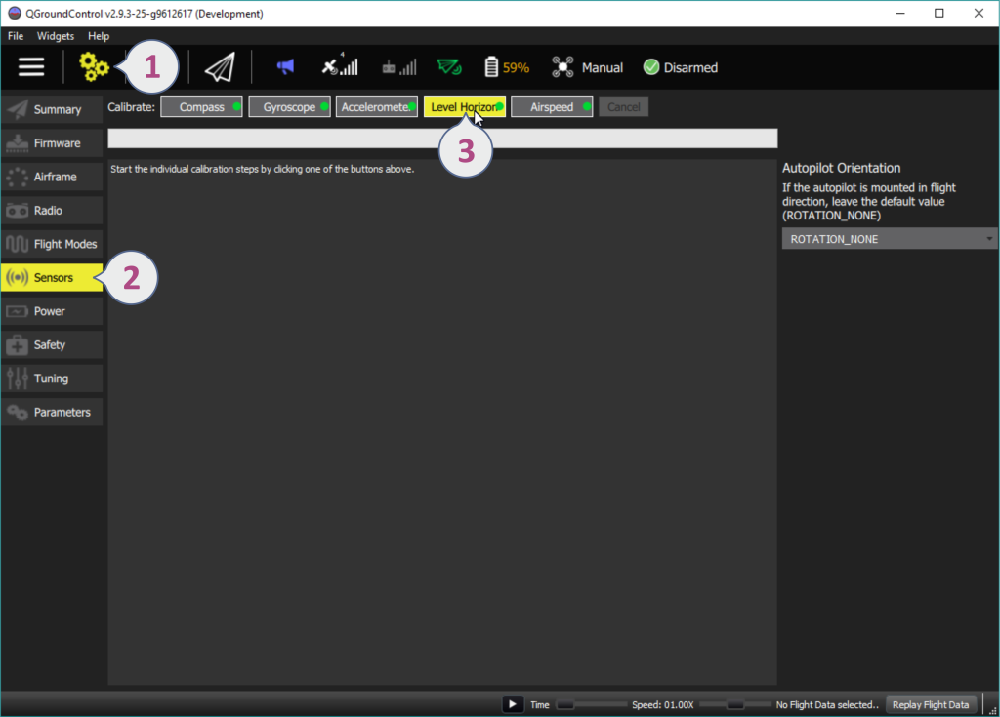
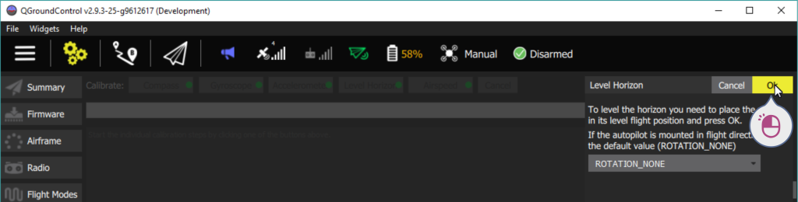
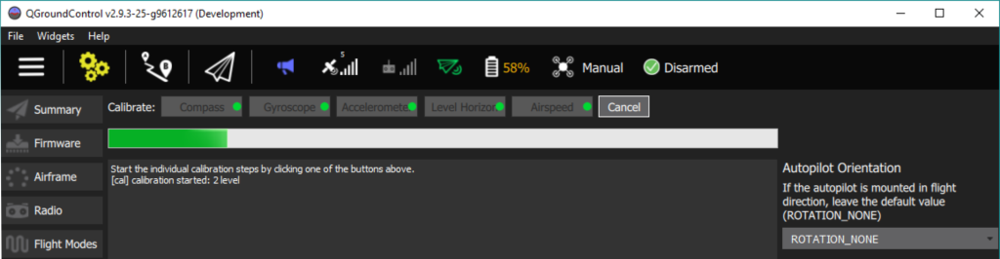

# Level Horizon Calibration

You can use *Level Horizon Calibration* to compensate for small miss-alignments in controller orientation and to level the horizon in the QGroundControl flight view (blue on top and green on bottom). Leveling the horizon is highly recommended, and will result in the best flight performance. 

This process can also be repeated if you notice a constant drift during flight.

## Performing the Calibration 

To calibrate the horizon:

1. Configure the [Flight Controller Orientation](../config/flight_controller_orientation.md) (if this has not already been done).
2. Place the vehicle in its level flight orientation on a level surface:
   - For planes this is the position during level flight (planes tend to have their wings slightly pitched up!)
   - For copters this is the hover position.
3. Open the QGroundControl menu: **Settings > Sensors**.
4. Click the **Level Horizon** button. 

   

5. Press **OK** to start the calibration process

   

6. Wait until the calibration process is finished.

   

## Further information

* [Advanced Orientation Tuning](../advanced_config/advanced_flight_controller_orientation_leveling.md) (advanced users only).
