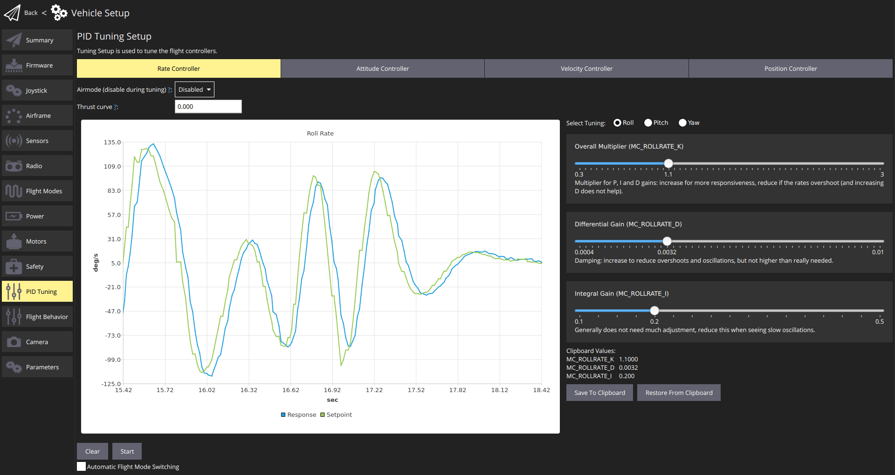

# Helicopter Configuration

This section contains topics related to helicopter configuration and tuning.

## Supported Configurations

Supported helicopter configurations:
- Single main rotor with any type of swash-plate
- ESC tail rotor

:::tip
Helicopters are less well-supported than other types of vehicles.
If you have any improvement (feature, new type, etc.) you are welcome to [contribute](../contribute/README.md).
:::

## Setup

After selecting a helicopter frame, set up the geometry:

1. Remove the rotor blades and propellers
1. Configure the swash-plate servos.
   The angle is measured clockwise with 0 pointing forwards.
   Trim is typically not needed, but can be used to offset individual servo positions.
1. Set the main rotor turning orientation
1. Assign the motors and servos to the outputs
1. Power the vehicle by battery and use the actuator testing sliders to validate correct servo and motor assignment and direction
1. Using an RC in [Acro mode](../flight_modes/acro_mc.md), verify the correct movement of the swash-plate:
   - moving the Roll stick to the right should tilt the swash-plate to the right
   - moving the Pitch stick forward should tilt the swash-plate forward
1. Arm the vehicle and check the main rotor spins up slowly. Adjust the throttle spoolup time as needed.
   You can also adjust the throttle curve with the parameters [CA_HELI_THR_Cx](../advanced_config/parameter_reference.md#CA_HELI_THR_C0).
   The default is constant, maximum throttle.
3. Disarm again and power off
4. Put the rotor blades on and power the vehicle
5. Configure the collective pitch curve using the parameters [CA_HELI_PITCH_Cx](../advanced_config/parameter_reference.md#CA_HELI_PITCH_C0).
  Set the minimum and maximum according to the minimum and maximum blade angles you want.
  Make sure the minimum is low enough so the vehicle can still descend.
  Instead start off with a too low value.
  The default is slightly negative for that reason and should be a good starting point.

## Tuning

After completing the previous steps you are ready to arm with blades mounted.
Tuning involves two steps that are specific to helicopters, the rest is the same as for multicopters.

### Rate Controller

The rate controller should be tuned in [Acro mode](../flight_modes/acro_mc.md), but can also be done in [Stabilized mode](../flight_modes/manual_stabilized_mc.md) if you cannot fly Acro mode.

Start off with disabled rate controller gains, and only some feedforward:

```
param set MC_ROLLRATE_P 0
param set MC_ROLLRATE_I 0
param set MC_ROLLRATE_D 0
param set MC_ROLLRATE_FF 0.1
param set MC_PITCHRATE_P 0
param set MC_PITCHRATE_I 0
param set MC_PITCHRATE_D 0
param set MC_PITCHRATE_FF 0.1
```

Take off slowly and provide some roll and stick movements.
Use the QGC tuning UI to check the response:



Increase the FF gains until the response reaches the setpoint when giving a step input.

Then enable the PID gains.
Start off with `P=FF/4`, `I=0.2` and `D=0.001`.
Then increase the `P` and `D` gains as needed until it tracks well.
It is expected that the `P` gain is considerably smaller than the `FF` gain.

### Yaw Compensation

There are two parameters to compensate yaw for the main rotor's collective and throttle.
A negative value is needed when positive thrust of the tail rotor rotates the vehicle opposite to the main rotor turn direction.

TODO: add log + explain

