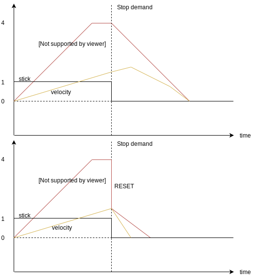

# Slew-rate Type Trajectory for Multicopters

The Slew Rate trajectory type should be used when a quick (and potentially "jerky") response to stick input is more important than ensuring smooth acceleration and deceleration (e.g.: for inspection, aggressive flight with position hold, fast missions).

This type is a simple implementation where the jerk and acceleration is limited using slew-rates.
In manual mode, it allows asymmetric profiles based on user intention (smooth acceleration and quick stop).
The jerk and acceleration limits are not hard constraints.

Enable this trajectory type using the following parameter settings: [MPC_POS_MODE=1](../advanced_config/parameter_reference.md#MPC_POS_MODE), `MPC_POS_MODE=2`, [MPC_AUTO_MODE=0](../advanced_config/parameter_reference.md#MPC_AUTO_MODE).

> **Note** [Setpoint Tuning (Trajectory Generator)](../config_mc/mc_trajectory_tuning.md) also supports [MC Jerk-limited Trajectory Tuning](../config_mc/mc_jerk_limited_type_trajectory.md) for smoother responses.

This topic explains how the trajectory type works, and can be tuned, in both position and mission modes.

## Position Mode

In [Position mode](../flight_modes/position_mc.md) the stick inputs are mapped to either **position-control** or **velocity-control**.
 
Position-control is active when the stick inputs are within the deadzone [MPC_HOLD_DZ](../advanced_config/parameter_reference.md#MPC_HOLD_DZ), and velocity-control otherwise.
All the parameters below are tuning parameters and cannot be mapped directly to the physical quantity.

#### MPC_ACC_HOR_MAX

This parameter is used for position-control in the horizontal direction, where the vehicle is supposed to stay at the current location.
The limit for the rate of change of the velocity setpoint is defined by [MPC_ACC_HOR_MAX](../advanced_config/parameter_reference.md#MPC_ACC_HOR_MAX).
This parameter should be set larger than any of the other acceleration related parameters in the horizontal direction.

#### MPC_ACC_HOR and MPC_DEC_HOR_SLOW {#mpc_acc_hor-and-mpc_dec_hor_slow}

In velocity-control the rate limit for the velocity setpoint is extracted from a linear map from stick input to acceleration limit with maximum [MPC_ACC_HOR](../advanced_config/parameter_reference.md#MPC_ACC_HOR) and minimum [MPC_DEC_HOR_SLOW](../advanced_config/parameter_reference.md#MPC_DEC_HOR_SLOW).
For example, if the stick input is at `MPC_HOLD_DZ`, the limiting acceleration is `MPC_DEC_HOR_SLOW`.
If the stick input is at maximum (=`1`), the limiting acceleration is `MPC_ACC_HOR` and any stick input in between is mapped linearly between the two parameters.
In addition, `MPC_DEC_HOR_SLOW` also limits the change in velocity setpoint when the user demands a deceleration in the current flight direction.
For instance, if the stick input changes from maximum (=`1`) to `0.5`, the velocity setpoint change will be limited by `MPC_DEC_HOR_SLOW`.

During transition from **velocity-control** to **position-control**, there is a hard switch from from `MPC_ACC_HOR` to `MPC_ACC_HOR_MAX` and a reset of the velocity setpoint to the current vehicle velocity.
The reset and the hard switch can both introduce a jerky flight performance during stopping.
Nonetheless, the reset is required because the smoothing parameters introduce a delay to the setpoint, which can lead to unexpected flight maneuvers.

A simple example explaining why the reset is needed is given below.

Consider the case where a user demands full speed from hover followed by a stop request. This is equivalent to full stick input with maximum value of `1` followed by zero stick input.
To simplify the example, assume that `MPC_ACC_HOR_MAX` is equal to `MPC_ACC_HOR` and therefore there is no hard switch in acceleration limit when switching from **velocity-control** to **position-control**. In addition, let's assume the maximum speed that can be demanded is `4 m/s`.

During full stick input, the velocity setpoint will not change directly from `0 m/s` to `4 m/s` (aka step input) - instead the velocity setpoint follows a ramp with slope `MPC_ACC_HOR`.
The actual velocity of the vehicle, however, will not track the setpoint perfectly, but rather will lag behind.
The lag will be more significant the larger the value of `MPC_ACC_HOR`. 

Without the reset (the top graph), at the moment of the stop demand (stick equal 0) the velocity setpoint will ramp down with the maximum rate given by `MPC_ACC_HOR_MAX`.
Due to the lag the vehicle will first continue to accelerate in the direction previous to the stop demand followed by slowly decelerating towards zero.
With the reset of the velocity setpoint to the current velocity, the delay due to the lag during stop demand can be overcome.

#### MPC_ACC_UP_MAX and MPC_ACC_DOWN_MAX

`MPC_ACC_UP_MAX` >= `MPC_ACC_DOWN_MAX`, otherwise the firmware will overwrite the given values.

- **position-control:** the limit in velocity setpoint change in z-direction is given by [MPC_ACC_UP_MAX](../advanced_config/parameter_reference.md#MPC_ACC_UP_MAX).
- **velocity-control:** the limit in velocity setpoint change for stick input is `MPC_ACC_UP_MAX` for upward and [MPC_ACC_DOWN_MAX](../advanced_config/parameter_reference.md#MPC_ACC_DOWN_MAX) for downward direction.

#### MPC_JERK_MAX and MPC_JERK_MIN

These two parameters only have effect during the transition from **velocity-control** to **position-control**.
The purpose of these two parameters are to minimize the jerk introduced from forward flight to hover (please see [MPC_ACC_HOR and MPC_DEC_HOR_SLOW](#mpc_acc_hor-and-mpc_dec_hor_slow)).

The jerk-parameter controls the rate limit with which the acceleration limit can change to `MPC_ACC_HOR_MAX`.
The actual jerk-value is a linear map from velocity speed to jerk where full speed maps to [MPC_JERK_MAX](../advanced_config/parameter_reference.md#MPC_JERK_MAX) and zero speed to [MPC_JERK_MIN](../advanced_config/parameter_reference.md#MPC_JERK_MIN).
The smoothing can be turned off by setting `MPC_JERK_MAX` to a value smaller than `MPC_JERK_MIN`.

## Mission Mode

In [Mission mode](../flight_modes/mission.md) the vehicle always follows a straight line from the previous waypoint to the current target.

$$\mathbf{wp}_{prev}$$ is the previous waypoint that either was already passed or is the position at the time when the new target waypoint was received, but no previous waypoint provided.

The setpoint during line tracking can be split into two components:
- position setpoint $$\mathbf{p}_{sp}$$: it is the pose on the track closest to vehicle position
- velocity setpoint $$\mathbf{v}_{cruise}$$: it the desired velocity along the track

The cruise speed of $$\mathbf{v}_{cruise}$$ is by default [MPC_XY_CRUISE](../advanced_config/parameter_reference.md#MPC_XY_CRUISE).
However, if the target waypoint (red circle) is close to the previous waypoint, the cruise speed will be adjusted accordingly.
To reach the cruise speed, $$\mathbf{v}_{cruise}$$ will  accelerate with `MPC_ACC_HOR`. 

When the vehicle is `1.5 x MPC_XY_CRUISE` in front of the target waypoint, the vehicle will start to decelerate to a target speed that depends on the angle $$\alpha$$.
The function used for the mapping from angle to target speed is an exponential function of the form $$a \times b^{x} + c$$:

At an angle of `180 degrees`, which corresponds to a straight line from $$\mathbf{wp}_{prev}$$ to $$\mathbf{wp}_{next}$$ with the target waypoint somewhere in between, the target speed at the target waypoint will be `MPC_XY_CRUISE`.
If the angle is `0 degrees`, which corresponds to having $$\mathbf{wp}_{next}$$ on the line $$\mathbf{wp}_{prev}$$ to target waypoint, then the target speed is set to a minimum speed of `1 m/s`.
If the angle is `90 degrees`, the target speed is set to [MPC_CRUISE_90](../advanced_config/parameter_reference.md#MPC_CRUISE_90).
All other possible angles are mapped to the target speed from the same exponential function.
If there is no $$\mathbf{wp}_{next}$$ present, then the vehicle will just decelerate to zero cruise speed.

A target waypoint is considered reached once the vehicle is within the acceptance radius $$r_{rad}$$ that is parametrized by [NAV_ACC_RAD](../advanced_config/parameter_reference.md#NAV_ACC_RAD).

In addition, the vehicle also has to reach the desired altitude (threshold [NAV_MC_ALT_RAD](../advanced_config/parameter_reference.md#NAV_MC_ALT_RAD)) and the desired yaw (threshold [MIS_YAW_ERR](../advanced_config/parameter_reference.md#MIS_YAW_ERR)).
Once the vehicle enters that circle, the waypoints will update.
$$\mathbf{wp}_{next}$$ will become the new target waypoint, $$\mathbf{wp}_{prev}$$ will assume the old target waypoint and a new $$\mathbf{wp}_{next}$$ will be added.
