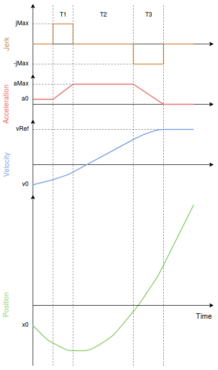

# Jerk-limited Type Trajectory for Multicopters

The Jerk-limited trajectory type should be used when smooth motion is required in response to user stick input or mission changes (e.g.: for filming, mapping, cargo).
It generates symmetric smooth S-curves where the jerk and acceleration limits are always guaranteed.

Enable this trajectory type using the following parameter settings: [MPC_POS_MODE=3](../advanced_config/parameter_reference.md#MPC_POS_MODE), [MPC_AUTO_MODE=1](../advanced_config/parameter_reference.md#MPC_AUTO_MODE).

> **Note** [Setpoint Tuning (Trajectory Generator)](../config_mc/mc_trajectory_tuning.md) also supports [MC Slew-rate Trajectory Tuning](../config_mc/mc_slew_rate_type_trajectory.md) for faster (albeit "jerky") response.

## Trajectory Generator

The graph below shows a typical jerk-limited profile with the following constraints:
- `jMax`: maximum jerk
- `a0`: initial acceleration 
- `aMax`: maximum acceleration
- `a3`: final acceleration (always 0)
- `v0`: initial velocity
- `vRef`: desired velocity

The constraints `jMax`, `aMax` are configurable by the user via parameters and can be different in manual position control and auto mode.

The resulting velocity profile is often called "S-Curve".

## Manual Mode

In manual position mode, the sticks are mapped to velocity where a full stick deflection corresponds to [MPC_VEL_MANUAL](../advanced_config/parameter_reference.md#MPC_VEL_MANUAL).

### Constraints

XY-plane:
- `jMax`: [MPC_JERK_MAX](../advanced_config/parameter_reference.md#MPC_JERK_MAX)
- `aMax`: [MPC_ACC_HOR_MAX](../advanced_config/parameter_reference.md#MPC_ACC_HOR_MAX)

Z-axis:
- `jMax`: [MPC_JERK_MAX](../advanced_config/parameter_reference.md#MPC_JERK_MAX)
- `aMax` (upward motion): [MPC_ACC_UP_MAX](../advanced_config/parameter_reference.md#MPC_ACC_UP_MAX)
- `aMax` (downward motion): [MPC_ACC_DOWN_MAX](../advanced_config/parameter_reference.md#MPC_ACC_DOWN_MAX)

## Auto Mode

In auto mode, the desired velocity is [MPC_XY_CRUISE](../advanced_config/parameter_reference.md#MPC_XY_CRUISE) but this value is automatically adjusted depending on the distance to the next waypoint, the maximum possible velocity in the waypoint and the maximum desired acceleration and jerk.

### Constraints

XY-plane:
- `jMax`: [MPC_JERK_AUTO](../advanced_config/parameter_reference.md#MPC_JERK_AUTO)
- `aMax`: [MPC_ACC_HOR](../advanced_config/parameter_reference.md#MPC_ACC_HOR)

Z-axis:
- `jMax`: [MPC_JERK_AUTO](../advanced_config/parameter_reference.md#MPC_JERK_AUTO)
- `aMax` (upward motion): [MPC_ACC_UP_MAX](../advanced_config/parameter_reference.md#MPC_ACC_UP_MAX)
- `aMax` (downward motion): [MPC_ACC_DOWN_MAX](../advanced_config/parameter_reference.md#MPC_ACC_DOWN_MAX)

Distance to velocity gains when close to a waypoint:
- [MPC_XY_TRAJ_P](../advanced_config/parameter_reference.md#MPC_XY_TRAJ_P)
- [MPC_Z_TRAJ_P](../advanced_config/parameter_reference.md#MPC_Z_TRAJ_P)

### Related Parameters

- [MPC_XY_VEL_MAX](../advanced_config/parameter_reference.md#MPC_XY_VEL_MAX)
- [MPC_Z_VEL_MAX_UP](../advanced_config/parameter_reference.md#MPC_Z_VEL_MAX_UP)
- [MPC_Z_VEL_MAX_DN](../advanced_config/parameter_reference.md#MPC_Z_VEL_MAX_DN)
- [MPC_TKO_SPEED](../advanced_config/parameter_reference.md#MPC_TKO_SPEED)
- [MPC_LAND_SPEED](../advanced_config/parameter_reference.md#MPC_LAND_SPEED)
- [MPC_LAND_ALT1](../advanced_config/parameter_reference.md#MPC_LAND_ALT1)
- [MPC_LAND_ALT2](../advanced_config/parameter_reference.md#MPC_LAND_ALT2)
