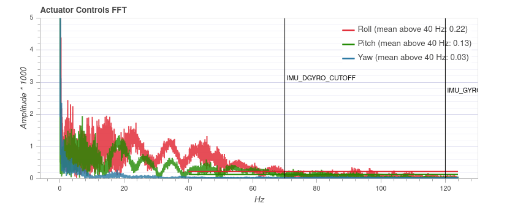

# Racer Setup

This page describes how to setup and configure a racer for optimal performance (in particular for [Acro mode](../flight_modes/acro_mc.md)).

Keep in mind that racers are fast vehicles, specifically designed to be overpowered! 
You should already have some experience, or let someone with experience help you.

> **Tip** Many things described here can also be applied to improve the flight performance of other types of multicopters.

> **Note** A racer usually omits some sensors (e.g. GPS). As a result, fewer failsafe options are available.

## Build Options

A racer usually omits some sensors.

The minimal configuration is to use only a gyro and accelerometer sensor.

> **Note** If the board has an internal magnetometer, it should not be used (small racers are particularly prone to strong electromagnetic interference).

Racers typically do not have a GPS as it adds some weight and is prone to damage during crashes (a GPS + external magnetometer must be placed on a GPS mast away from high currents to avoid magnetic interference, which unfortunately means that it is easy to break). 

There are however some benefits in adding GPS, particularly for beginners:
- You can go into position hold and the vehicle will just stay in one place.
  This is handy if you lose the orientation or need a brake. 
  It can also be used to land safely.
- [Return mode](../flight_modes/return.md) can be used, either on a switch or as RC loss/low
  battery failsafe.
- You will have the last position when it crashes.
- The log contains the flight track, which means you can review the flight (in 3D).
  This can help to improve your acrobatic flight skills.

> **Note** During aggressive acrobatic maneuvers the GPS can lose its position fix for a short time.
> If you switch into position mode during that time, altitude mode will be used instead until the position becomes valid again.

## Hardware Setup

The following paragraphs describe a few important points when building the vehicle. 
If you need complete build instructions, you can follow the
[QAV-R 5" KISS ESC Racer](../frames_multicopter/qav_r_5_kiss_esc_racer.md) build log.

### Vibration Setup

There are various mounting approaches to reduce vibrations. For example, the flight controller can be mounted with vibration dampening foam, or using [O-rings](../frames_multicopter/qav_r_5_kiss_esc_racer.md#mounting).

While there is no single best method, you will typically have fewer problems with vibrations if you use high-quality components (frame, motors, props) as for example used in the [QAV-R 5" KISS ESC Racer](../frames_multicopter/qav_r_5_kiss_esc_racer.md).

Make sure to use **balanced props**. 

### Center of Gravity

Make sure that the center of gravity is as close as possible to the center of thrust. 
Left-right balance is usually not a problem, but front-back balance may be.
You can move the battery until it is correct and mark it on the frame so you will always place it correctly.

> **Note** The integral term can account for an imbalanced setup, and a custom mixer can do that even better.
  However it is best to fix any imbalance as part of the vehicle setup.

### Motor Ordering
If you plan to use a 4-in-1 ESC, such as the [Hobbywing XRotor Micro 40A 4in1](http://www.hobbywing.com/goods.php?id=588), you will notice that it uses a motor ordering that is different from the one that PX4 uses.
PX4 allows you to change the motor ordering in software via [MOT_ORDERING](../advanced_config/parameter_reference.md#MOT_ORDERING) parameter. You can select the Betaflight/Cleanflight motor ordering that is typically used on these 4-in-1 ESCs.

## Software Setup

After having built the racer, you will need to configure the software.
Go through the [Basic Configuration Guide](../config/README.md) and choose the [Generic 250 Racer](../airframes/airframe_reference.md#copter_quadrotor_x_generic_250_racer) airframe, which already sets some racer-specific parameters.

These parameters are important:
- Enable One-Shot by setting [PWM_RATE](../advanced_config/parameter_reference.md#PWM_RATE) to 0.
- Set the maximum roll-, pitch- and yaw rates for Manual/Stabilized mode as
  desired: [MC_ROLLRATE_MAX](../advanced_config/parameter_reference.md#MC_ROLLRATE_MAX), [MC_PITCHRATE_MAX](../advanced_config/parameter_reference.md#MC_PITCHRATE_MAX) and [MC_YAWRATE_MAX](../advanced_config/parameter_reference.md#MC_YAWRATE_MAX).
  The maximum tilt angle is configured with [MPC_MAN_TILT_MAX](../advanced_config/parameter_reference.md#MPC_MAN_TILT_MAX).
- The minimum thrust [MPC_MANTHR_MIN](../advanced_config/parameter_reference.md#MPC_MANTHR_MIN) should be set to 0.
- Disable RC input filtering by setting [RC_FLT_CUTOFF](../advanced_config/parameter_reference.md#RC_FLT_CUTOFF) to 0.

### Estimator

If you use a GPS you can skip this section and use the default estimator.
Otherwise you should switch to the Q attitude estimator, which works without a magnetometer or barometer. 

To select it, set [SYS_MC_EST_GROUP](../advanced_config/parameter_reference.md#SYS_MC_EST_GROUP) to 1, and change the
following parameters:
- Set [SYS_HAS_MAG](../advanced_config/parameter_reference.md#SYS_HAS_MAG) to 0 if the system does not have a magnetometer.
- Set [SYS_HAS_BARO](../advanced_config/parameter_reference.md#SYS_HAS_BARO) to 0 if the system does not have a barometer.
- Configure the Q estimator: set [ATT_ACC_COMP](../advanced_config/parameter_reference.md#ATT_ACC_COMP) to 0, [ATT_W_ACC](../advanced_config/parameter_reference.md#ATT_W_ACC) to 0.4 and
  [ATT_W_GYRO_BIAS](../advanced_config/parameter_reference.md#ATT_W_GYRO_BIAS) to 0. You can tune these later if you wish.

### Failsafe

Configure [RC loss and low battery failsafe](../config/safety.md). 
If you do not use a GPS, set the failsafe to **Lockdown**, which turns off the motors. 
Test RC loss on the bench without props attached by turning off the remote when the vehicle is armed.

Make sure to assign a [kill switch](../config/safety.md#kill_switch) or an [arming switch](../config/safety.md#arming_switch). Test it and train to use it!

### PID Tuning

> **Note** Make sure to calibrate the ESCs before doing any tuning.

At this point you should be ready for a first test flight.

If it goes well, do a first pass of [PID tuning](../config_mc/pid_tuning_guide_multicopter.md) (ignore the thrust curve settings).
The vehicle needs to be **undertuned**, meaning the **P** and **D** gains should be set too low - such that there are no oscillations from the controller that could be interpreted as noise (the default gains might be good enough). 
This is important for the [filter](#filters) tuning.
There will be a second PID tuning round later.

### Control Latency {#control_latency}

The *control latency* is the delay from a physical disturbance of the vehicle until the motors react to the change.

> **Tip** It is *crucial* to reduce the control latency as much as possible — a lower latency allows you to increase the rate **P** gains, which means better flight performance. 
Even one millisecond added to the latency makes a difference. 

These are the factors that affect the latency:
- A soft airframe or soft vibration mounting increases latency (they act as a filter).
- Low-pass filters in software and on the sensor chip trade off increased latency for improved noise filtering.
- PX4 software internals: the sensor signals need to be read in the driver and then pass through the controller to the output driver.
- The IO chip (MAIN pins) adds about 5.4 ms latency compared to using the AUX pins (this does not apply to a *Pixracer* or *Omnibus F4*, but does apply to a Pixhawk).
  To avoid the IO delay, disable [SYS_USE_IO](../advanced_config/parameter_reference.md#SYS_USE_IO) and attach the motors to the AUX pins instead.
- PWM output signal: enable One-Shot to reduce latency ([PWM_RATE](../advanced_config/parameter_reference.md#PWM_RATE)=0) 

### Filters {#filters}

<!-- TODO: this probably should be documented somewhere else -->
As mentioned in the previous section, filters affect the control latency. 

This is the filtering pipeline for the controllers in PX4:
- On-chip DLPF for the gyro sensor. 
  The cutoff frequency is set to 98Hz and it is sampled at 1kHz.
- Low-pass filter on the gyro sensor data.
  It can be configured with the [IMU_GYRO_CUTOFF](../advanced_config/parameter_reference.md#IMU_GYRO_CUTOFF) parameter.
- A separate low-pass filter on the D-term.
  The D-term is most susceptible to noise while slightly increased latency does not negatively affect performance.
  For this reason the D-term has a separately-configurable low-pass filter, [IMU_DGYRO_CUTOFF](../advanced_config/parameter_reference.md#IMU_DGYRO_CUTOFF).
- A slewrate filter on the motor outputs ([MOT_SLEW_MAX](../advanced_config/parameter_reference.md#MOT_SLEW_MAX)).
  Generally not used.

To reduce the control latency, we want to increase the cutoff frequency for the low-pass filters.
However this is a trade-off as it will also increase the noise of the signal, which is fed to the motors.
Noise on the motors has the following consequences:
- Motors and ESCs can get hot, to the point where they get damaged.
- Reduced flight time because the motors continuously change their speed.
- Visible random small twitches.

The best filter settings depend on the vehicle.
The defaults are set conservatively — such that they work on lower-quality setups as well.

#### Filter Tuning

First make sure to have the high-rate logging profile activated ([SDLOG_PROFILE](../advanced_config/parameter_reference.md#SDLOG_PROFILE) parameter).
[Flight Review](../getting_started/flight_reporting.md) will then show an FFT plot for the roll, pitch and yaw controls.

> **Warning** Do not try to fix a vehicle that suffers from high vibrations with filter tuning. Instead fix the vehicle hardware setup.

Filter tuning is best done by reviewing flight logs. 
You can do multiple flights right after each other with different parameters and then inspect all logs, 
but make sure to disarm in between so that separate log files are created.

The performed flight maneuver can simply be hovering in [Manual/Stabilized mode](../flight_modes/manual_stabilized_mc.md) with some rolling and pitching to all directions and some increased throttle periods.
The total duration does not need to be more than 30 seconds. 
In order to better compare, the maneuver should be similar in all tests.

First tune the gyro filter [IMU_GYRO_CUTOFF](../advanced_config/parameter_reference.md#IMU_GYRO_CUTOFF) by increasing it in steps of 10 Hz while using a low D-term filter value ([IMU_DGYRO_CUTOFF](../advanced_config/parameter_reference.md#IMU_DGYRO_CUTOFF) = 30).  
Upload the logs to https://logs.px4.io and compare the *Actuator Controls FFT* plot. 
Set the cutoff frequency to a value before the noise starts to increase noticeably (for frequencies around and above 60 Hz). 
Then tune the D-term filter (`IMU_DGYRO_CUTOFF`) in the same way. 

Below is an example for three different filter values (40Hz, 70Hz, 90Hz). 
At 90 Hz the general noise level starts to increase (especially for roll), and thus a cutoff frequency of 70 Hz is a safe setting.

> **Note** The plot cannot be compared between different vehicles, as the y axis scale can be different. 
> On the same vehicle it is consistent and independent of the flight duration though.

### PID Tuning (Second Round)

Now do a second round of PID tuning, this time as tight as possible, and also tune the thrust curve.

### Airmode

After you verified that the vehicle flies well at low and high throttle, you can enable [airmode](../config_mc/pid_tuning_guide_multicopter.md#airmode) with the [MC_AIRMODE](../advanced_config/parameter_reference.md#MC_AIRMODE) parameter.
This feature makes sure that the vehicle is still controllable and tracks the rate at low throttle.

Happy flipping :)
