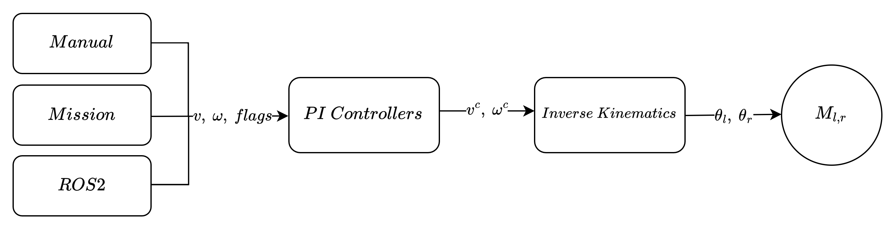

# Differential Drive Rover Configuration & Tuning

This is the configuration document for a [Differential Drive Rover](../airframes/airframe_reference.md#rover_rover_aion_robotics_r1_ugv), this rover type is very similar to also known as "Tank Drive & Skid Steer". This type of rover control type is essentially what you would find in a modern robot vacuum cleaner, also known as a "Roomba". 

## Firmware & Basic Settings 

1. Run _QGroundControl_
2. Flash the firmware for your current release or master (PX4 `main` branch build).
3. In the [Frame setup](../config/airframe.md) section select the appropriate Rover airframe.

### Configuration Parameters

Proper configuration of the rover's parameters is crucial for optimal control and stability. The parameters are divided into different categories based on their purpose.

#### Geometric Parameters

- `RDD_WHEEL_BASE`: This parameter defines the distance between the centers of the left and right wheels. It is a critical parameter for the inverse kinematics calculations used to translate the desired linear and angular velocities into individual wheel speeds.

- `RDD_WHEEL_RADIUS`: This parameter specifies the radius of the rover's wheels. Along with the wheel base, it is used in the inverse kinematics calculations to determine the appropriate wheel speeds for a given desired motion.

#### Motion Constraints

- `RDD_MAX_JERK`: This parameter limits the rate of change of acceleration/deceleration, resulting in smoother motion profiles and reducing the risk of sudden jerks or oscillations.

- `RDD_MAX_ACCEL`: This parameter sets the maximum acceleration (in meters per second squared) for the rover, limiting the rate at which the rover can increase or decrease its speed.

Proper configuration of these parameters is essential for achieving the desired performance and stability of the Differential Drive Rover. The geometric parameters define the rover's physical characteristics, while the speed parameters control the maximum attainable velocities. The control gains dictate the responsiveness and accuracy of the control system, and the motion constraints ensure smooth and safe operation.

### Control Structure

In this control structure, the user can choose between three sources for the setpoints, all of which use the [DifferentialDriveSetpoint](../msg_docs/DifferentialDriveSetpoint.md) message:

1. Manual setpoint
2. Mission setpoint
3. ROS2 setpoint

The `DifferentialDriveSetpoint` message includes:

- `speed` (float32): Collective roll-off speed in body x-axis [m/s]
- `closed_loop_speed_control` (bool): True if speed is controlled using estimator feedback, false if direct feed-forward
- `yaw_rate` (float32): Yaw rate [rad/s]
- `closed_loop_yaw_rate_control` (bool): True if yaw rate is controlled using gyroscope feedback, false if direct feed-forward

Regardless of the source (manual, mission, or ROS2), the setpoints (`v, ω, flags`) are sent through the `DifferentialDriveSetpoint` message to the PI controllers. The controlled setpoints (`v', ω'`) are then passed to the inverse kinematics module, which calculates the wheel angular velocities (`θl, θr`) for the left and right wheels, respectively. These wheel angular velocities are used to control the left and right motors.

### Tuning Guide

Once the basic configuration is complete, you may need to fine-tune the control gains and motion constraints to achieve the desired performance. The tuning process involves adjusting the parameters based on empirical testing and observing the rover's behavior in various scenarios.

#### Manual Control Tuning

The following parameters allow you to adjust the maximum speed and angular velocity of the rover during manual control:

- `RDD_SPEED_SCALE`: Scales the maximum forward/reverse speed. A value of 1 represents the maximum configured speed, while lower values limit the top speed.
  
- `RDD_ANG_SCALE`: Scales the maximum angular (rotational) velocity. A value of 1 represents the maximum configured angular velocity, while lower values limit the maximum rotation rate.
  
- `RDD_WHEEL_SPEED`: Sets the maximum wheel speed in radians per second, which is used to calculate the rover's maximum linear and angular velocities based on the wheel radius and wheelbase.

These parameters can be adjusted to suit your needs, such as reducing the maximum speed or angular velocity for increased control or safety.

#### Controller Tuning

The following parameters control the gains of the Proportional-Integral (PI) controllers responsible for maintaining the desired heading, speed, and angular velocity:

- `RDD_P_HEADING`: Proportional gain for the heading controller, adjusting the rover's rotation rate to maintain the desired heading.
  
- `RDD_P_SPEED`: Proportional gain for the speed controller, adjusting the rover's linear velocity to maintain the desired speed.
  
- `RDD_I_SPEED`: Integral gain for the ground speed controller, helping to eliminate steady-state errors in the rover's linear velocity.
  
- `RDD_P_ANG_VEL`: Proportional gain for the angular velocity controller, adjusting the rover's rotation rate to maintain the desired angular velocity.
  
- `RDD_I_ANG_VEL`: Integral gain for the angular velocity controller, helping to eliminate steady-state errors in the rover's rotation rate.

To tune the controller gains, it is recommended to measure the step responses and adjust the PI gains to achieve the desired performance. Higher proportional gains will increase the responsiveness but may lead to overshoot and oscillations, while higher integral gains can help eliminate steady-state errors but may cause instability if set too high.

It's crucial to consider the characteristics of the terrain, payload, and environmental conditions when tuning the parameters for optimal performance. Extensive testing in different environments and scenarios is recommended to ensure the rover's behavior meets your requirements.

