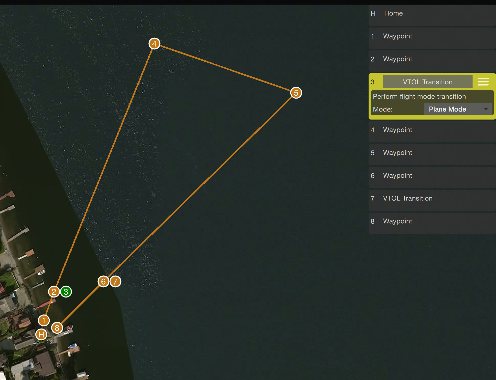
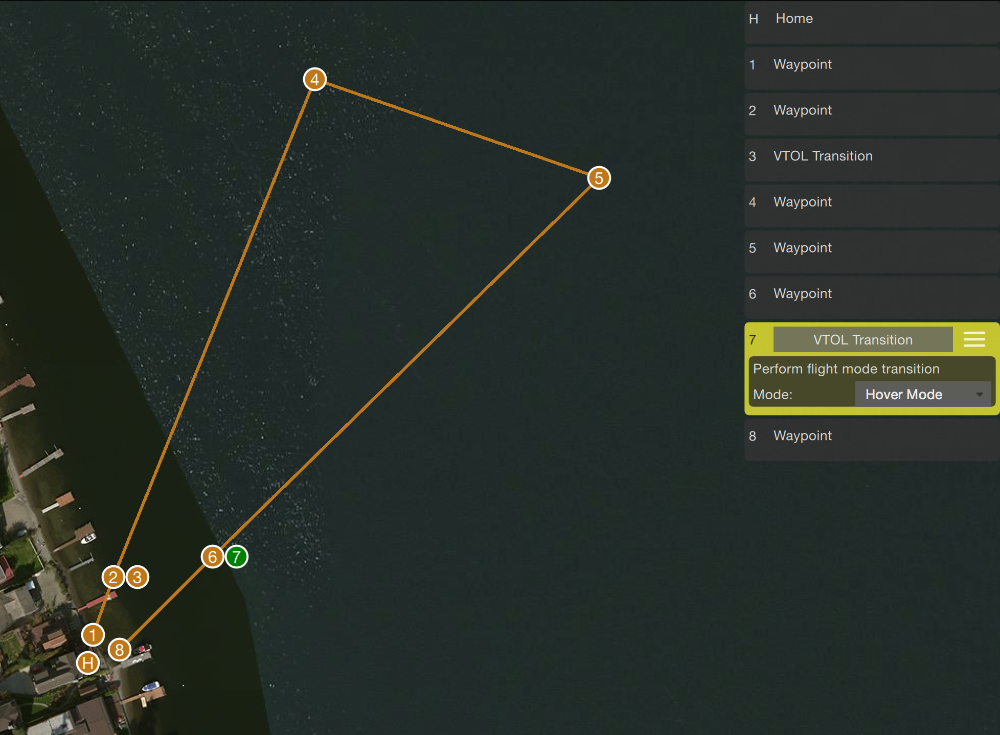

# VTOL Transition Testing

This topic explains how to test that a VTOL functions correctly, in particular during transition. It covers both on-bench and in-flight testing.

## Transition Overview

There are currently 3 ways of commanding the VTOL to transition:

* RC switch (2 position switch triggering AUX1)
* MAVLink command (`MAV_CMD_DO_VTOL_TRANSITION`)
* Transition during mission (`MAV_CMD_DO_VTOL_TRANSITION` internally)

When a transition is commanded (by either of the methods above), the VTOL enters the transition phase. If the VTOL receives a new transition command back to the old state during an ongoing transition it will switch back instantly. This is a safety feature to abort the transition when necessary. After the transition has been completed, the VTOL will be in the new state and a commanded transition into the reverse direction will take place normally.

> **Note** Make sure the AUX1 channel is assigned to an RC switch and that airspeed is working properly.

## On-Bench Testing

> **Caution** Remove all props! To test transition functionality properly, the vehicle needs to be armed.

By default, starting in multicopter (MC) mode:

* Arm the vehicle
* Check that motors are running in MC configuration (rudders/elevons should not move on roll/pitch/yaw inputs)
* Toggle transition switch
* (if applicable) wait on step 1 of the transition phase to complete
* Blow into pito tube to simulate airspeed
* (if applicable) step 2 of the transition phase will be executed
* Check that motors are running in fixed-wing configuration (roll/pitch/yaw inputs should control rudders/elevons)
* Toggle transition switch
* Observe back transition
* Check that motors are running in MC configuration (rudders/elevons should not move on roll/pitch/yaw inputs)

## In-Flight Testing

> **Tip** Before testing transitions in flight, make sure the VTOL is stable when flying in MC mode. In general, if something doesn't go as planned, transition to MC mode and let it recover (it does a good job when it's properly tuned).

In-flight transition requires at least the following parameters to match your airframe and piloting skills:

| Param | Notes |
| :--- | :--- |
| [VT_FW_PERM_STAB](../advanced_config/parameter_reference.md#VT_FW_PERM_STAB) | Turns permanent stabilization on/off for fixed-wing. |
| [VT_ARSP_BLEND](../advanced_config/parameter_reference.md#VT_ARSP_BLEND) | At which airspeed the fixed-wing controls become active. |
| [VT_ARSP_TRANS](../advanced_config/parameter_reference.md#VT_ARSP_TRANS) | At which airspeed the transition to fixed-wing is complete. |

There are more parameters depending on the type of VTOL, see the [parameter reference](../advanced_config/parameter_reference.md#vtol-attitude-control).

### Manual Transition Test

The basic procedure to test manual transitions is as follows:

* Arm and takeoff in MC mode
* Climb to a safe height to allow for some drop after transition
* Turn into the wind
* Toggle transition switch
* Observe transition from MC to Fixed Wing (FW) mode
* Fly in fixed-wing
* Come in at a safe height to allow for some drop after transition
* Toggle transition switch
* Observe transition from MC to FW mode
* Land and disarm

**MC-FW**

During the transition from MC to FW the following can happen:

1. The vehicle looses control while gaining speed (this can happen due to many factors).
   - Switch back to MC (this will happen instantly). Try to identify the problem (check setpoints)
2. The transition takes too long and the vehicle flies too far away before the transition finishes.
   - If blending airspeed is set and it has a higher airspeed already it is controllable as FW. Therefore it is possible to fly around and give it more time to finish the transition. Otherwise switch back to MC and try to identify the problem (check airspeed).

**FW-MC**

The transition from FW to MC is mostly unproblematic. In-case it seems to loose control the best approach is to let it recover.

### Automatic Transition Test (mission, commanded)

Commanded transitions only work in [Mission](../flight_modes/mission.md) or *Offboard* flight-mode. Make sure you are confident that you can operate the auto/offboard and transition switch in flight.

Switching to manual will reactivate the transition switch. For example, if you switch out of auto/offboard when in automatic fixed-wing flight and the transition switch is currently in MC position it will transition to MC right away.

#### Procedure

The following procedure can be used to test a mission with transition:

* Upload mission
* Takeoff in MC mode and climb to mission height
* Enable mission with switch
* Observe transition to fixed-wing flight
* Fly
* Observe transition back to MC mode
* Disable mission
* Land manually
  
During flight, the manual transition switch stays in MC position. If something doesn't go as planned, switch to manual and it will recover in MC mode.

#### Example Mission

The mission should contain at least (also see screenshots below):

* (1) position waypoint near takeoff location
* (2) position waypoint in the direction of the planned fixed-wing flight route
* (3) transition waypoint (to plane mode)
* (4) position waypoint further away (at least as far away as the transition needs)
* (6) position waypoint to fly back (a bit before takeoff location so back transition takes some distance)
* (7) transition waypoint (to hover mode)
* (8) position waypoint near takeoff location

