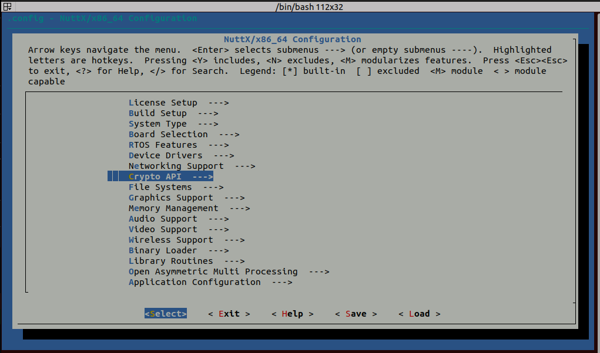
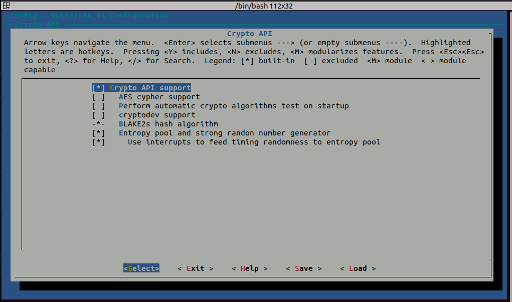
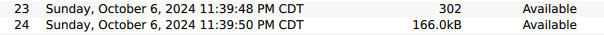

# Log Encryption

<Badge type="tip" text="PX4 v1.13" />

The [System Logger](../modules/modules_system.md#logger) can be used to create encrypted logs, which may then be decrypted manually before analysis.

The encryption algorithm used is XChaCha20, and the default wrapping algorithm used is RSA2048-OAEP.

::: warning
Log encryption is not enabled by default in PX4 firmware builds.
To use it you will need to build firmware with this feature enabled and then upload it to the flight controller (see instructions below).
:::

::: info
The encryption algorithm used can be changed by modifying [SDLOG_ALGORITHM](../advanced_config/parameter_reference.md#SDLOG_ALGORITHM).
However at time of writing, only XChaCha20 can actually be used (AES can be selected, but there is no implementation).
:::

## How ULog Encryption Works

When the ULog file is first opened:

- If [SDLOG_ALGORITHM](../advanced_config/parameter_reference.md#SDLOG_ALGORITHM) is set to default, a symmetric XChaCha20 key is generated and wrapped (encrypted) with RSA2048 public key encryption
- This wrapped key is stored on the SD Card with the ".ulgk" suffix.

While the ULog file is written to disk:

- The generated (plaintext) key is used to encrypt the data blocks right before writing to disk.

After the flight, there are two files:

- `.ulogc` (ulog cipher): the actual log file data, encrypted
- `.ulogk` (ulog wrapped key): the symmetric key, wrapped with rsa

However, these files will both have the normal `.ulg` suffix if downloading from QGroundControl.

## Creating a Flight Controller Build that contains Log Encryption

Crypto uses large amounts of flash memory, and is therefore not included in PX4 builds by default (the exception is the make target `px4-fmu-v5_cryptotest`).
Below we show how to add log encryption functionality to a flight controller target, using the `px4-fmu-v5` board as an example.

Reference the `cryptotest.px4board` file in `boards/px4/fmu-v5` for the arguments you will need to add to the `.px4board` file associated with the flight controller you are targeting.
You could also copy and paste `cryptotest.px4board` to the other flight controller's `boards/` location if you want this to be a separate build entirely (in that case, your `make` command would include `_cryptotest` at the end to add log encryption).

### Crypto .px4board arguments

| Argument                     | Description                                                                                                                        |
| ---------------------------- | ---------------------------------------------------------------------------------------------------------------------------------- |
| CONFIG_BOARD_CRYPTO          | Include crypto module in firmware.<br />= `y`: Enable log encryption.<br />= `n`: Disable log encryption. |
| CONFIG_DRIVERS_SW_CRYPTO     | Include the built-in PX4 crypto backend library (used by above library).<br />= `y`: Enable<br />= `n`: Disable               |
| CONFIG_DRIVERS_STUB_KEYSTORE | Includes the built-in PX4 stub keystore driver.<br />= `y`: Enable<br />= `n`: Disable                                              |
| CONFIG_PUBLIC_KEY0           | Location of public key for keystore index 0.<br />= `{path to key0}`                                                               |
| CONFIG_PUBLIC_KEY1           | Location of public key for keystore index 1.<br />= `{path to key1}`                                                               |

::: warning
Crypto uses a lot of flash memory, and many builds are close to their maximum capacity.
If you run into a build error telling you that you have gone above the maximum flash memory, you will need to disable other features in the `.px4board` file you are working on, or in the `default.px4board` file.
Be careful not to disable something you need.

As an example, you could disable SIH mode by setting `CONFIG_MODULES_SIMULATION_SIMULATOR_SIH=n` which could free up enough flash memory to allow crypto to be added.
:::

## Adding Log Encryption to NuttX Config

If the flight controller you are working with does not already have certain encryption settings enabled in the nuttX config, you will need to add them.
This is done using the `kconfig` tool, which is described in [PX4 Board Configuration (Kconfig)](../hardware/porting_guide_config.md).

To use Kconfig you will need to add these dependencies

```sh
sudo apt-get install libncurses-dev flex bison openssl libssl-dev dkms libelf-dev libudev-dev libpci-dev libiberty-dev autoconf
```

Now, in PX4, run the normal `make` command you would use to build the board you are targeting, but add "menuconfig" at the end of it.
As an example:

```sh
make px4_fmu-v5_cryptotest menuconfig
```

Now go to "Crypto API".



Check "Crypto API Support", "Blake2s hash algorithm", "Entropy pool and strong random number generator" and "Use interrupts to feed timing randomness to entropy pool".



::: tip
Some of these options can be tweaked if desired.
:::

After enabling encryption settings in kconfig, you may now build and test.

## Download Encrypted Log Files From QGroundControl

::: info
When you download log files off of QGroundControl, both the encrypted log and the symmetric key will have the ".ulg" suffix.
You can tell which one is the symmetric key by the file size.
The symmetric key is normally pretty small (around 300 bytes).
:::

The process for downloading log files is the same, except you will download two separate files per log.
Each time you fly, a log file, and a symmetric key are generated.
The only way to tell them apart is by file size.

As normal, go to **Analyze Tools -> Log Download** and select the log you wish to download.

Make sure to download both the encrypted log and symmetric key that were generated.



This screenshot shows both a generated symmetric key and the associated encrypted ULog file.

### Decrypt ULogs

Before you can analyze your encrypted logs, you will need to decrypt them.
There is a Python script that can be used to decrypt logs in Tools/decrypt_ulog.py.

decrypt_ulog.py takes 3 arguments:

1. The encrypted `.ulogc` file.
2. The symmetric key `.ulogk` file.
3. The decryption key (the RSA2048 `.pem` private key which is used to unwrap the `.ulogk` file).

```sh
usage: decrypt_ulog.py [-h] [ulog_file] [ulog_key] [rsa_key]

CLI tool to decrypt an ulog file

positional arguments:
  ulog_file   .ulog file
  ulog_key    .ulogk, encrypted key
  rsa_key     .pem format key for decrypting the ulog key

optional arguments:
  -h, --help  show this help message and exit

```

As an example:

```sh
python3 decrypt_ulog.py \
/home/john/Downloads/log_24_2024-10-6-23-39-50.ulg \
/home/john/Downloads/log_23_2024-10-6-23-39-48.ulg \
new_keys/private_key.pem
```

There will be no printed output on a successful decryption, and a new file is created with the ".ul" suffix instead of ".ulg".
Rename this back to a .ulg file and it is now ready for flight review!

### Generate Your Own Keys

In a production environment, you should your own generated keys rather than using the example keys.

- To generate the key0 public key, you can run the `Tools/cryptotools.py` python program.

As an example, this generates a file called new.pub and a new.json file in Tools/test_keys:

```sh
python3 Tools/cryptotools.py  --genkey Tools/test_keys/new
```

- To generate a rsa2048 private and public key, you can use openssl

```sh
openssl genpkey -algorithm RSA -out private_key.pem -pkeyopt rsa_keygen_bits:2048
```

Then, you can create a public key from this private key,

```sh
# Convert private_key.pem to a DER file
openssl rsa -pubout -in private_key.pem -outform DER -out public_key.der
# From the DER file, generate a public key in hex format, seperated by commas
xxd -p public_key.der | tr -d '\n' | sed 's/\(..\)/0x\1, /g' > public_key.pub
```

Now, you would modify your `.px4board` file to point CONFIG_PUBLIC_KEY0 to the path of `new.pub` that was generated via `cryptotools.py`, and set CONFIG_PUBLIC_KEY1 to `rsa2048.pub`.
The private key generated can be used in the decryption environment.
