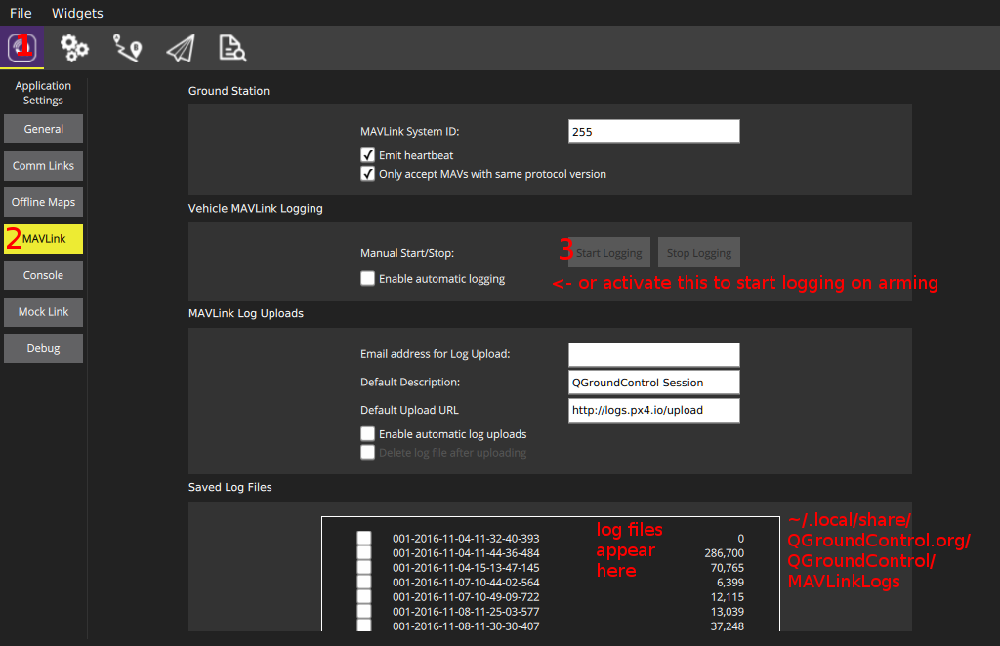

# Logging

The [system logger](../modules/modules_system.md#logger) is able to log any ORB topic with all included fields.
Everything necessary is generated from the `.msg` file, so that only the topic name needs to be specified.
An optional interval parameter specifies the maximum logging rate of a certain topic.
All existing instances of a topic are logged.

The output log format is [ULog](../dev_log/ulog_file_format.md).

## Usage
By default, logging is automatically started when arming, and stopped when disarming.
A new log file is created for each arming session on the SD card.
To display the current state, use `logger status` on the console.
If you want to start logging immediately, use `logger on`.
This overrides the arming state, as if the system was armed.
`logger off` undoes this.

Use
```
logger help
```
for a list of all supported logger commands and parameters.


## Configuration

The logging system is configured by default to collect sensible logs for use with [Flight Review](http://logs.px4.io).

Logging may further be configured using the [SD Logging](../advanced_config/parameter_reference.md#sd-logging) parameters.
The parameters you are most likely to change are listed below.

Parameter | Description
--- | ---
[SDLOG_MODE](../advanced_config/parameter_reference.md#SDLOG_MODE) | Logging Mode defines when logging starts and stops.<br />- `0`: log when armed until disarm (default).<br />- `1`: log from boot until disarm.<br />- `2`: log from boot until shutdown.
[SDLOG_PROFILE](../advanced_config/parameter_reference.md#SDLOG_PROFILE) | Logging profile. Use this to enable less common logging/analysis (e.g. for EKF2 replay, high rate logging for PID & filter tuning, thermal temperature calibration).
[SDLOG_MISSION](../advanced_config/parameter_reference.md#SDLOG_MISSION) | Create very small additional "Mission Log".<br>This log can *not* be used with *Flight Review*, but is useful when you need a small log for geotagging or regulatory compliance.

:::note
*Developers* can further configure what information is logged via the [logger](../modules/modules_system.md#logger) module (you would use this, for example, if you want to log your own topics).
For more information see: [Logging](../dev_log/logging.md).
:::

### SD Card Configuration

Separately, the list of logged topics can also be customized with a file on the SD card.
Create a file `etc/logging/logger_topics.txt` on the card with a list of topics (For SITL, it's `build/px4_sitl_default/tmp/rootfs/fs/microsd/etc/logging/logger_topics.txt`):
```
<topic_name> <interval> <instance>
```
The `<interval>` is optional, and if specified, defines the minimum interval in ms between two logged messages of this topic.
If not specified, the topic is logged at full rate.

The `<instance>` is optional, and if specified, defines the instance to log.
If not specified, all instances of the topic are logged.
To specify `<instance>`, `<interval>` must be specified. It can be set to 0 to log at full rate

The topics in this file replace all of the default logged topics.

Example : 
```
sensor_accel 0 0
sensor_accel 100 1
sensor_gyro 200
sensor_mag 200 1
```
This configuration will log sensor_accel 0 at full rate, sensor_accel 1 at 10Hz, all sensor_gyro instances at 5Hz and sensor_mag 1 at 5Hz.


## Scripts
There are several scripts to analyze and convert logging files in the [pyulog](https://github.com/PX4/pyulog) repository.


## Dropouts
Logging dropouts are undesired and there are a few factors that influence the
amount of dropouts:
- Most SD cards we tested exhibit multiple pauses per minute.
  This shows itself as a several 100 ms delay during a write command.
  It causes a dropout if the write buffer fills up during this time.
  This effect depends on the SD card (see below).
- Formatting an SD card can help to prevent dropouts.
- Increasing the log buffer helps.
- Decrease the logging rate of selected topics or remove unneeded topics from being logged (`info.py <file>` is useful for this).

## SD Cards

The following provides performance results for different SD cards.
Tests were done on a Pixracer; the results are applicable to Pixhawk as well.

:::note
The maximum supported SD card size for NuttX is 32GB (SD Memory Card Specifications Version 2.0).
:::

| SD Card | Mean Seq. Write Speed [KB/s] | Max Write Time / Block (average) [ms] |
| -- | -- | -- |
| SanDisk Extreme U3 32GB | 461 | **15** |
| Sandisk Ultra Class 10 8GB | 348 | 40 |
| Sandisk Class 4 8GB | 212 | 60 |
| SanDisk Class 10 32 GB (High Endurance Video Monitoring Card) | 331 | 220 |
| Lexar U1 (Class 10), 16GB High-Performance | 209 | 150 |
| Sandisk Ultra PLUS Class 10 16GB | 196 | 500 |
| Sandisk Pixtor Class 10 16GB | 334 | 250 |
| Sandisk Extreme PLUS Class 10 32GB | 332 | 150 |

More important than the mean write speed is the maximum write time per block (of 4 KB).
This defines the minimum buffer size: the larger this maximum, the larger the log buffer needs to be to avoid dropouts.
Logging bandwidth with the default topics is around 50 KB/s, which all of the SD cards satisfy.

By far the best card we know so far is the **SanDisk Extreme U3 32GB**.
This card is recommended, because it does not exhibit write time spikes (and thus virtually no dropouts).
Different card sizes might work equally well, but the performance is usually different.

You can test your own SD card with `sd_bench -r 50`, and report the results to https://github.com/PX4/PX4-Autopilot/issues/4634.

## Log Streaming

The traditional and still fully supported way to do logging is using an SD card on the FMU.
However there is an alternative, log streaming, which sends the same logging data via MAVLink.
This method can be used for example in cases where the FMU does not have an SD card slot (e.g. Intel® Aero Ready to Fly Drone) or simply to avoid having to deal with SD cards.
Both methods can be used independently and at the same time.

The requirement is that the link provides at least ~50KB/s, so for example a WiFi link.
And only one client can request log streaming at the same time.
The connection does not need to be reliable, the protocol is designed to handle drops.

There are different clients that support ulog streaming:
- `mavlink_ulog_streaming.py` script in PX4-Autopilot/Tools.
- QGroundControl:
  
- [MAVGCL](https://github.com/ecmnet/MAVGCL)

### Diagnostics
- If log streaming does not start, make sure the `logger` is running (see above), and inspect the console output while starting.
- If it still does not work, make sure that MAVLink 2 is used.
  Enforce it by setting `MAV_PROTO_VER` to 2.
- Log streaming uses a maximum of 70% of the configured MAVLink rate (`-r` parameter).
  If more is needed, messages are dropped.
  The currently used percentage can be inspected with `mavlink status` (1.8% is used in this example):
  ```
  instance #0:
          GCS heartbeat:  160955 us ago
          mavlink chan: #0
          type:           GENERIC LINK OR RADIO
          flow control:   OFF
          rates:
          tx: 95.781 kB/s
          txerr: 0.000 kB/s
          rx: 0.021 kB/s
          rate mult: 1.000
          ULog rate: 1.8% of max 70.0%
          accepting commands: YES
          MAVLink version: 2
          transport protocol: UDP (14556)
  ```
  Also make sure `txerr` stays at 0.
  If this goes up, either the NuttX sending buffer is too small, the physical link is saturated or the hardware is too slow to handle the data.
