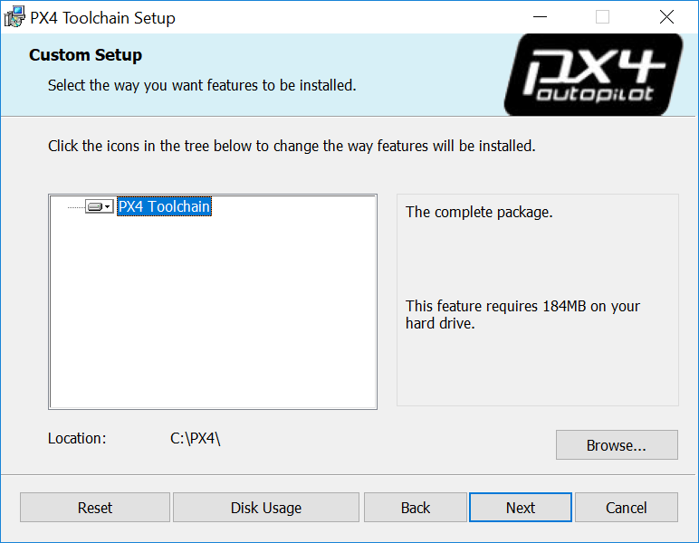
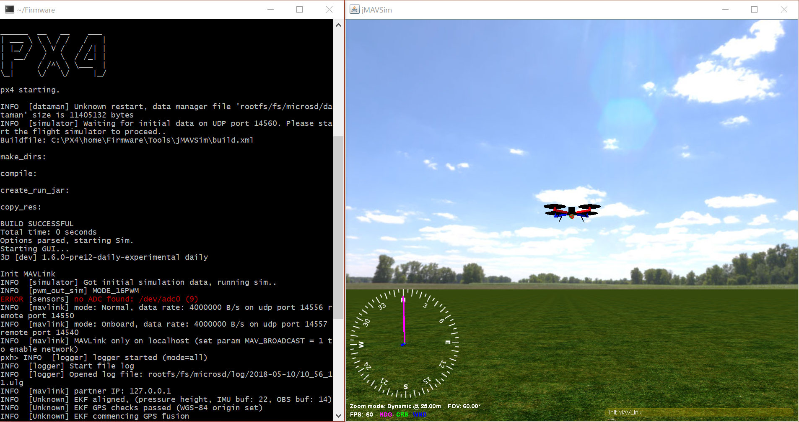

# Windows Development Environment

The following instructions explain how to set up a (Cygwin-based) PX4 development environment on Windows 10.
This environment can be used to build PX4 for:
* Pixhawk and other NuttX-based hardware
* [jMAVSim Simulation](../simulation/jmavsim.md)

:::tip
This setup is supported by the PX4 dev team.
To build other targets you will need to use a [different OS](../dev_setup/dev_env.md#supported-targets) (or an [unsupported windows development environment](../advanced/dev_env_unsupported.md)).
:::

<a id="installation"></a>
## Installation Instructions

1. Download the latest version of the ready-to-use MSI installer from: [Github releases](https://github.com/PX4/windows-toolchain/releases) or [Amazon S3](https://s3-us-west-2.amazonaws.com/px4-tools/PX4+Windows+Cygwin+Toolchain/PX4+Windows+Cygwin+Toolchain+0.9.msi) (fast download).
1. Run it, choose your desired installation location, let it install:
    
1. Tick the box at the end of the installation to *clone the PX4 repository, build and run simulation with jMAVSim* (this simplifies the process to get you started).
   :::note
   If you missed this step you will need to [clone the PX4-Autopilot repository manually](#getting_started).
   :::


<a id="getting_started"></a>
## Getting Started

The toolchain uses a specially configured console window (started by running the **run-console.bat** script) from which you can call the normal PX4 build commands:

1. Browse to the toolchain installation directory (default **C:\\PX4\\**)
1. Run **run-console.bat** (double click) to start the linux-like Cygwin bash console (you must use this console to build PX4).
1. Clone the PX4 PX4-Autopilot repository from within the console:
   
   :::note
   Skip this step if you ticked the installer option to *clone the PX4 repository, build and run simulation with jMAVSim*.
   Cloning only needs to be done once!
   :::

   ```bash
   # Clone the PX4-Autopilot repository into the home folder & loads submodules in parallel
   git clone --recursive -j8 https://github.com/PX4/PX4-Autopilot.git
   ```

   You can now use the console/PX4-Autopilot repository to build PX4.

1. For example, to run JMAVSim:
   ```bash
   # Navigate to PX4-Autopilot repo
   cd PX4-Autopilot
   # Build and runs SITL simulation with jMAVSim to test the setup
   make px4_sitl jmavsim
   ```
   The console will then display:

   


## Next Steps

Once you have finished setting up the command-line toolchain:

- Install the [QGroundControl Daily Build](https://docs.qgroundcontrol.com/en/releases/daily_builds.html)
- Continue to the [build instructions](../dev_setup/building_px4.md).


<a id="usage_instructions"></a>
## Troubleshooting

### File Monitoring Tools vs Toolchain Speed

Antivirus and other background file monitoring tools can significantly slow down both installation of the toolchain and PX4 build times.

You may wish to halt them temporarily during builds (at your own risk).

### Windows & Git Special Cases

#### Windows CR+LF vs Unix LF Line Endings

We recommend that you force Unix style LF endings for every repository you're working with using this toolchain (and use an editor which preserves them when saving your changes - e.g. Eclipse or VS Code).
Compilation of source files also works with CR+LF endings checked out locally, but there are cases in Cygwin (e.g. execution of shell scripts) that require Unix line endings (otherwise you get errors like `$'\r': Command not found.`).
Luckily git can do this for you when you execute the two commands in the root directory of your repo:
```
git config core.autocrlf false
git config core.eol lf
```

If you work with this toolchain on multiple repositories you can also set these two configurations globally for your machine:
```
git config --global ...
```
This is not recommended because it may affect any other (unrelated) git use on your Windows machine.

#### Unix Permissions Execution Bit

Under Unix there's a flag in the permissions of each file that tells the OS whether or not the file is allowed to be executed.
*git* under Cygwin supports and cares about that bit (even though the Windows NTFS file system does not use it).
This often results in *git* finding "false-positive" differences in permissions.
The resulting diff might look like this:
```
diff --git ...
old mode 100644
new mode 100755
```

We recommend globally disabling the permission check on Windows to avoid the problem:
```sh
# disable execution bit check globally for the machine
git config --global core.fileMode false 
```

For existing repositories that have this problem caused by a local configuration, additionally:
```sh
# remove the local option for this repository to apply the global one
git config --unset core.filemode 

# remove the local option for all submodules
git submodule foreach --recursive git config --unset core.filemode 
```


<!--
Instructions for building/updating this toolchain are covered in [Windows Cygwin Development Environment (Maintenance Instructions)](../advanced/windows_cygwin_toolchain_setup.md)
-->