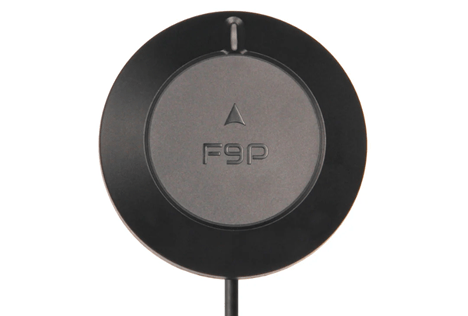

# Holybro H-RTK ZED-F9P Rover (DroneCAN)

## Where to Buy

Order this module from:

- [Holybro](https://holybro.com/collections/h-rtk-gps/products/h-rtk-zed-f9p-rover)

## Hardware Specifications

- Sensors
  - Ublox ZED-F9P GPS
    - Centimetre-level accuracy RTK positioning
    - IP66 Dust and Water Resistant
    - EMI Shielding for more accurate GNSS performance
    - Out of the box moving baseline support
    - DroneCAN via AP Periph firmware
  - Invensense ICM-42688 IMU
  - High-precision low-noise RM3100 compass
  - ICP20100 Barometer
- STM32G4 MCU
- Two JST GH CAN connectors (via pigtail)
- LED Indicators
  - Tri-coloured LED indicator
- Key Specifications
  - Working Temperature: -40C to 85C
  - Input power: 4.75-5.25V
  - Current Consumption: 250 mA
  - Weight: 117 grams

## Hardware Setup

### Wiring

The Holybro ZED-F9P GPS is connected to the CAN bus using a Pixhawk standard 4 pin JST GH cable.
For more information, refer to the [CAN Wiring](../can/index.md#wiring) instructions.

For dual F9P setups leveraging GPS yaw, connect both F9P CAN connectors to the same bus via a CAN or I2C expansion splitter or [hub](https://holybro.com/products/can-hub?_pos=1&_sid=eeb6b74b2&_ss=r).

## Firmware Setup

Holybro ZED-F9P GPS boards ship with "AP Periph" (Ardupilot DroneCAN firmware) already installed.

In order to update the AP Periph firmware, download the latest binary [here](https://firmware.ardupilot.org/AP_Periph/latest/HolybroG4_GPS/).

Then either flash the binary using the [DroneCAN FW Upgrade](https://docs.holybro.com/gps-and-rtk-system/zed-f9p-h-rtk-series/dronecan-fw-upgrade) guide and mission planner, or a serial-to-can converter (such as the Zubax babel) using the [DroneCAN GUI Tool](https://dronecan.github.io/Implementations/Libuavcan/Tutorials/11._Firmware_update/).

For the official DroneCAN FW Upgrade guide, you will need an _Ardupilot_ flashed autopilot.

### Enable DroneCAN

In order to use the Holybro ZED-F9P GPS board, connect it to the Pixhawk CAN bus and enable the DroneCAN driver by setting parameter [UAVCAN_ENABLE](../advanced_config/parameter_reference.md#UAVCAN_ENABLE) to `2` for dynamic node allocation (or `3` if using [DroneCAN ESCs](../dronecan/escs.md)).

The steps are:

- In _QGroundControl_ set the parameter [UAVCAN_ENABLE](../advanced_config/parameter_reference.md#UAVCAN_ENABLE) to `2` or `3` and reboot (see [Finding/Updating Parameters](../advanced_config/parameters.md)).
- Connect Holybro ZED-F9P GPS CAN to the Pixhawk CAN.

Once enabled, the module will be detected on boot and assigned a dynamic node ID via PX4.

DroneCAN configuration in PX4 is explained in more detail in [DroneCAN > Enabling DroneCAN](../dronecan/index.md#enabling-dronecan).

### Sensor Position Configuration

- For the the single Rover the module should be mounted with the included mast.
- For the Dual ZED-F9P setup (moving baseline), the DroneCAN modules should be placed at least 30cm apart on the airframe and elevated on a mast also.
  See the following [mast](https://holybro.com/products/30-antenna-mount?_pos=20&_sid=67b49d76b&_ss=r).
- F9P module arrow(s) should be pointing forward with respect to the autopilot orientation.

## Dual ZED-F9P DroneCAN Modules For Heading

In order to use dual ZED-F9P GPS heading in PX4, follow these steps:

- Open the QGroundControl parameters page.
- On the left side next to the parameters list, double-click on the _System_ section (this hides the section).
- Components should be visible on the left panel.
  Click on the first `_Component_<ID#>` that maps to the ZED-F9P DroneCAN node (below shown as _Component 124_).
- Click on the _GPS_ subsection and configure the parameters listed below
  - `GPS_TYPE`: Either set to `17` for moving baseline _base_, or set to `18` to be the moving baseline _rover_.
    One F9P MUST be _rover_, and the other MUST be _base_.
  - `GPS_AUTO_CONFIG`: set to 1 for both the rover and base
  - `GPS_POS_X`, `GPS_POS_Y`, `GPS_POS_Z`: This is the antenna placement, which for the F9P is internal to the module.
    This is the local offset (FRD) with respect to the autopilot.

Then in order to enable the subscription in DroneCAN, enable the following PX4 autopilot params:

- [UAVCAN_ENABLE](../advanced_config/parameter_reference.md#UAVCAN_ENABLE): Set to `1` to enable DroneCAN in PX4
- [EKF2_GPS_CTRL](../advanced_config/parameter_reference.md#EKF2_GPS_CTRL): Set to `15` to enable Dual antenna heading.
- [UAVCAN_SUB_GPS_R](../advanced_config/parameter_reference.md#UAVCAN_SUB_GPS_R): Set to `1` to enable subscription to GNSS relative.
- [GPS_YAW_OFFSET](../advanced_config/parameter_reference.md#GPS_YAW_OFFSET): Set to the clockwise angle (degrees) corresponding to base and rover orientation (e.g. 90 degrees when moving base to the left and rover to the right)

Once these params are enabled and the F9Ps are mounted to the airframe (assuming valid RTK fix) the LED's on both F9Ps should turn green.

Note that the Dual F9P heading is only accurate/valid if both F9P's are reporting a status of `RTK Fixed (6)`.
This means that dual heading will not work indoors or in areas with GPS interference/lack of coverage.
