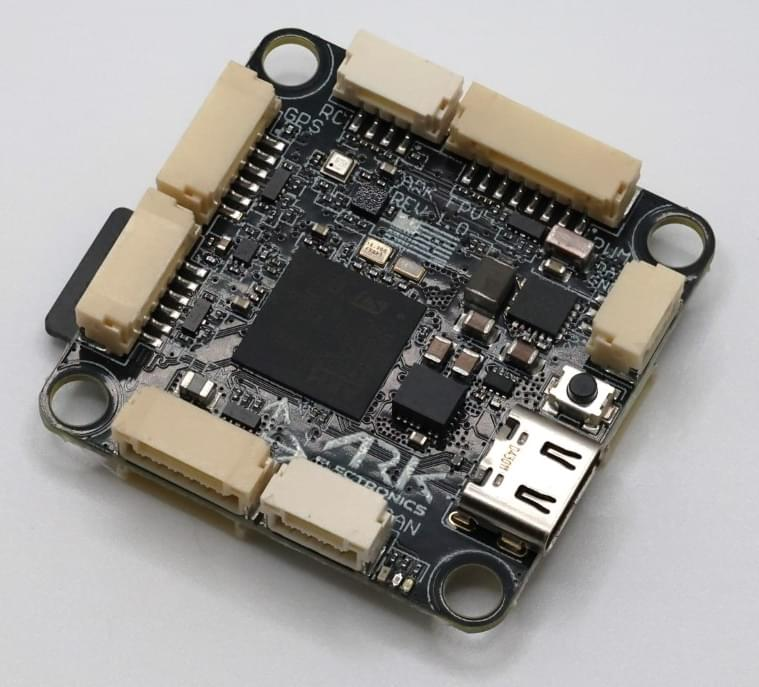

# ARK FPV Flight Controller

:::warning
PX4 does not manufacture this (or any) autopilot.
Contact the [manufacturer](https://arkelectron.com/contact-us/) for hardware support or compliance issues.
:::

The USA-built ARK FPV flight controller is based on the [ARKV6X](https://arkelectron.com/product/arkv6x/) in a 30.5mm standard mounting pattern, supporting a 3-12s battery input with a regulated 12V 2A output for video transmitters and payloads.

:::info
This flight controller is [manufacturer supported](../flight_controller/autopilot_manufacturer_supported.md).
:::

## Where To Buy

Order from [Ark Electronics](https://arkelectron.com/product/arkv6x/) (US)

## Documentation

See the documentation [Ark Electronics GitBook](https://arkelectron.gitbook.io/ark-documentation/flight-controllers/ark-fpv)

## Sensors

- [Invensense IIM-42653 Industrial IMU](https://invensense.tdk.com/products/motion-tracking/6-axis/iim-42653/)
- [Bosch BMP390 Barometer](https://www.bosch-sensortec.com/products/environmental-sensors/pressure-sensors/bmp390/)
- [ST IIS2MDC Magnetometer](https://www.st.com/en/magnetic-sensors/iis2mdc.html)

## Microprocessor

- [STM32H743IIK6 MCU](https://www.st.com/en/microcontrollers-microprocessors/stm32h743ii.html)
  - 480 MHz
  - 2 MB Flash
  - 1 MB RAM

## Power Requirements

- 5.5V - 54V
- 500 mA (300 mA main system, 200 mA heater)

## Additional Information

- Weight: 7.5 g g with MicroSD card
- Dimensions: 3.6 x 3.6 x 0.8 cm

## Pinout

See the [DS-10 Pixhawk Autopilot Bus Standard](https://arkelectron.gitbook.io/ark-documentation/flight-controllers/ark-fpv/pinout)

