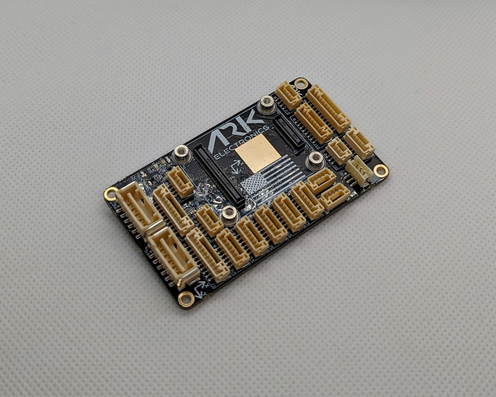
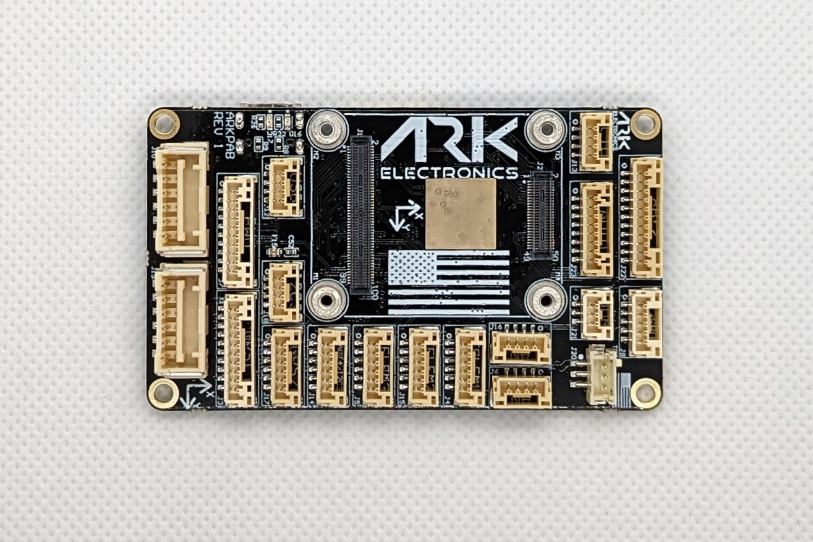
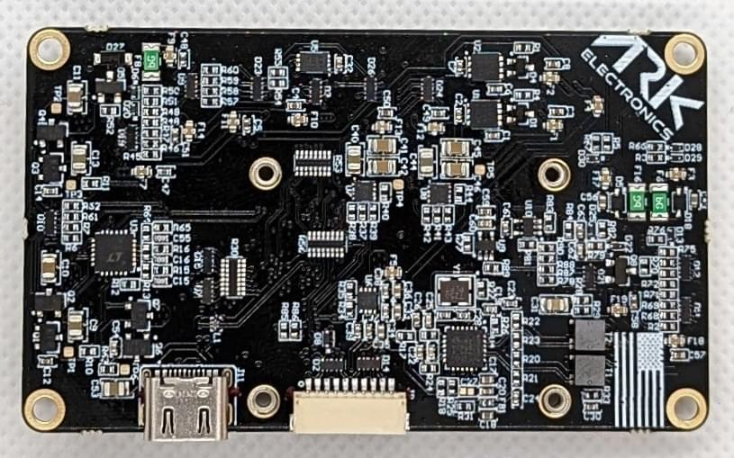

# ARK Pixhawk Autopilot Bus Carrier

:::warning
PX4 does not manufacture this (or any) autopilot.
Contact the [manufacturer](https://arkelectron.com/contact-us/) for hardware support or compliance issues.
:::

The ARK Pixhawk Autopilot Bus (PAB) Carrier is a USA-built flight controller carrier board, based on the [Pixhawk Autopilot Bus open source standard](https://github.com/pixhawk/Pixhawk-Standards).

The PAB form factor enables the ARK PAB Carrier to be used with any PAB-compatible flight controller, such as the [ARKV6X](../flight_controller/arkv6x.md).

## Features

- [Pixhawk Autopilot Bus (PAB) Form Factor](https://github.com/pixhawk/Pixhawk-Standards/blob/master/DS-010%20Pixhawk%20Autopilot%20Bus%20Standard.pdf?_ga=2.20605755.2081055420.1671562222-391294592.1671562222)
- USA Built

## Connectors

- PAB Board to Board Interface
  - 100 Pin Hirose DF40
  - 40 Pin Hirose DF40
- Dual Digital Power Module Inputs
  - 5V Input
  - I2C Power Monitor
  - 6 Pin Molex CLIK-Mate
- Ethernet
  - 100Mbps
  - Built in Magnetics
  - 4 Pin JST-GH
- Full GPS Plus Safety Switch Port
  - 10 Pin JST-GH
- Basic GPS Port
  - 6 Pin JST-GH
- Dual CAN Ports
  - 4 Pin JST-GH
- Triple Telemetry Ports with Flow - Control
  - 6 Pin JST-GH
- Eight PWM Outputs
  - 10 Pin JST-GH
- UART/I2C Port
  - 6 Pin JST-GH
- I2C Port
  - 4 Pin JST-GH
- PPM RC Port
  - 3 Pin JST-GH
- DSM RC Port
  - 3 Pin JST-ZH
- SPI Port
  - 11 Pin JST-GH
- ADIO Port
  - 8 Pin JST-GH
- Debug Port
  - 10 Pin JST-SH

## Additional Information

- Power Requirements
  - 5V
  - TBD
- Dimensions (Without Flight Controller Module)
  - 74mm x 43.5mm x 12mm

