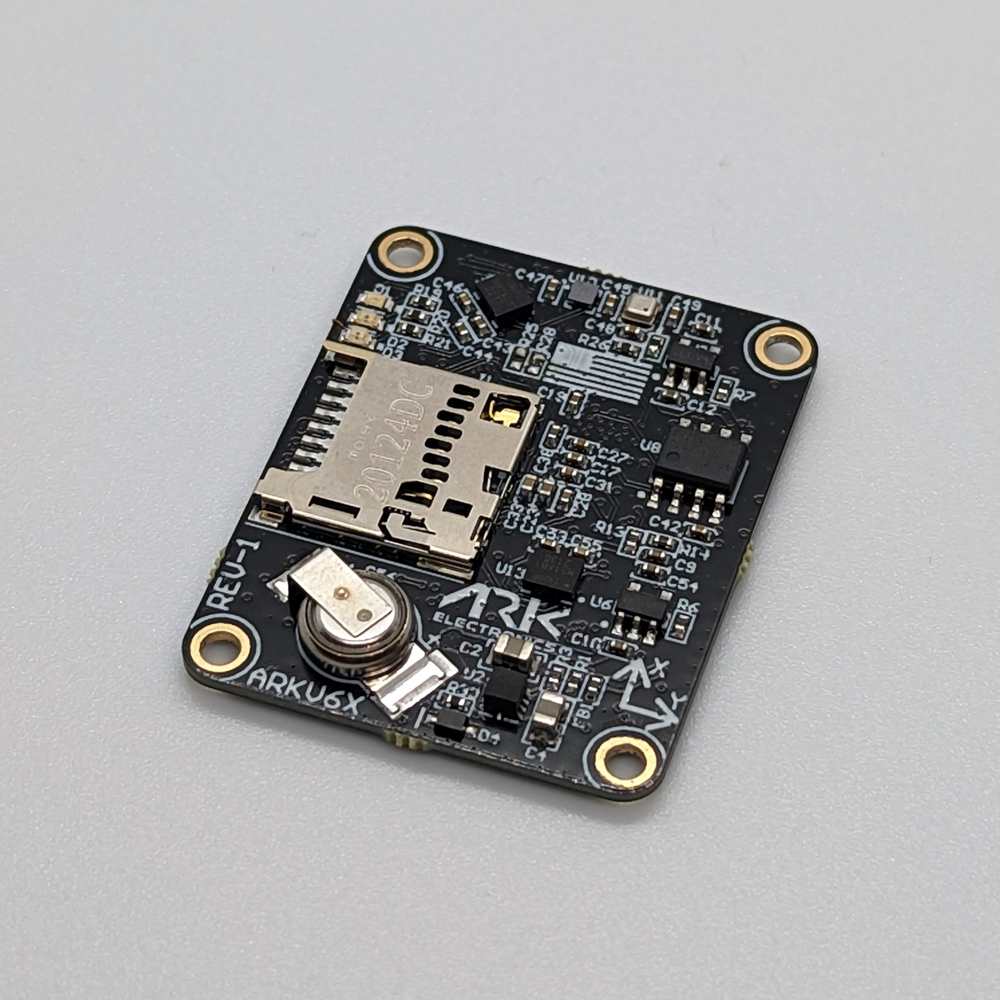

# ARK Electronics ARKV6X

:::warning PX4 does not manufacture this (or any) autopilot. Contact the [manufacturer](https://arkelectron.com/contact-us/) for hardware support or compliance issues. :::

USA built flight controller based on the [FMUV6X and Pixhawk Autopilot Bus open source standard](https://github.com/pixhawk/Pixhawk-Standards) with triple synced IMUs.

## Description

The ARKV6X flight controller is based on the [FMUV6X and Pixhawk Autopilot Bus open source sstandards](https://github.com/pixhawk/Pixhawk-Standards). With triple synced IMUs, data averaging, voting, and filtering is possible. The Pixhawk Autopilot Bus (PAB) form factor enables the ARKV6X to be used on any PAB carrier board. ARK Electronics also offers a compatible [PAB](../flight_controller/arkpab.md).

Pixhawk Autopilot Bus open source specifications

### Sensors

- [Dual Invensense ICM-42688-P IMUs](https://invensense.tdk.com/products/motion-tracking/6-axis/icm-42688-p/)
- [Invensense IIM-42652 Industrial IMU](https://invensense.tdk.com/products/smartindustrial/iim-42652/)
- [Bosch BMP390 Barometer](https://www.bosch-sensortec.com/products/environmental-sensors/pressure-sensors/pressure-sensors-bmp390.html)
- [Bosch BMM150 Magnetometer](https://www.bosch-sensortec.com/products/motion-sensors/magnetometers-bmm150/)

### Heater

- Designed with a 1W heater. Keeps sensors warm even in extreme conditions
- Sensors have very little drift over a range of temperatures

### Microprocessor

- [STM32H743IIK6 MCU](https://www.st.com/en/microcontrollers-microprocessors/stm32h743ii.html)
    - 480MHz
    - 2MB Flash
    - 1MB Flash

### Other Features

- FRAM
- [Pixhawk Autopilot Bus (PAB) Form Factor](https://github.com/pixhawk/Pixhawk-Standards/blob/master/DS-010%20Pixhawk%20Autopilot%20Bus%20Standard.pdf)
- LED Indicators
- MicroSD Slot
- USA Built

### Power Requirments

- 5V
    - 300mA

### Additional Information

- Weight | 5.0 g
- Dimensions | 3.6 x 2.9 x 0.5 cm

## Where To Buy

Order From [Ark Electronics](https://arkelectron.com/product/arkv6x/)

## Building Firmware

    make ark_fmu-v6x_default