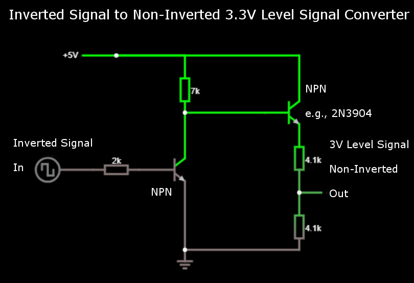

# BeagleBone Blue


## Quick Start

[BeagleBone Blue](https://beagleboard.org/blue) is an all-in-one Linux-based 
computer. Although it is optimized for robotics, this compact inexpensive 
board has all necessary sensors and peripherals needed by a flight controller. 
This topic shows how to set up the board to run PX4 with 
[librobotcontrol](https://github.com/StrawsonDesign/librobotcontrol) robotics 
package.

### OS Image

The latest official OS image for [BeagleBone Blue](https://beagleboard.org/blue) 
is available [here](https://beagleboard.org/latest-images), and test OS images 
are frequently released on [this site](https://rcn-ee.net/rootfs/bb.org/testing/). 
Refer to [this page](https://github.com/beagleboard/beaglebone-blue/wiki/Flashing-firmware) 
when flashing OS image. Other useful information can be found in 
[this FAQ](https://github.com/beagleboard/beaglebone-blue/wiki/Frequently-Asked-Questions-&lpar;FAQ&rpar;).


### Robot Control Library

On [BeagleBone Blue](https://beagleboard.org/blue), PX4 uses 
[librobotcontrol](https://github.com/StrawsonDesign/librobotcontrol) of 
version 1.0.0 or higher. BeagleBoard OS images come with librobotcontrol 
preinstalled. We need choose OS images in which librobotcontrol works 
properly. Optionally you can update to a realtime kernel, and if you do, 
re-check if librobotcontrol works properly with the realtime kernel.

One way to check if librobotcontrol works properly is to run rc_test_drivers 
which comes with librobotcontrol. As shown in the following example, all tests
should pass. Optionally run other tests such as rc_test_bmp, rc_test_mpu, etc.

```sh
debian@beaglebone:~$ rc_test_drivers

Kernel: 4.14.56-ti-rt-r64
BeagleBoard.org Debian Image 2018-07-22
Debian: 9.5

PASSED: gpio 0
PASSED: gpio 1
PASSED: gpio 2
PASSED: gpio 3
PASSED: pwm1
PASSED: pwm2
PASSED: eqep0
PASSED: eqep1
PASSED: eqep2
PASSED: pru-rproc
PASSED: uart1
PASSED: uart2
PASSED: uart4
PASSED: uart5
PASSED: i2c1
PASSED: i2c2
PASSED: spi
PASSED: LED
PASSED: ADC iio

Currently running on a:
MODEL_BB_BLUE
Robot Control library Version:
1.0.0

```

As of this writing, the latest OS images in which librobotcontrol works properly
is [bone-debian-9.5-iot-armhf-2018-07-22-4gb.img.xz](https://rcn-ee.net/rootfs/bb.org/testing/2018-07-22/stretch-iot/bone-debian-9.5-iot-armhf-2018-07-22-4gb.img.xz).

#### Setup Robot Control Library

If you want to build px4, there are additional setup steps for this library.

It seems that currently librobotcontrol debian package is only available on 
BeagleBoard products. Here are the ways to obtain the librobotcontrol on 
BeagleBone Blue:

1. use the one pre-installed in BeagleBoard images

2. install from debian package or repository 
```sh
    sudo apt update && sudo apt install librobotcontrol
```

3. install from source
```sh
    git clone https://github.com/StrawsonDesign/librobotcontrol.git
    cd librobotcontrol
    sudo make install
```

After acquiring the pre-built library,

* select librobotcontrol installation directory, and define it as LIBROBOTCONTROL_INSTALL_DIR environment variable so that other unwanted headers will not be included

* install robotcontrol.h and rc/* into $LIBROBOTCONTROL_INSTALL_DIR/include

 install pre-built native (ARM) version of librobotcontrol.* into $LIBROBOTCONTROL_INSTALL_DIR/lib

then the BeagleBone Blue target can be built on both cross compile host system 
and native build system, i.e., 
```sh
    make posix_bbblue_cross [upload]
```

### File Transfer from the Development Computer to the Target Board

In PX4 cross compile build system, rsync is used to transfer files from the 
development computer to the target board over a network (WiFi or Ethernet). 
For rsync over SSH with key authentication, setup SSH using steps similar 
to ones described [here](../flight_controller/raspberry_pi_navio2.md).

On development host computer, define BeagleBone Blue board as BBBluePX4 in 
/etc/hosts, and run the following command to build and upload files:
```sh
    make posix_bbblue_cross upload
```

To test the uploaded files on BeagleBone Blue board, run the following commands:

```sh
cd /home/debian/px4 
sudo ./bin/px4 -s px4.config 
```
Currently librobotcontrol requires root access.

Note that if you use a PX4 version before [Posix Shell](https://github.com/PX4/Firmware/pull/10173) 
is available, run the following commands instead:

```sh
cd /home/debian/px4 
sudo px4 posix-configs/px4.config 
```

### Native Builds (optional)

You can run PX4 builds directly on the BeagleBone Blue if you desire. This is the *native*
build. The other option is to run builds on a development computer which
cross-compiles for the BeagleBone Blue, and pushes the PX4 executable binary directly to the
BeagleBone Blue. This is the *cross-compiler* build, and the recommended one for developers
due to speed of deployment and ease of use.

For cross-compiling setups, you can skip this step.

The steps below will setup the build system on the BeagleBone Blue to that required by PX4.
Run these commands on the BeagleBone Blue itself!

```sh
sudo apt-get update
sudo apt-get install cmake python-empy
```

Then clone the Firmware directly onto the BeagleBone Blue.

### Building the Code

Continue with our [standard build system installation](https://dev.px4.io/en/setup/dev_env_linux.html).

### Autostart during Boot

Here is an example [/etc/rc.local]:

```sh
#!/bin/sh -e
#
# rc.local
#
# This script is executed at the end of each multiuser runlevel.
# Make sure that the script will "exit 0" on success or any other
# value on error.
#
# In order to enable or disable this script just change the execution
# bits.
#
# By default this script does nothing.

# wait for services to start up
/bin/sleep 25

cd /home/debian/px4 

#For PX4 version before Posix Shell (pull request https://github.com/PX4/Firmware/pull/10173) is available
#/home/debian/px4/px4 -d /home/debian/px4  /home/debian/px4/posix-configs/px4.config > /home/debian/px4/PX4.log & 
/home/debian/px4/bin/px4 -d -s /home/debian/px4/px4.config > /home/debian/px4/PX4.log & 

exit 0
```

Below is a systemd service example [/lib/systemd/system/px4-quad-copter.service]:

```sh
[Unit]
Description=PX4 Quadcopter Service
After=networking.service network-online.target 
StartLimitIntervalSec=0
Conflicts=px4-fixed-wing.service

[Service]
WorkingDirectory=/home/debian/px4
User=root
ExecStart=/home/debian/px4/bin/px4 -d -s /home/debian/px4/px4.config  

Restart=on-failure
RestartSec=1

[Install]
WantedBy=multi-user.target
```

### Miscellaneous

#### Power Servo Rail

When PX4 starts, it automatically applies power to servos.

#### Unique Features

BeagleBone Blue has some unique features such as multiple choices of WiFi 
interfaces. Refer to comments in /home/debian/px4/px4.config for usage of 
these features.

#### SBUS Signal Converter

SBUS signal from receiver (e.g., FrSky X8R) is an inverted signal. 
UARTs on BeagleBone Blue only can work with non-inverted 3.3V level signal. The 
following circuit is an example of signal converter which converts the inverted
input signal to a non-inverted 3.3V level output signal. The resistor values 
shown in the diagram reflect resistors that the author had on hand back then, 
and you can choose resistor values as you see fit.

