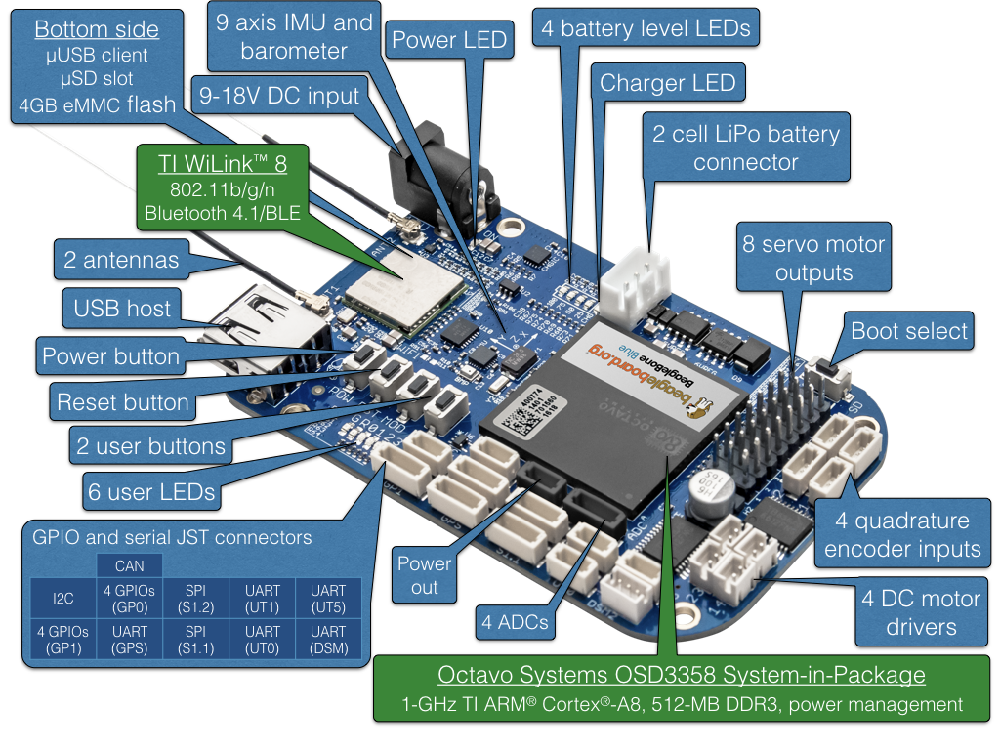
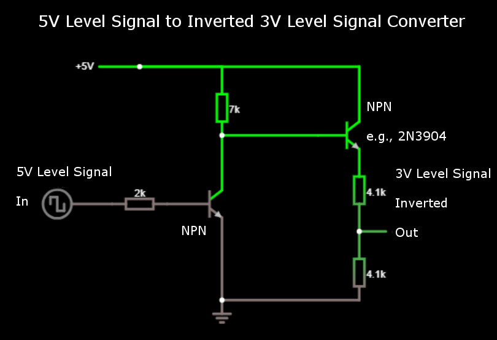

# BeagleBone Blue



## Quick Start

### OS Image

The latest official OS image for [BeagleBone Blue](https://beagleboard.org/blue) 
is available [here](https://beagleboard.org/latest-images), and test OS images 
are frequently released on [this site](https://rcn-ee.net/rootfs/bb.org/testing/). 
Refer to [this page](https://github.com/beagleboard/beaglebone-blue/wiki/Flashing-firmware) 
when flashing OS image. Other useful information can be found in 
[this FAQ](https://github.com/beagleboard/beaglebone-blue/wiki/Frequently-Asked-Questions-(FAQ) ).


### Robot Control Library

On [BeagleBone Blue](https://beagleboard.org/blue), PX4 uses 
[librobotcontrol](https://github.com/StrawsonDesign/librobotcontrol). 
BeagleBoard OS images come with librobotcontrol preinstalled. We need choose
OS images in which librobotcontrol works properly. Optionally you can update
to a realtime kernel, and if you do, re-check if librobotcontrol works properly
with the realtime kernel.

One way to check if librobotcontrol works properly is to run rc_test_drivers 
which comes with librobotcontrol. As shown in the following example, all tests
should pass. Optionally run other tests such as rc_test_bmp, rc_test_mpu, etc.

```sh
debian@beaglebone:~$ rc_test_drivers

Kernel: 4.14.58-ti-rt-r66
BeagleBoard.org Debian Image 2018-07-22
Debian: 9.5

PASSED: gpio 0
PASSED: gpio 1
PASSED: gpio 2
PASSED: gpio 3
ERROR:  ti-pwm driver not loaded for hrpwm1
PASSED: pwm2
PASSED: eqep0
PASSED: eqep1
PASSED: eqep2
PASSED: pru-rproc
PASSED: uart1
PASSED: uart2
PASSED: uart4
PASSED: uart5
PASSED: i2c1
PASSED: i2c2
PASSED: spi
PASSED: LED
PASSED: ADC iio

Currently running on a:
MODEL_BB_BLUE
Robot Control library Version:
1.0.0
```

As of this writing, the last OS images in which librobotcontrol works properly
is [bone-debian-9.5-iot-armhf-2018-07-22-4gb.img.xz](https://rcn-ee.net/rootfs/bb.org/testing/2018-07-22/stretch-iot/bone-debian-9.5-iot-armhf-2018-07-22-4gb.img.xz).

#### Setup Robot Control Library

If you want to build px4, there are additional setup steps for this library.

It seems that currently librobotcontrol debian package is only available on 
BeagleBoard products. Here are the ways to obtain the librobotcontrol on 
BeagleBone Blue:

1) use the one pre-installed in BeagleBoard images

2) install from debian package or repository (sudo apt update && sudo apt install librobotcontrol)

3) install from source
    git clone https://github.com/StrawsonDesign/librobotcontrol.git
    cd librobotcontrol
    sudo make install

After acquiring the pre-built library,

a) select and define LIBROBOTCONTROL_INSTALL_DIR environment variable so that other unwanted headers will not be included

b) install robotcontrol.h and rc/* into $LIBROBOTCONTROL_INSTALL_DIR/include

c) install pre-built native (ARM) version of librobotcontrol.* into $LIBROBOTCONTROL_INSTALL_DIR/lib

then the BeagleBone Blue target can be built on both cross compile host system 
and native build system, e.g., make posix_bbblue_cross [upload | upload_px4].


### File Transfer from the Development Computer to the Target Board

We use SCP to transfer files from the development computer to the target board 
over a network (WiFi or Ethernet). Setup SSH using steps similar to ones described
[here](../flight_controller/raspberry_pi_navio2.md).

On development host computer, define BeagleBone Blue board as BBBluePX4 in /etc/hosts.

On BeagleBone Blue board, create directory: /home/debian/px4/posix-configs. 
PX4 will be installed to /home/debian/px4.

To test your setup, try pushing a file from the development PC to BeagleBone Blue over the network now. 

```sh
echo "Hello" > hello.txt
scp hello.txt debian@BBBluePX4:/home/debian/px4/posix-configs
rm hello.txt
```
After verifying that the file was indeed copied, delete it.

### Native Builds (optional)

You can run PX4 builds directly on the BeagleBone Blue if you desire. This is the *native*
build. The other option is to run builds on a development computer which
cross-compiles for the BeagleBone Blue, and pushes the PX4 executable binary directly to the
BeagleBone Blue. This is the *cross-compiler* build, and the recommended one for developers
due to speed of deployment and ease of use.

For cross-compiling setups, you can skip this step.

The steps below will setup the build system on the BeagleBone Blue to that required by PX4.
Run these commands on the BeagleBone Blue itself!

```sh
sudo apt-get update
sudo apt-get install cmake python-empy
```

Then clone the Firmware directly onto the BeagleBone Blue.

### Building the Code

Continue with our [standard build system installation](https://dev.px4.io/en/setup/dev_env_linux.html).

### Autostart during Boot

Here is an example [/etc/rc.local]:

```sh
#!/bin/sh -e
#
# rc.local
#
# This script is executed at the end of each multiuser runlevel.
# Make sure that the script will "exit 0" on success or any other
# value on error.
#
# In order to enable or disable this script just change the execution
# bits.
#
# By default this script does nothing.

# wait for services to start up
/bin/sleep 25

cd /home/debian/px4 

/home/debian/px4/px4 -d /home/debian/px4  /home/debian/px4/posix-configs/px4.config > /home/debian/px4/PX4.log & 

exit 0
```

Here is a systemd service example [/lib/systemd/system/px4-quad-copter.service]:

```sh
[Unit]
Description=PX4 Quadcopter Service
After=networking.service network-online.target 
StartLimitIntervalSec=0
Conflicts=px4-fixed-wing.service

[Service]
WorkingDirectory=/home/debian/px4
User=root
ExecStart=/home/debian/px4/px4 -d /home/debian/px4/posix-configs/px4.config 

Restart=on-failure
RestartSec=1

[Install]
WantedBy=multi-user.target
```

### Miscellaneous

#### 5V Level Signal to Inverted 3V Level Signal Converter

SBUS signal from receiver (e.g., FrSky X8R) is a 5V level inverted signal. 
UARTs on BeagleBone Blue only work with un-inverted 3V level signal. The 
following circuit is an example of signal converter which converts 5V level
input signal to 3V level output signal:

