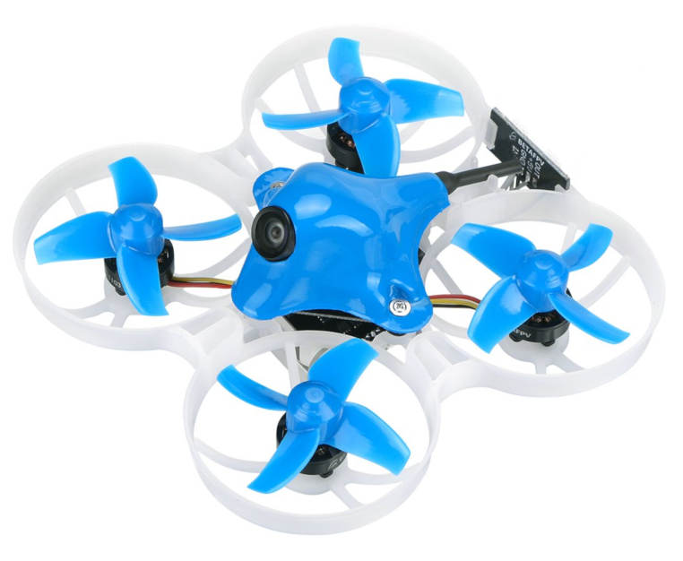

# BetaFPV Beta75X 2S Brushless Whoop

The [BetaFPV Beta75X](https://betafpv.com/products/beta75x-2s-whoop-quadcopter) is a very small quadrotor that can be flown indoors or outdoors, FPV or line-of-sight.

## Where to Buy

The *Beta75X* can be bought from a number of vendors, including:
- [GetFPV](https://www.getfpv.com/beta75x-2s-brushless-whoop-micro-quadcopter-xt30-frsky.html)
- [Amazon](https://www.amazon.com/BETAFPV-Beta75X-Brushless-Quadcopter-Smartaudio/dp/B07H86XSPW)

In addition you will need:
- An RC transmitter. *Beta75X* can ship with a number of receivers. PX4 is compatible with all of them, but make sure to select the version that matches your transmitter.
- LiPo battery charger (vehicle ships with one battery, but you may want spares).
- FPV goggles if you want to fly FPV. There are many compatible options, including these ones from [Fatshark](https://www.fatshark.com/product/dominator-hd3-core-fpv-goggles/).
  > **Note** FPV support is completely independent of PX4/flight controller.

## Flashing PX4

The *Beta75X* comes preinstalled with Betaflight.

To install the PX4 bootloader and firmware follow the [Omnibus F4 instructions](omnibus_f4_sd.md#betaflight_configurator) (this is the flight controller board on the *Beta75X*).

## Configuration

Once the firmware is loaded, you should be able to connect the vehicle to *QGroundControl* via a USB cable.

To configure PX4:
- [Set the Airframe](../config/airframe.md) to *BetaFPV Beta75X 2S Brushless Whoop*.
- Continue with [basic configuration](../config/README.md), including sensor calibration and radio setup.

## Video


https://youtu.be/_-O0kv0Qsh4

