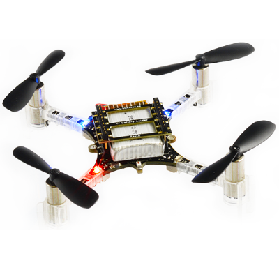

# Crazyflie 2.0

The Crazyflie line of micro quads was created by Bitcraze AB. An overview of the Crazyflie 2 (CF2) is here: https://www.bitcraze.io/crazyflie-2/

## Quick Summary

> **Note** The main hardware documentation is here: https://wiki.bitcraze.io/projects:crazyflie2:index

  * Main System-on-Chip: STM32F405RG
    * CPU: 168 MHz ARM Cortex M4 with single-precision FPU
    * RAM: 192 KB SRAM
  * nRF51822 radio and power management MCU
  * MPU9250 Accel / Gyro / Mag
  * LPS25H barometer
  
## Where to buy
* [Crazyflie 2.0](https://store.bitcraze.io/collections/kits/products/crazyflie-2-0)
* [Crazyradio PA 2.4 GHz USB dongle](https://store.bitcraze.io/collections/kits/products/crazyradio-pa): used for wireless communication between QGC and crazyflie 2.0.
* [Breakout deck](https://store.bitcraze.io/collections/decks/products/breakout-deck): breakout expansion board for connecting new peripherals. 
* [Flow deck](https://store.bitcraze.io/collections/decks/products/flow-deck): contains an optical flow sensor to measure movements of the ground and a distance sensor to measure the distance to the ground. This will be useful for precise altitude and position control.
* [SD-card deck](https://store.bitcraze.io/collections/decks/products/sd-card-deck): used for high speed onboard logging to a micro SD card.

## Flashing

After setting up the PX4 development environment, follow these steps to put the PX4 software on the CF2:

1. Grab source code of the PX4 [Bootloader](https://github.com/PX4/Bootloader)
1. Compile using `make crazyflie_bl`
1. Put the CrazyFly 2 (CF2) into DFU mode by following these steps:
   - Ensure it is initially unpowered
   - Hold down button
   - Plug into computer's USB port
   - After a second, the blue LED should start blinking and after 5 seconds should start blinking faster
   - Release button
1. Flash bootloader using dfu-util: `sudo dfu-util -d 0483:df11 -a 0 -s 0x08000000 -D ./build_crazyflie_bl/crazyflie_bl.bin` and unplug CF2 when done
   - If successful, then the yellow LED should blink when plugging in again
1. Grab the [Firmware](https://github.com/PX4/Firmware)
1. Compile with `make crazyflie_default upload`
1. When prompted to plug in device, plug in CF2: the yellow LED should start blinking indicating bootloader mode. Then the red LED should turn on indicating that the flashing process has started.
1. Wait for completion
1. Done! Calibrate via QGC

> **Note** If QGC does not connect with the vehicle, ensure that in [nuttx-config](https://github.com/PX4/Firmware/blob/master/platforms/nuttx/nuttx-configs/crazyflie/nsh/defconfig#L934) for crazyflie `# CONFIG_DEV_LOWCONSOLE is not set` is replaced by `CONFIG_DEV_LOWCONSOLE=y`

## Wireless

The onboard nRF module allows connecting to the board via Bluetooth or through the proprietary 2.4GHz Nordic ESB protocol.

- A [Crazyradio PA](https://www.bitcraze.io/crazyradio-pa/) is recommended.
- To fly the CF2 right away, the Crazyflie phone app is supported via Bluetooth

Using the official Bitcraze **Crazyflie phone app**

- Connect via Bluetooth
- Change mode in settings to 1 or 2
- Calibrate via QGC

Connecting via **MAVLink**

- Use a Crazyradio PA alongside a compatible GCS
- Clone the [crazyflie-lib-python](https://github.com/barzanisar/crazyflie-lib-python/tree/cfbridge).
- Make sure you have set the udev permissions to use the USB Radio. To do this, follow the steps listed [here](https://github.com/bitcraze/crazyflie-lib-python#setting-udev-permissions) and **restart** your computer.
- Connect a Crazyradio PA via USB.
- Build a [virtualenv (local python environment)](https://virtualenv.pypa.io/en/latest/) with package dependencies:
  * `pip install virtualenv`
  * `pip install tox`
  * `virtualenv venv`
  * Navigate to the crazyflie-lib-python folder.
  * `source venv-cflib/bin/activate`
- `pip install -r requirements.txt`

Note: For systems that support [make](https://www.gnu.org/software/make/manual/html_node/Simple-Makefile.html), the above six steps can be skipped and replaced with:
 * `pip install tox`
 * Navigate to the crazyflie-lib-python folder.
 * `make venv`

To launch cfbridge.py everytime:
- Switch on CF2 (which is already flashed with PX4 firmware) by pressing its ON button and wait for it to boot up.
- Connect a Crazyradio PA via USB.
- Navigate to the crazyflie-lib-python folder.
- Activate the environment: `source venv-cflib/bin/activate`
- `cd examples`
- `python cfbridge.py`
- Open QGC.
- After using cfbridge, you can deactivate the virtualenv if you activated it by running `deactivate` or pressing `CTRL+z`

> **Note** Set the Joystick rate parameter in QGC to any value between 5 to 15 Hz. This is the rate at which Joystick commands are sent from QGC to CF2 via crazyradio PA. (This parameter does not exist yet. For now, you can set the [sleep time](https://github.com/mavlink/qgroundcontrol/blob/master/src/Joystick/Joystick.cc#L546) between 80 to 100 ms. To do this, you will need to follow the instructions [here](https://github.com/mavlink/qgroundcontrol) to obtain QGC source code and build it.)

## Flying

https://www.youtube.com/watch?v=oWk0RRIzF-4
