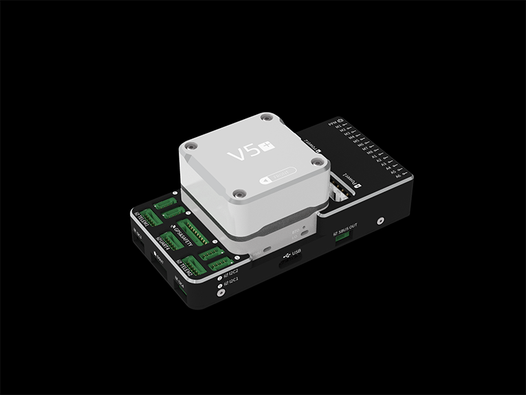

# CUAV V5+

CUAV *V5+ *<sup>&reg;</sup> is an advanced autopilot manufactured by CUAV<sup>&reg;</sup>.It was designed by CUAV<sup>&reg;</sup> in collaboration with the PX4 team.

The board is based on the Pixhawk **FMUv5 design standard**, the external interface uses the [Pixhawk standard pinouts](https://pixhawk.org/pixhawk-connector-standard/), and the modular design allows the users to customize their own carrier board. The autopilot is compatible [PX4](http://px4-travis.s3.amazonaws.com/Firmware/master/px4fmu-v5_default.px4) firmware.can be used for academic research and commercial systems integration.




## Quick Summary

* Main FMU Processor: STM32F765
  * 32 Bit Arm® Cortex®-M7, 216MHz, 2MB memory, 512KB RAM
* IO Processor: STM32F100
  * 32 Bit Arm® Cortex®-M3, 24MHz, 8KB SRAM
* On-board sensors:
  * Accelerometer/Gyroscope: ICM-20689
  * Accelerometer/Gyroscope: BMI055
  * Magnetometer: IST8310
  * Barometer: MS5611

* Interfaces:
  * 8-14 PWM outputs (6 from IO, 8 from FMU)
  * 3 dedicated PWM/Capture inputs on FMU
  * Dedicated R/C input for CPPM
  * Dedicated R/C input for Spektrum / DSM and S.Bus with analog / PWM RSSI input
  * analog / PWM RSSI input
  * S.Bus servo output
  * 5 general purpose serial ports
  * 4 I2C ports
  * 4 SPI buses
  * 2 CANBuses  with serial ESC
  * Analog inputs for voltage / current of 2 batteries
* Power System:
  * Power: 4.3~5.4V
  * USB Input: 4.75~5.25V
  * Servo Rail Input: 0~36V
* Weight and Dimensions:
  * Weight: 90g
  * Dimensions: 85.5\*42\*33mm 
* Other Characteristics:
  * Operating temperature: -20 ~ 80°c（Measured value）
  
## Purchase

[CUAV Store](https://store.cuav.net/index.php?id_product=95&id_product_attribute=0&rewrite=cuav-new-pixhack-v5-autopilot-m8n-gps-for-fpv-rc-drone-quadcopter-helicopter-flight-simulator-free-shipping-whole-sale&controller=product&id_lang=1)

[CUAV Aliexpress(for international users)](https://www.aliexpress.com/item/32890380056.html?spm=a2g0o.detail.1000060.1.7a7233e7mLTlVl&gps-id=pcDetailBottomMoreThisSeller&scm=1007.13339.90158.0&scm_id=1007.13339.90158.0&scm-url=1007.13339.90158.0&pvid=d899bfab-a7ca-46e1-adf2-72ad1d649822)

[CUAV Taobao(for China Mainland users)](https://item.taobao.com/item.htm?spm=a1z10.5-c.w4002-21303114052.37.a28f697aeYzQx9&id=594262853015).

## Connection{#connection}

* [CUAV V5+ Wiring Quickstart](../assembly/quick_start_cuav_v5+.md)

## Pinouts{#pinouts}

Download **CUAV V5+** pinouts from [here](http://manual.cuav.net/V5-Plus.pdf).

## Voltage Ratings

*CUAV V5+* can be triple-redundant on the power supply if three power sources are supplied. The three power rails are: **POWER1**, **POWER2** and **USB**.

> **Note** The output power rails **FMU PWM OUT** and **I/O PWM OUT** (0V to 36V) do not power the flight controller board (and are not powered by it). You must supply power to one of **POWER1**, **POWER2** or **USB** or the board will be unpowered. 

**Normal Operation Maximum Ratings**

Under these conditions all power sources will be used in this order to power the system:
1. **POWER1** and **POWER2** inputs (4.3V to 5.4V)
1. **USB** input (4.75V to 5.25V)

## Building Firmware

> **Tip** Most users will not need to build this firmware!
  It is pre-built and automatically installed by *QGroundControl* when appropriate hardware is connected.

To [build PX4](https://dev.px4.io/en/setup/building_px4.html) for this target:
```
make px4_fmu-v5_default
```

## Debug Port

The system's serial console and SWD interface operate on the **FMU Debug** port. Simply connect the FTDI cable to the Debug & F7 SWD connector (the product list contains the CUAV FTDI cable).
It does not have an i/o debug interface.

# Peripherals {#Optional-hardware}

* [Digital Airspeed Sensor](https://item.taobao.com/item.htm?spm=a1z10.3-c-s.w4002-16371268452.37.6d9f48afsFgGZI&id=9512463037)
* [Telemetry Radio Modules](https://cuav.taobao.com/category-158480951.htm?spm=2013.1.w5002-16371268426.4.410b7a821qYbBq&search=y&catName=%CA%FD%B4%AB%B5%E7%CC%A8)
* [Rangefinders/Distance sensors](https://docs.px4.io/en/sensor/rangefinders.html)

## Supported Platforms / Airframes

Any multicopter / airplane / rover or boat that can be controlled with normal RC servos or Futaba S-Bus servos. The complete set of supported configurations can be seen in the [Airframes Reference](../airframes/airframe_reference.md).

## Further info

- [FMUv5 reference design pinout](https://docs.google.com/spreadsheets/d/1-n0__BYDedQrc_2NHqBenG1DNepAgnHpSGglke-QQwY/edit#gid=912976165). 
- [CUAV Github](https://github.com/cuav) 
- [Base board design reference](https://github.com/cuav/hardware/tree/master/V5_Autopilot/V5%2B/V5%2B_BASE)
- [CUAV V5+ Manual](http://manual.cuav.net/V5-Plus.pdf)


