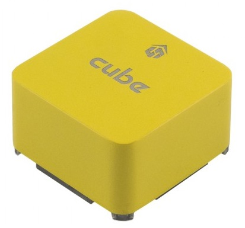

# CubePilot Cube Yellow Flight Controller

:::warning
PX4 does not manufacture this (or any) autopilot.
Contact the [manufacturer](https://cubepilot.org/#/home) for hardware support or compliance issues.
:::

The Cube Yellow flight controller is a flexible autopilot intended primarily for manufacturers of commercial systems.



The controller is designed to be used with a domain-specific carrier board in order to reduce the wiring, improve reliability, and ease of assembly.
For example, a carrier board for a commercial inspection vehicle might include connections for a companion computer, while a carrier board for a racer could includes ESCs for the frame of the vehicle.

Cube includes vibration isolation on two of the IMU's, with a third fixed IMU as a reference / backup.

:::tip
The manufacturer [Cube Docs](https://docs.cubepilot.org/user-guides/autopilot/the-cube-module-overview) contain detailed information, including an overview of the [Differences between Cube Colours](https://docs.cubepilot.org/user-guides/autopilot/the-cube-module-overview#differences-between-cube-colours).
:::


## Key Features

* 32bit STM32F777VI (32bit [ARM Cortex M7](https://en.wikipedia.org/wiki/ARM_Cortex-M#Cortex-M7), 400 MHz, Flash 2MB, RAM 512 KB).
* 32 bit STM32F103 failsafe co-processor <!-- check -->
* 14 PWM / Servo outputs (8 with failsafe and manual override, 6 auxiliary, high-power compatible)
* Abundant connectivity options for additional peripherals (UART, I2C, CAN)
* Integrated backup system for in-flight recovery and manual override with dedicated processor and stand-alone power supply (fixed-wing use)
* Backup system integrates mixing, providing consistent autopilot and manual override mixing modes (fixed wing use)
* Redundant power supply inputs and automatic failover
* External safety switch
* Multicolor LED main visual indicator
* High-power, multi-tone piezo audio indicator
* microSD card for high-rate logging over extended periods of time


<span id="stores"></span>
## Where to Buy

* [Reseller list](https://www.cubepilot.com/#/reseller/list)

## Assembly

[Cube Wiring Quickstart](../assembly/quick_start_cube.md)

## Specifications

* **Processor:**
  * STM32F777VI (32bit [ARM Cortex M7](https://en.wikipedia.org/wiki/ARM_Cortex-M#Cortex-M7))
  * 400 MHz
  * 512 KB MB RAM
  * 2 MB Flash
* **Failsafe co-processor:** <!-- inconsistent info on failsafe processor: 32 bit STM32F103 failsafe co-processor http://www.proficnc.com/all-products/191-pixhawk2-suite.html -->
  * STM32F100 (32bit *ARM Cortex-M3*)
  * 24 MHz
  * 8 KB SRAM
* **Sensors:** (all connected via SPI)
  * **Accelerometer:** (3) ICM20948, ICM20649, ICM20602
  * **Gyroscope:** (3) ICM20948, ICM20649, ICM20602
  * **Compass:** (1) ICM20948
  * **Barometric Pressure Sensor:** (2) MS5611
* **Operating Conditions:**
  * **Operating Temp:** -10C to 55C
  * **IP rating/Waterproofing:** Not waterproof
  * **Servo rail input voltage:** 3.3V / 5V
  * **USB port input:**
    * Voltage: 4V - 5.7V
    * Rated current: 250 mA
  * **POWER:**
    * Input voltage: 4.1V - 5.7V
    * Rated input current: 2.5A
    * Rated input/output power: 14W
* **Dimensions:**
  - **Cube:** 38.25mm x 38.25mm x 22.3mm
  - **Carrier:** 94.5mm x 44.3mm x 17.3mm
* **Interfaces**
  * IO Ports: 14 PWM servo outputs (8 from IO, 6 from FMU)
  * 5x UART (serial ports), one high-power capable, 2x with HW flow control
  * 2x CAN (one with internal 3.3V transceiver, one on expansion connector)
  * **R/C inputs:**
    - Spektrum DSM / DSM2 / DSM-X® Satellite compatible input
    - Futaba S.BUS® compatible input and output
    - PPM-SUM signal input
  * RSSI (PWM or voltage) input
  * I2C
  * SPI
  * 3.3v ADC input
  * Internal microUSB port and external microUSB port extension

## Pinouts and Schematics

Board schematics and other documentation can be found here: [The Cube Project](https://github.com/proficnc/The-Cube).


## Ports

### Top-Side (GPS, TELEM etc)


## Serial Port Mapping

UART | Device | Port
--- | --- | ---
USART1 | /dev/ttyS0 | <!-- # IO DEBUG:/dev/ttyS0 -->
USART2 | /dev/ttyS1 | TELEM1 (flow control)
USART3 | /dev/ttyS2 | TELEM2 (flow control)
UART4  | /dev/ttyS3 | GPS1
USART6 | /dev/ttyS4 | PX4IO
UART7  | /dev/ttyS5 | CONSOLE
UART8  | /dev/ttyS6 | GPS2
  
<!-- Note: Got ports using https://github.com/PX4/PX4-user_guide/pull/672#issuecomment-598198434 -->
<!-- https://github.com/PX4/PX4-Autopilot/blob/main/boards/hex/cube-orange/default.px4board -->
<!-- https://github.com/PX4/PX4-Autopilot/blob/main/boards/hex/cube-orange/nuttx-config/nsh/defconfig#L194-L200 -->


### Debug Ports


### USB/SDCard Ports


## Building Firmware

:::tip
Most users will not need to build this firmware!
It is pre-built and automatically installed by *QGroundControl* when appropriate hardware is connected.
:::

To [build PX4](../dev_setup/building_px4.md) for this target:
```
make cubepilot_cubeyellow
```

## Issues

CAN1 and CAN2 silk screen on the Cube are flipped (CAN1 is CAN2 and vice versa).

## Further Information/Documentation

- [Cube Wiring Quickstart](../assembly/quick_start_cube.md)
- Cube Docs (Manufacturer):
  - [Cube Module Overview](https://docs.cubepilot.org/user-guides/autopilot/the-cube-module-overview)
  - [Cube User Manual](https://docs.cubepilot.org/user-guides/autopilot/the-cube-user-manual)
  - [Mini Carrier Board](https://docs.cubepilot.org/user-guides/carrier-boards/mini-carrier-board)
