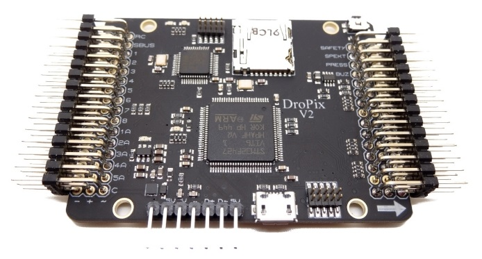
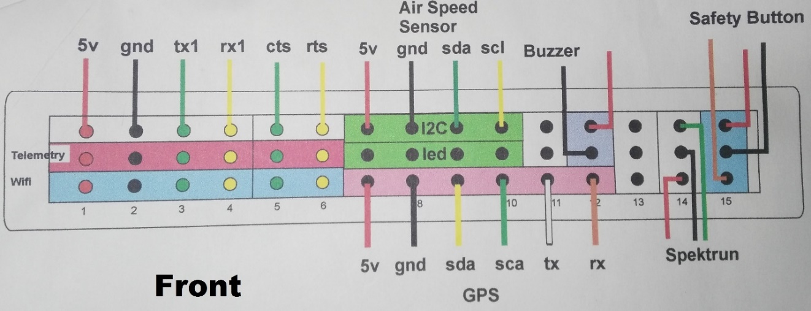
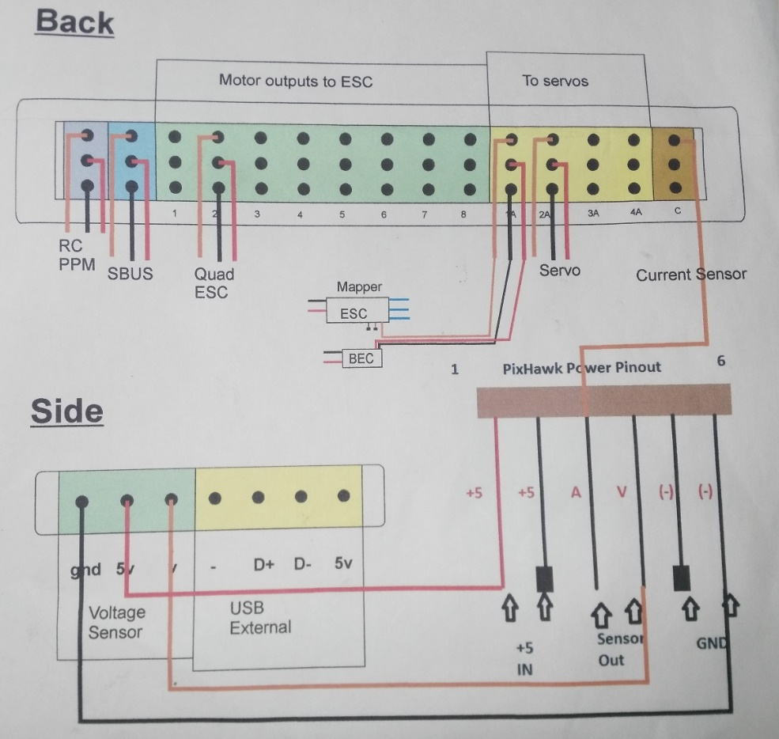

# DroPix Flight Controller

:::warning
PX4 does not manufacture this (or any) autopilot.
Contact the [manufacturer](https://store.drotek.com/) for hardware support or compliance issues.
:::

The Drotek<sup>&reg;</sup> *DroPix autopilot* is based on the [Pixhawk<sup>&reg;</sup>-project](https://pixhawk.org/) **FMUv2** open hardware design. It runs the PX4 Flight Stack on the [NuttX](https://nuttx.apache.org/) OS.

The DroPix system includes integrated multithreading, a Unix/Linux-like programming environment, completely new autopilot functions such as Lua scripting of missions and flight behavior, and a custom PX4 driver layer ensuring tight timing across all processes.



:::note
This flight controller is [manufacturer supported](../flight_controller/autopilot_manufacturer_supported.md).
:::


## Key Features

* Advanced 32 bit ARM Cortex® M4 Processor running NuttX RTOS
* 14 PWM/servo outputs (8 with failsafe and manual override, 5 auxiliary, high-power compatible)
* Abundant connectivity options for additional peripherals (UART, I2C, CAN)
* Integrated backup system for in-flight recovery and manual override with dedicated processor and stand-alone power supply
* Backup system integrates mixing, providing consistent autopilot and manual override mixing modes
* Redundant power supply inputs and automatic failover
* External safety button for easy motor activation
* Multicolor LED indicator
* High-power, multi-tone piezo audio indicator
* microSD card for long-time high-rate logging
* Sensors
  * ST Micro L3GD20 3-axis 16-bit gyroscope
  * ST Micro LSM303D 3-axis 14-bit accelerometer / magnetometer
  * Invensense<sup>&reg;</sup> MPU 6000 3-axis accelerometer/gyroscope
  * MEAS MS5611 barometer
* Standard MK style mounting holes 45 mm x 45 mm (M3 holes)
* Dimensions
  * Size: 67*50*6 mm
  * Weight: 15g (without connectors)
  
## Where to buy

[DroPix Autopilots & Accessories](https://store.drotek.com/dropix-autopilots)


## Documentation

[DroPix User's Guide](https://drotek.gitbook.io/dropix-user-guide/)

## Wiring Guides

The following diagrams show the Dropix connector information (for more information see the [drotek documentation](https://drotek.gitbook.io/dropix-user-guide/)).






## Building Firmware

:::tip
Most users will not need to build this firmware!
It is pre-built and automatically installed by *QGroundControl* when appropriate hardware is connected.
:::

To [build PX4](../dev_setup/building_px4.md) for this target:
```
make px4_fmu-v2_default
```

## Serial Port Mapping

UART | Device | Port
--- | --- | ---
UART1 | /dev/ttyS0 | IO debug
USART2 | /dev/ttyS1 | TELEM1 (flow control)
USART3 | /dev/ttyS2 | TELEM2 (flow control)
UART4 | | 
UART7 | CONSOLE
UART8 | SERIAL4

<!-- Note: Got ports using https://github.com/PX4/PX4-user_guide/pull/672#issuecomment-598198434 -->