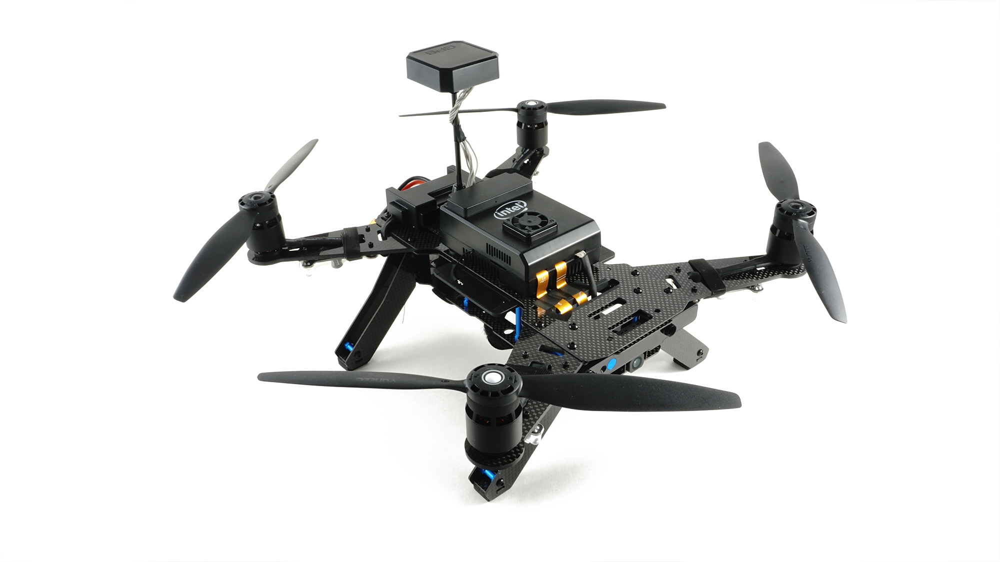
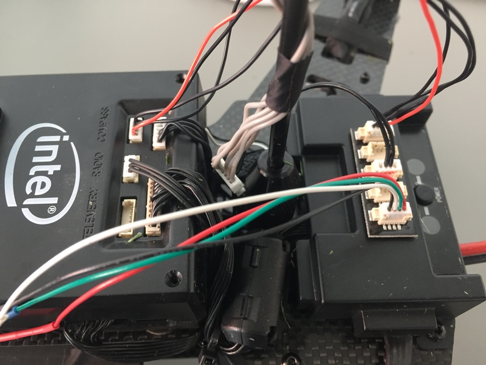
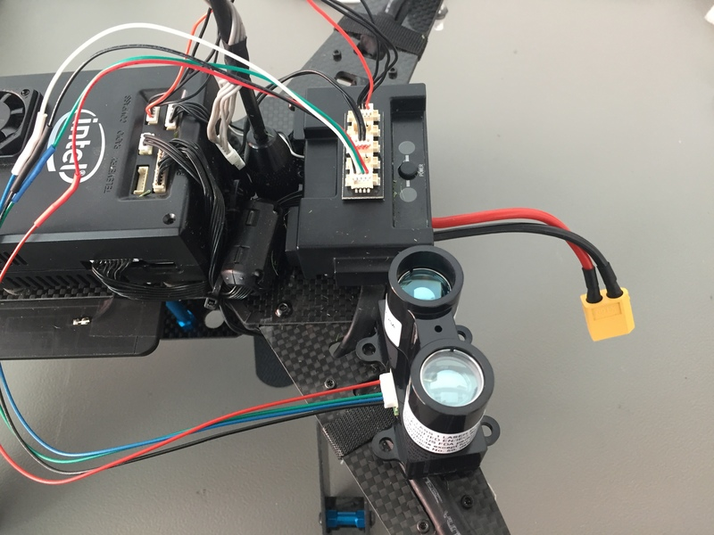

# Intel® Aero Ready to Fly Drone

The Intel® Aero Ready to Fly Drone is a UAV development platform. Part of this is the [Intel Aero
Compute Board](https://software.intel.com/en-us/aero/dev-kit), running Linux on
a Quad-core CPU. The other part is an STM32 microcontroller that is connected
to it and that runs PX4 on NuttX. These are integrated in the same package on
the [Intel® Aero Ready to Fly Drone](https://software.intel.com/en-us/aero/drone-dev-kit), which also includes
the vision accessory kit.




## Introduction

The main documentation on the [official wiki](https://github.com/intel-aero/meta-intel-aero/wiki) explains how to setup, update and connect to the board, and how to do development on the Linux side. The instructions in this topic concentrate on updating the firmware on the microcontroller from a development tree.

It's important to update to the latest image available since some instructions change between releases. You can check the BIOS and distro version by connecting to the board and running the following command:

```
get_aero_version.py
```

The instructions here are tested with the following version:

```
BIOS_VERSION = Aero-01.00.13
OS_VERSION = Poky Aero (Intel Aero Linux Distro) 1.5.1-dev (pyro)"
AIRMAP_VERSION = 1.8
FPGA_VERSION = 0xc1
```


## Flashing

After setting up the PX4 development environment, follow these steps update the PX4 software:

1. Do a full update of all software on the Aero (https://github.com/intel-aero/meta-intel-aero/wiki/Upgrade-To-Latest-Software-Release)
1. Grab the [Firmware](https://github.com/PX4/Firmware)
1. Compile with `make aerofc-v1_default`
1. Configure the target hostname

   If your system resolves link local names you don't have to do anything and you can skip this step. You can test it by trying to ssh into intel-aero.local after connecting to it either via WiFi or USB:

   ```
   ssh root@intel-aero.local
   ```

   If it doesn't work you can try giving the IP that will be used by the upload script:

   ```
   # WiFi IP
   export AERO_HOSTNAME=192.168.8.1

   # Ethernet-over-USB IP
   export AERO_HOSTNAME=192.168.7.2
   ```

1. Upload with  `make aerofc-v1_default upload`


## Connecting QGroundControl via Network

1. Make sure you are connected to the board with WiFi or USB Network
1. ssh to the board and make sure mavlink forwarding runs. By default it automatically starts when booting. It can be started manually with:
   ```
   systemctl start mavlink-router
   ```
1. Start QGroundControl and it should automatically connect.
1. Instead of starting QGroundControl, you can open a [NuttX shell](https://dev.px4.io/en/debug/system_console.html#mavlink-shell) with:
   ```
   ./Tools/mavlink_shell.py 0.0.0.0:14550
   ```

## Connecting a Lidar Lite Range Finder

The following instructions are for a Lidar Lite V3 connected via I2C. The Aero has two ports with I2C: One labled COMPASS and the other TELEMETRY. The pinout for both of them can be found below. We recommend using the TELEMETRY port as it is not being used. If your TELEMETRY port is already occupied, a splitter can be used to share the I2C connection (works on any I2C port). Check the images below for the splitter setup.
In addition it is recommended to use a electrolytic capacitor for the Lidar Lite I2C connection to reduce spikes in the distance readings (see [here](https://static.garmin.com/pumac/LIDAR_Lite_v3_Operation_Manual_and_Technical_Specifications.pdf) on page 3).

The pinout for the Lidar Lite V3 is as follows

| pin | Aerofc TELEMETRY | Lidar Lite V3    |
| --- | ---------------- | ---------------- |
| 1   | VCC              | VCC              |
| 2   | TX               | -                |
| 3   | RX               | -                |
| 4   | SCL              | SCL              |
| 5   | SDA              | SDA              |
| 6   | GND              | GND              |

| pin | Aerofc COMPASS | Lidar Lite V3    |
| --- | -------------- | ---------------- |
| 1   | VCC            | VCC              |
| 2   | SCL            | -                |
| 3   | SDA            | -                |
| 4   | GND            | SCL              |
| 5   | -              | SDA              |
| 6   | -              | GND              |




