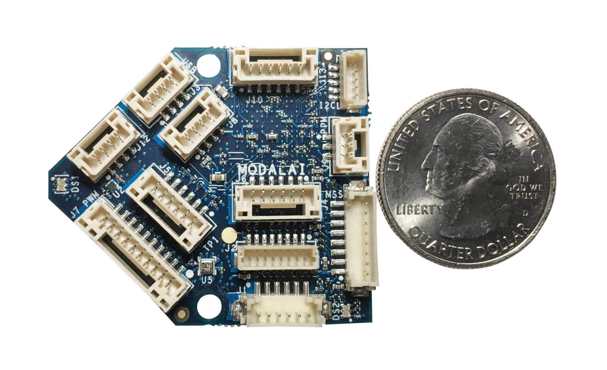

# ModalAI Flight Core v1

The ModalAI Flight Core is a [Pixhawk Series](../flight_controller/pixhawk_series.md) derived flight controller, made in the USA. The Flight Core can be paired with [ModalAI VOXL](https://docs.modalai.com/voxl-datasheet/) for obstacle avoidance and GPS-denied navigation, or used independently as a standalone flight controller.



## Quick Summary

The main hardware documentation can be found [here].(https://docs.modalai.com/flight-core-datasheet/)

## Specification

| Feature          | Details |
|:--------         |:------- |
| MCU              | 216MHz, 32-bit ARM M7 [STM32F765II](https://www.st.com/en/microcontrollers-microprocessors/stm32f765ii.html) |
| Memory           | 256Kb FRAM   |
|                  | 2Mbit Flash  |
|                  | 512Kbit SRAM |
| Firmware         | [PX4](https://github.com/PX4/Firmware/tree/master/boards/modalai/fc-v1) |
| IMUs             | [ICM-20602](https://www.invensense.com/products/motion-tracking/6-axis/icm-20602/) (SPI1) |
|                  | ICM-42688 (SPI2) |
|                  | [BMI088](https://www.bosch-sensortec.com/bst/products/all_products/bmi088_1) (SPI6) |
| Barometer        | [BMP388](https://www.bosch-sensortec.com/bst/products/all_products/bmp388) (I2C4) |
| Secure Element   | [A71CH](https://www.nxp.com/products/security-and-authentication/authentication/plug-and-trust-the-fast-easy-way-to-deploy-secure-iot-connections:A71CH) (I2C4) |
| microSD Card     | [Information on supported cards](https://dev.px4.io/v1.9.0/en/log/logging.html#sd-cards) |
| Inputs           | GPS/Mag |
|                  | Spektrum |
|                  | Telemetry |
|                  | CAN bus   |
|                  | PPM    |
| Outputs          | 6 LEDs (2xRGB) |
|                  | 8 PWM Channels |
| Extra Interfaces | 3 serial ports |
|                  | I2C |
|                  | GPIO |

## Availability

- Flight Core Complete Kit is available [here](https://shop.modalai.com/products/flight-core)
- Flight Core Board Only is available [here](https://shop.modalai.com/products/flight-core-pcb-only)
- Flight Core assembled with VOXL and cameras is available at [here](https://shop.modalai.com/products/voxl-flight-deck-r1)

## Quick Start

### Connectors

Detailed information about the pinouts can be found [here](https://docs.modalai.com/flight-core-datasheet-connectors).


| Connector | Summary |
| --- | --- |
| J1  | VOXL Communications Interface Connector (TELEM2) |
| J2  | Programming and Debug Connector |
| J3  | USB Connector |
| J4  | VOXL Spare Communications Interface Connector (TELEM3) |
| J5  | Telemetry Connector (TELEM1) |
| J6  | VOXL-Power Management Input / Expansion |
| J7  |  8-Channel PWM Output Connector |
| J8  | CAN Bus Connector |
| J9  | PPM RC In |
| J10  | External GPS & Magnetometer Connector |
| J12  | Spektrum UART Connector |
| J13  | I2C Display (Spare Sensor Connector) / Safety Button Input |


### User Guide

The full user guide is available [here](https://docs.modalai.com/flight-core-manual/).

### How to Build

To [build PX4](https://dev.px4.io/master/en/setup/building_px4.html) for this target:

```
make modalai_fc-v1
```

## Support

Please visit http://support.modalai.com/ for more information.
