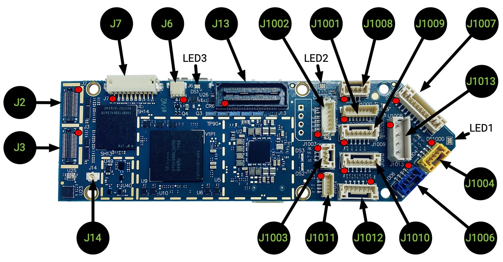
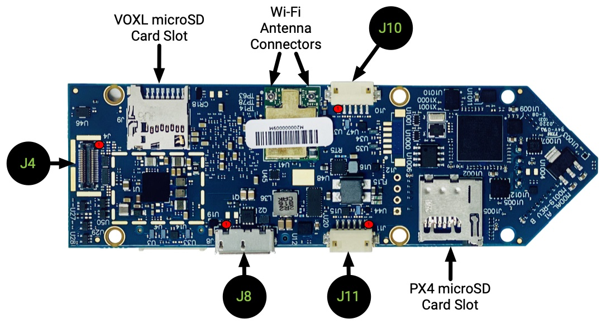

# ModalAI VOXL 2

:::warning
PX4 does not manufacture this (or any) autopilot.
Contact the [manufacturer](https://forum.modalai.com/) for hardware support or compliance issues.
:::

The ModalAI [VOXL 2](https://modalai.com/voxl-2) ([Datasheet](https://docs.modalai.com/voxl2-datasheets/))  is ModalAI’s next-gen autonomous computing platform built around the Qualcomm QRB5165 processor. VOXL 2 boasts 8 cores, integrated PX4, seven camera concurrency, advanced onboard AI up to 15+ TOPS, and 5G connectivity. At 16 grams, VOXL 2 is the future of fully autonomous and connected drones!


:::note
This flight controller is [manufacturer supported](../flight_controller/autopilot_manufacturer_supported.md).
:::


## Specifications

### System


| Feature                                                                       | VOXL 2                                                           |
|-------------------------------------------------------------------------------|------------------------------------------------------------------|
| CPU                                                                           | QRB5165 <br>8 cores up to 3.091GHz <br>8GB LPDDR5<br>128GB Flash |
| OS                                                                            | Ubuntu 18.04 - Linux Kernel v4.19                                |
| GPU                                                                           | Adreno 650 GPU – 1024 ALU                                        |
| NPU                                                                           | 15 TOPS                                                          |
| Flight Controller Embedded                                                    | Yes (Sensors DSP)                                                |
| Built in WiFi                                                                 | No                                                               |
| Add-on Connectivity                                                           | WiFi, 5G, 4G/LTE, Microhard                                      |
| Video Encoding                                                                | 8K30 h.264/h.265 108MP still images                              |
| Computer Vision Sensors                                                       | QTY. 2 Stereo Pair<br>QTY. 1 Tracking                            |
| Tracking Sensor                                                               | Yes                                                              |
| Dimensions                                                                    | 70mm x 36mm                                                      |
| Weight                                                                        | 16g                                                              |
| VOXL SDK: GPS-denied navigation, SLAM, obstacle avoidance, object recognition | Yes                                                              |
| ROS                                                                           | ROS 1 & 2                                                        |
| QGroundControl                                                                | Yes                                                              |
| ATAK                                                                          | Yes                                                              |
| NDAA ’20 Section 848 Compliant                                                | Yes, Assembled in USA                                            |
| PMD TOF                                                                       | Pending                                                          |
| FLIR Boson                                                                    | USB                                                              |
| FLIR Lepton                                                                   | USB, SPI in development                                          |


:::note
More detailed hardware documentation can be found [here](https://docs.modalai.com/voxl-flight-datasheet/).
:::


## Dimensions

### 2D Dimensions


### 3D Dimensions

[3D STEP File](https://storage.googleapis.com/modalai_public/modal_drawings/M0054_VOXL2_PVT_SIP_REVA.step)


## PX4 Firmware Compatibility

*VOXL 2* is currently being mainlined into PX4, and ModalAI is actively working on a [branched PX4 version](https://github.com/modalai/px4-firmware/tree/voxl-dev) that can be used.

As VOXL 2 runs Ubuntu, the production releases of PX4 for VOXL 2 are distributed through [apt package management](https://docs.modalai.com/configure-pkg-manager/) and the [VOXL SDK](https://docs.modalai.com/voxl-sdk/).

More information about the firmware can be found [here](https://docs.modalai.com/voxl2-px4-developer-guide/).


## QGroundControl Support

This board supported in QGroundControl 4.0 and later.

## Availability

- [VOXL Flight Complete Kit](https://modalai.com/voxl-flight)
- [VOXL Flight Board](https://www.modalai.com/products/voxl-flight?variant=31707275362355) (only)
- [VOXL Flight integrated with Obstacle Avoidance Cameras (VOXL Flight Deck)](https://modalai.com/flight-deck) ([Datasheet](https://docs.modalai.com/voxl-flight-deck-platform-datasheet/))
- [VOXL Flight in a ready to fly VOXL m500 Development Drone](https://www.modalai.com/collections/development-drones/products/voxl-m500) ([Datasheet](https://docs.modalai.com/voxl-m500-reference-drone-datasheet/))


## Quick Start

A quickstart from the vendor is located [here](https://docs.modalai.com/voxl-flight-quickstart/).

### voxl-vision-px4

The VOXL Flight runs [voxl-vision-px4](https://gitlab.com/voxl-public/modal-pipe-architecture/voxl-vision-px4) on the  companion computer portion of the hardware serving as a sort of MAVLink proxy.
For details, the source code is available [here](https://gitlab.com/voxl-public/modal-pipe-architecture/voxl-vision-px4)

### Connectors

Detailed information about the pinouts can be found [here](https://docs.modalai.com/voxl-flight-datasheet-connectors/).

#### Top



*Note: 1000 Series connectors accessible from the STM32/PX4*

| Connector | Summary | Used By |
| --- | --- | --- |
| J2  | Hires 4k Image Sensor (CSI0) | Snapdragon - Linux |
| J3  | Stereo Image Sensor (CSI1) | Snapdragon - Linux |
| J6  | Cooling Fan Connector | Snapdragon - Linux |
| J7  | BLSP6 (GPIO) and BLSP9 (UART) | Snapdragon - Linux |
| J13  | Expansion B2B | Snapdragon - Linux |
| J14  | Integrated GNSS Antenna Connection | Snapdragon - Linux |
| J1001  | Programming and Debug/UART3 | STM32 - PX4 |
| J1002  | UART ESC, UART2/TELEM3 | STM32 - PX4 |
| J1003  | PPM RC In | STM32 - PX4 |
| J1004  | RC Input, Spektrum/SBus/UART6  | STM32 - PX4 |
| J1006  | USB 2.0 Connector (PX4/QGroundControl) | STM32 - PX4 |
| J1007  | 8-Channel PWM/DShot Output | STM32 - PX4 |
| J1008  | CAN Bus | STM32 - PX4 |
| J1009  | I2C3, UART4 | STM32 - PX4 |
| J1010  | Telemetry (TELEM1) | STM32 - PX4 |
| J1011  | I2C2, Safety Button Input | STM32 - PX4 |
| J1012  | External GPS & Mag, UART1, I2C1 | STM32 - PX4 |
| J1013  | Power Input, I2C3 | STM32 - PX4 (powers whole  system) |

#### Bottom



*Note: 1000 Series connectors accessible from the STM32/PX4*

| Connector | Summary | Used By |
| --- | --- | --- |
| J4  | Tracking/Optic Flow Image Sensor (CSI2) | Snapdragon - Linux |
| J8  | USB 3.0 OTG | Snapdragon - Linux, **adb** |
| J10  | BLSP7 UART and I2C off-board | Snapdragon - Linux |
| J11  | BLSP12 UART and I2C off-board  | Snapdragon - Linux |
| VOXL microSD  |  | Snapdragon - Linux |
| PX4 microSD  | 32Gb Max | STM32 - PX4 |
| Wi-Fi Antennas | Included | Snapdragon - Linux |

### User Guide

The full user guide is available [here](https://docs.modalai.com/voxl-flight-quickstart).


### How to Build

To [build PX4](../dev_setup/building_px4.md) for this target:

```
make modalai_fc-v1
```

## Serial Port Mapping

*Note: mappings shown are for the PX4 controlled interfaces only*

UART | Device | Port
--- | --- | ---
USART1 | /dev/ttyS0 | GPS1 (J1012) |
USART2 | /dev/ttyS1 | TELEM3 (J1002) |
USART3 | /dev/ttyS2 | Debug Console (J1001) |
UART4 | /dev/ttyS3 | Expansion UART (J6) |
UART5 | /dev/ttyS4 | UART between PX4 and Companion Computer |
USART6 | /dev/ttyS5 | RC (J1004)
UART7 | /dev/ttyS6 | TELEM1 (J1010)
UART8 | /dev/ttyS7 | N/A

<!-- Note: Got ports using https://github.com/PX4/PX4-user_guide/pull/672#issuecomment-598198434 -->

## Support

Please visit the [ModalAI Forum](https://forum.modalai.com/category/8/voxl-flight) for more information.
