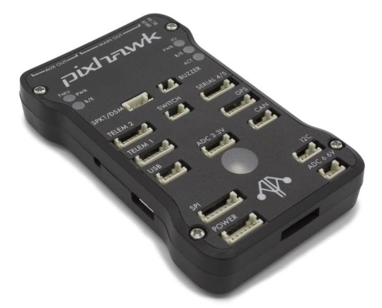

# mRo Pixhawk  Flight Controller (Pixhawk 1)

The *mRo Pixhawk<sup>&reg;</sup>* is a hardware compatible version of the original [Pixhawk 1](../flight_controller/pixhawk.md).  It runs PX4 on the [NuttX](http://nuttx.org) OS. 

> **Tip** The controller can be used as a drop-in replacement for the 3DR<sup>&reg;</sup> [Pixhawk 1](../flight_controller/pixhawk.md).

<span></span>
> **Note** The main difference is that it is based on the [Pixhawk-project](https://pixhawk.org/) **FMUv3** open hardware design, which corrects a bug that limited the original Pixhawk 1 to 1MB of flash.



Assembly/setup instructions for use with PX4 are provided here: [Pixhawk Wiring Quickstart](../assembly/quick_start_pixhawk.md)

## Key Features

* Microprocessor:
  * 32-bit STM32F427 Cortex<sup>&reg;</sup> M4 core with FPU
  * 168 MHz/256 KB RAM/2 MB Flash
  * 32 bit STM32F103 failsafe co-processor
* Sensors:
  * ST Micro L3GD20 3-axis 16-bit gyroscope
  * ST Micro LSM303D 3-axis 14-bit accelerometer / magnetometer
  * Invensense<sup>&reg;</sup> MPU 6000 3-axis accelerometer/gyroscope
  * MEAS MS5611 barometer
* Interfaces:
  * 5x UART (serial ports), one high-power capable, 2x with HW flow control
  * 2x CAN
  * Spektrum DSM / DSM2 / DSM-X® Satellite compatible input up to DX8 (DX9 and above not supported)
  * Futaba<sup>&reg;</sup> S.BUS compatible input and output
  * PPM sum signal
  * RSSI (PWM or voltage) input
  * I2C
  * SPI
  * 3.3 and 6.6V ADC inputs
  * External microUSB port
* Power System:
  * Ideal diode controller with automatic failover
  * Servo rail high-power (7 V) and high-current ready
  * All peripheral outputs over-current protected, all inputs ESD protected

* Weight and Dimensions:
  * Weight: 38g (1.31oz)
  * Width: 50mm (1.96")
  * Thickness: 15.5mm (.613")
  * Length: 81.5mm (3.21")


## Availability

* [Bare Bones](https://store.mrobotics.io/Genuine-PixHawk-1-Barebones-p/mro-pixhawk1-bb-mr.htm) - Just the board (useful as a 3DR Pixhawk replacement)
* [mRo Pixhawk 2.4.6 Essential Kit!](https://store.mrobotics.io/Genuine-PixHawk-Flight-Controller-p/mro-pixhawk1-minkit-mr.htm) - Everything except for telemetry radios
* [mRo Pixhawk 2.4.6 Cool Kit! (Limited edition)](https://store.mrobotics.io/product-p/mro-pixhawk1-fullkit-mr.htm) - Everything you need including telemetry radios


## Building Firmware

> **Tip** Most users will not need to build this firmware!
  It is pre-built and automatically installed by *QGroundControl* when appropriate hardware is connected.

To [build PX4](https://dev.px4.io/en/setup/building_px4.html) for this target:
```
make px4fmu-v3_default
```

## Pinouts and Schematics

The board is based on the [Pixhawk-project](https://pixhawk.org/) **FMUv3** open hardware design.

* [FMUv3 schematic](https://github.com/PX4/Hardware/raw/master/FMUv3_REV_D/Schematic%20Print/Schematic%20Prints.PDF) -- Schematic and layout

> **Note** As a CC-BY-SA 3.0 licensed Open Hardware design, all schematics and design files are [available](https://github.com/PX4/Hardware). 

