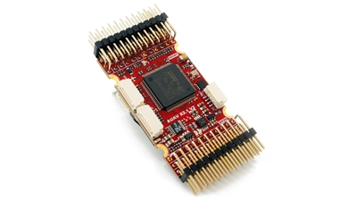

# mRobotics-X2.1 Autopilot

The [mRo](http://www.mRobotics.io/) *mRo-X2.1 autopilot* is based on the [Pixhawk-project](https://pixhawk.org/) **FMUv2** open hardware design. It runs PX4 on the [NuttX](http://nuttx.org) OS.

## Quick Summary

* Main System-on-Chip: [STM32F427](http://www.st.com/web/en/catalog/mmc/FM141/SC1169/SS1577/LN1789)
  * CPU: STM32F427VIT6 ARM microcontroller - Revision 3
  * IO: STM32F100C8T6 ARM microcontroller
* Sensors:
  * Invensense MPU9250 9DOF
  * Invensense ICM-20603 6DOF
  * MEAS MS5611 barometer
* Dimensions/Weight
  * Size: 36mm x 50mm
  * Mounting Points: 30.5mm x 30.5mm 3.2mm diameter
  * Weight: 10.9g
* Power OR-ing schematic with reverse voltage protection. 5V power module is required!

## Connectivity

* 2.54mm headers:
* GPS (USART4) with I2C
* CAN Bus
* RC input
* PPM input
* Spektrum input
* RSSI input
* sBus input
* sBus output
* Power input
* Buzzer output
* LED output
* 8 x Servo outputs
* 6 x Aux outputs
* Kill Pin
* AirSpeed Sensor
* USART2 (Telem 1)
* USART3 (Telem 2)
* USART7 (Console)
* USART8 (OSD)

## PX4 BootLoader Issue

By default a mRo X2.1 might come preconfigured for ArduPilot rather than PX4. This 
can be seen during firmware update when the board is recognized as FMUv2 instead of X2.1.

In this case you must update the BootLoader using [BL_Update_X21.zip](https://github.com/PX4/px4_user_guide/raw/master/assets/hardware/BL_Update_X21.zip).
If this correction is not carried out your compass direction will be wrong and the
secondary IMU will not be detected. 

The update steps are:
1. Download and extract [BL_Update_X21.zip](https://github.com/PX4/px4_user_guide/raw/master/assets/hardware/BL_Update_X21.zip).
2. Find the folder *BL_Update_X21*. This contains a **bin** file and a subfolder named **/etc** containing an **rc.txt** file
3. Copy these files to your micro SD card's root directory and insert it into the mRO x2.1
4. Power on the mRO x2.1 Wait for it to boot and then reboot 1 time.

## Availability

This product can be ordered at the [mRobotics Store](https://store.mrobotics.io/mRo-X2-1-Rev-2-p/mro-x2.1rv2-mr.htm).
 
## Wiring Guide

*TBD*

## Schematics

The board is documented on the [Pixhawk project](https://pixhawk.org/modules/pixhawk) website.
