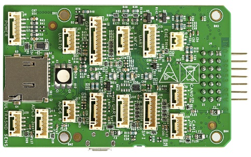

# NXP RDDRONE-FMUK66 FMU

RDDRONE-FMUK66 FMU is a reference design using NXP Semiconductor components that closely follows Pixhawk V4 specifications while adding two wire automotive Ethernet 100BASET1 and secure element A71CH (RevC) or SE050 (RevD). NXP provides the schematics, gerbers, BOM and source files so that anyone can duplicate, change or repurpose this design. This is the official FMU for use with the development www.hovergames.com

The NXP FMU and included peripherals have been tested to comply with FCC/CE/RoHs/REACH directives




## Quick Summary

- **Main FMU Processor:** 
-- * Kinetis K66 MK66FN2MOVLQ18 microcontroller running at 180MHz Cortex-M4F MCU, 2MB Flash, 256KB SRAM, Dual USBs (FS + HS), Ethernet, 144-LQFP.
- **On-board sensors:**
  * Accel/Gyro: BMI088/ICM42688 (RevD)...
  * Accel/Magnetometer: FXOS8700CQ
  * Gyro: FXAS21002CQ
  * Magnetometer: BMM150
  * Barometer ML3115A2
  * Barometer BMP280
- **GPS:**
  * ublox Neo-M8N GPS/GLONASS receiver; integrated magnetometer IST8310
 
This FMU is provided only as a kit, and includes Segger Jlink EDU mini debugger, DCD-LZ debugger adapter, USB-TTL-3V3 console cable, HolyBro GPS module, battery power module, SDCard and Case,screws and stickers. Telemetry radios (HGD-TELEM433 and HGD-TELEM915) must be purchased separately to match ISM band frequencies used in your country. https://www.nxp.com/assets/images/en/photography/RDDRONE-FMUK66-KIT-IMG.jpg

A Lite version RDDRONE-FMUK66L is also available which does not include the power module, GPS, Jlink or USB-TTL-3V3 console cable or SDCard.

Additional information can be found in the [Technical Data Sheet](www.nxp.com/rddrone-fmuk66).


## Purchase
RDDRONE-FMUK66 reference design kit may be purchased direct from NXP or from any of NXP's authorised electronics distributors worldwide.https://www.nxp.com/support/sample-and-buy/distributor-network:DISTRIBUTORS

[Purchase Link]
https://www.nxp.com/design/designs/px4-robotic-drone-fmu-rddrone-fmuk66:RDDRONE-FMUK66#buy
Note that RDDRONE-FMUK66 FMU is also included in the complete HoverGames drone kit
KITHGDRONE-K66
https://www.nxp.com/applications/solutions/industrial/aerospace-and-mobile-robotics/uavs-drones-and-rovers/nxp-hovergames-drone-kit-including-rddrone-fmuk66-and-peripherals:KIT-HGDRONEK66#buy

NOTE- Telemetry radios are purchased separately depending on frequency band:
HGD-TELEM433 https://www.nxp.com/part/HGD-TELEM433
HGD-TELEM915 https://www.nxp.com/part/HGD-TELEM915


## Connectors

[Connector Diagram]

## Pinouts

[Pinouts listing or link]

## Dimensions

[Dimensions]


## Assembly/Setup

https://nxp.gitbook.io/hovergames

## Building Firmware

> **Tip** Most users will not need to build this firmware!
  It is pre-built and automatically installed by *QGroundControl* when appropriate hardware is connected.

To [build PX4](https://dev.px4.io/master/en/setup/building_px4.html) for this target:
```
make XXXXXX
```


## Debug Port

The system's serial console and SWD interface runs on the **DCD-LZ FMU Debug** port. DCD-LZ breakout adapter permits the use of a standard 10 pin JTAG/SWD interface (i.e. using the Segger Jlink) and a standard 5 pin FTDI USB-TTL-3V3 type cable. NXP's DCD-LZ is a 7 pin JST-GH connector and adds the nRST/MCU_RESET pin to the standard DCD (DroneCode Debug) interface port.

https://nxp.gitbook.io/hovergames/rddrone-fmuk66/connectors/debug-interface-dcd-lz


## Peripherals

* [List of anything people should use with this hardware]


## Supported Platforms / Airframes

Any multicopter / airplane / rover or boat that can be controlled with normal RC servos or Futaba S-Bus servos. The complete set of supported configurations can be seen in the [Airframes Reference](../airframes/airframe_reference.md).

**HoverGames Drone Kit**
NXP has available a complete drone development kit kit-HGDRONE-K66 which includes everything needed to build a quadcopter. You only need to supply the 3S/4S LiPo battery.
https://www.nxp.com/kit-hgdronek66


## Further info

- ]In addition to PX4.io user and programming guide, specific assembly, construction, debugging, programming instructions are available on the HoverGames online documentation here: 
https://nxp.gitbook.io/hovergames


