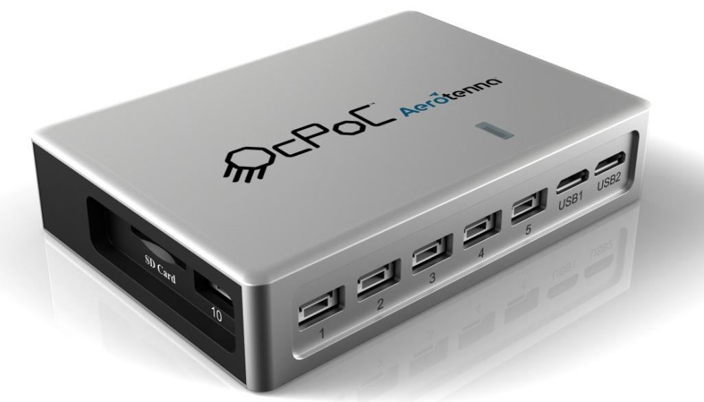

# Aerotenna OcPoC-Zynq Mini Flight Controller

The [OcPoC-Zynq Mini](https://aerotenna.com/ocpoc-zynq/) is a FPGA+ARM SoC based flight control platform. 
OcPoC-Zynq's enhanced I/O flexibility and increased processing power makes it a great solution for commercial UAS developers and researchers. 
The FPGA's I/O flexibility allows for rapid sensor integration and customization of the flight controller hardware, allowing for capabilities such as triple redundancy in GPS, magnetometers, and IMUs. 
OcPoC-Zynq maintains also lightweight, compact footprint, leaving more space and weight on the airframe for sensor and peripheral expansion.

Main documentation is available on [Aerotenna's User Hub](https://aerotenna.readme.io/docs/ocpoc-mini-zynq-specifications) for hardware setup, FAQs, and various tutorials including FPGA and kernel development.



## Quick Summary

  * Main FPGA+ARM System-on-Chip: Xilinx Zynq Z-7010
    * CPU: 667 MHz Dual-Core ARM A9
    * FPGA: Artix®-7 with 28K Logic Cells
    * RAM: 512 MB DDR3
    * Flash: 128 MB
    * SD Card: 16 GB
  * IMU: 2x MPU9250 9-DOF
  * Baro: 1x MS5611
  * Power: 5-30 VDC
    * OcPoC regulates internally to 5V
    * 2S-6S LiPo battery is typical power source on airframe
    * For bench testing, the console "USB1" port supplies 5V
  * 16x Programmable 3-pin GPIOs
  * 10x Programmable I/Os on JST-GH connectors supporting the following interfaces:
    * I2C
    * USB-OTG
    * USB-UART
    * SPI
    * CSI
    * GSI
    * CAN
  * Availability: [Aerotenna Store](https://aerotenna.com/shop/ocpoc-zynq-mini/)

## Pinouts and SD Card Setup

Pinouts for the default OcPoC-Zynq configuration and full step-by-step instructions for first time setup are available on [Aerotenna's User Hub](https://aerotenna.readme.io/docs/ocpoc-mini-zynq-specifications).

## Building PX4 for OcPoC-Zynq

After setting up the PX4 development environment and cloning the [PX4 Firmware](https://github.com/PX4/Firmware), you can build PX4 for OcPoC-Zynq with the following commands (for Aerotenna's default ubuntu-armhf root file system):
```
make aerotenna_ocpoc_ubuntu
```

See the user hub page [PX4 on OcPoC Zynq Mini](https://aerotenna.readme.io/docs/px4-setup) for full step-by-step instructions for first time setup of PX4 on OcPoC-Zynq. 
Note: At the present time PX4 firmware must be built from source as no pre-built binaries for OcPoC-Zynq are supplied through QGroundControl.

## Serial Port Mapping

OcPoc Port | Device | Port
--- | --- | ---
(OcPoC Port 5) | /dev/ttyS0 | TELEM4 / uSharp-Patch
(OcPoC Port 9) | /dev/ttyS1 | GPS/Compass 3
(OcPoC Port 2) | /dev/ttyS2 | TELEM3
(OcPoC Port 6) | /dev/ttyS3 | GPS/Compass #1
(OcPoC Port 4) | /dev/ttyPS1 | TELEM1 / Radio Telemetry
(OcPoC Port 8) | /dev/ttyS6 | TELEM2 / uLanding Radar Altimeter
(OcPoC Port 7) | /dev/ttyS6 | GPS/Compass #2 

