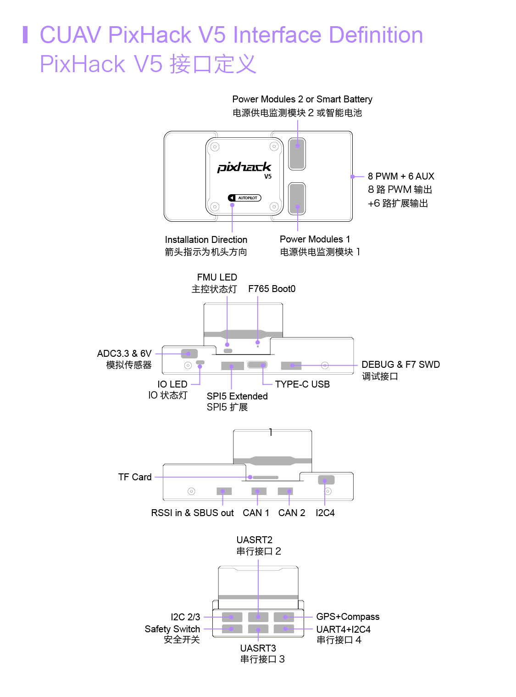

# Pixhack v5

*Pixhack v5*&reg; is an advanced autopilot designed and made in CUAV&reg; . 
The board is  is based on the [Pixhawk-project](https://pixhawk.org/) **FMUv5** open hardware design. It runs PX4 on the [NuttX](http://nuttx.org) OS, and is fully compatible with both PX4 &reg;  firmware. intended primarily for academic and commercial develop.

## Quick Summary

* Main FMU Processor: STM32F765
  * 32 Bit Arm® Cortex®-M7, 216MHz, 2MB memory, 512KB RAM
* IO Processor: STM32F100
  * 32 Bit Arm® Cortex®-M3, 24MHz, 8KB SRAM
* On-board sensors:
  * Accelerometer/Gyro: ICM-20689
  * Accelerometer/Gyro: BMI055
  * Magnetometer: IST8310
  * Barometer: MS5611

* Interfaces:
  * 8-14 PWM outputs (6 from IO, 8 from FMU)
  * 3 dedicated PWM/Capture inputs on FMU
  * Dedicated R/C input for CPPM
  * Dedicated R/C input for ppm/DSM and S.Bus 
  * analog / PWM RSSI input
  * S.Bus servo output
  * 5 general purpose serial ports
  * 4 I2C ports
  * 4 SPI buses
  * 2 CANBuses  with serial ESC
  * Analog inputs for voltage / current of 2 batteries
* Power System:
  * Power: 4.3~5.4V
  * USB Input: 4.75~5.25V
  * Servo Rail Input: 0~36V
* Weight and Dimensions:
  * Weight: 90g
  * Dimensions: 44x84x12mm
* Other Characteristics:
  * Operating temperature: -20 ~ 80°c（Measured value）

## Purchase

Order from [CUAV](https://cuav.taobao.com/index.htm?spm=2013.1.w5002-16371268426.2.411f26d9E18eAz).
## connection{#connection}

> **Warning**The RCIN interface is limited to powering the rc receiver and cannot be connected to any power/load.

## Voltage Ratings

*Pixhach v5* can be triple-redundant on the power supply if three power sources are supplied. The three power rails are: **POWER1**, **POWER2** and **USB**.

> **Note** The output power rails **FMU PWM OUT** and **I/O PWM OUT** (0V to 36V) do not power the flight controller board (and are not powered by it). You must supply power to one of **POWER1**, **POWER2** or **USB** or the board will be unpowered. 

**Normal Operation Maximum Ratings**

Under these conditions all power sources will be used in this order to power the system:
1. **POWER1** and **POWER2** inputs (4.3V to 5.4V)
1. **USB** input (4.75V to 5.25V)

## Building Firmware

`make px4fmu-v5_default upload`

## Debug Port

The system's serial console and SWD interface operate on the **FMU Debug** port. Simply connect the FTDI cable to the Debug & F7 SWD connector.
To access the I/O Debug port, the user must remove the *Pixhack v5 shell.
Both ports have standard serial pins and can be connected to a standard FTDI cable (3.3V, but 5V tolerant) or [Dronecode probe]. [Dronecode probe](https://kb.zubax.com/display/MAINKB/Dronecode+Probe+documentation). 
The pinout as shown

 

## Peripherals

* [Digital Airspeed Sensor](https://drotek.com/shop/en/home/848-sdp3x-airspeed-sensor-kit-sdp33.html)
* [Telemetry Radio Modules](https://docs.px4.io/en/telemetry/)
* [Rangefinders/Distance sensors](https://docs.px4.io/en/sensor/rangefinders.html)

## Supported Platforms / Airframes

Any multicopter / airplane / rover or boat that can be controlled with normal RC servos or Futaba S-Bus servos. The complete set of supported configurations can be seen in the [Airframes Reference](../airframes/airframe_reference.md).

## Further info
- [FMUv5 reference design pinout](https://docs.google.com/spreadsheets/d/1-n0__BYDedQrc_2NHqBenG1DNepAgnHpSGglke-QQwY/edit#gid=912976165). 

