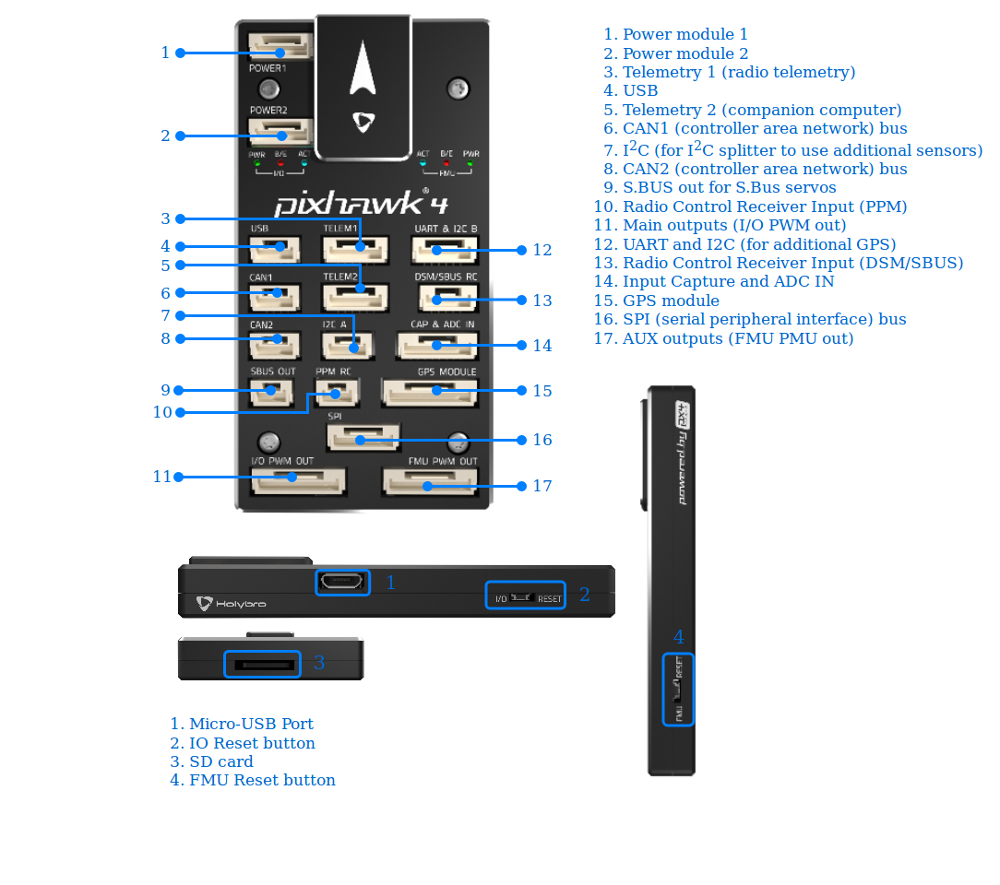

# Pixhawk 4 

Pixhawk&reg; 4 is an advanced autopilot designed and made in collaboration with Holybro&reg; and the PX4 team. It is optimized to run PX4 version 1.7, suitable for academic and commercial developers. 

## Quick Summary

* Main FMU Processor: STM32F765
  * 32 Bit Arm® Cortex®-M7, 216MHz, 2MB memory, 512KB RAM
* IO Processor: STM32F100
  * 32 Bit Arm® Cortex®-M3, 24MHz, 8KB SRAM
* On-board sensors:
  * Accel/Gyro: ICM-20689
  * Accel/Gyro: BMI055
  * Magnetometer: IST8310
  * Barometer: MS5611
* GPS: ublox Neo-M8N GPS/GLONASS receiver; integrated magnetometer IST8310
* Interfaces:
  * 8-16 PWM outputs (8 from IO, 8 from FMU)
  * 3 dedicated PWM/Capture inputs on FMU
  * Dedicated R/C input for CPPM
  * Dedicated R/C input for Spektrum / DSM and S.Bus with analog / PWM RSSI input
  * Dedicated S.Bus servo output
  * 5 general purpose serial ports
  * 3 I2C ports
  * 4 SPI buses
  * Up to 2 CANBuses for dual CAN with serial ESC
  * Analog inputs for voltage / current of 2 batteries
* Power System:
  * Power module output: 4.9~5.5V
  * USB Power Input: 4.75~5.25V
  * Servo Rail Input: 0~36V
* Weight and Dimensions:
  * Weight: 15.8g
  * Dimensions: 44x84x12mm
* Other Characteristics:
  * Operating temperature: -40 ~ 85°c

Download full Pixhawk 4 Technical Data Sheet from [here]().
<!-- Later change to holybro wesbite (https://github.com/PX4/Hardware/blob/master/FMUv5/Pixhawk4-Datasheet.pdf).-->

## Assembly/Setup 

Pixhawk 4 Wiring Quick Start is provided [here](../assembly/quick_start_pixhawk4.md). It includes instructions on how to assemble important peripherals such as GPS, Power Management Board etc.

## Build Instructions

`make px4fmu-v5_default upload`

## Purchase
Order from [Holybro](https://shop.holybro.com/pixhawk-4beta-launch_p1089.html)

## Connectors
> **Note** The SBUS RC and PPM RC ports are for RC receivers only and provide power. NEVER connect any servos, power supplies or batteries to it 
or to the receiver connected to it.

## Pinouts

Download Pixhawk 4 pinouts from [here]().
<!-- link to holybro (https://github.com/PX4/Hardware/blob/master/FMUv5/Pixhawk4-Pinouts.pdf)-->

## Voltage Ratings

Pixhawk 4 can be triple-redundant on the power supply if three power sources are supplied. The three rails are: Power module inputs 1 and 2 and 
USB input.

**Normal Operation Maximum Ratings**

Under these conditions all power sources will be used in this order to power the system:
1. Power module inputs 1 and 2  (4.9V to 5.5V)
1. USB power input (4.75V to 5.25V)

> **Note** **FMU PWM OUT** and **I/O PWM OUT** (0V to 36V) input voltage does not power autopilot, autopilot will be unpowered if power module input is not present.

**Absolute Maximum Ratings**

Under these conditions the system will not draw any power (will not be operational), but will remain intact.
1. Power module inputs 1 and 2 (operational range 4.1V to 5.7V, 0V to 10V undamaged)
1. USB power input (operational range 4.1V to 5.7V, 0V to 6V undamaged)
1. Servo input: VDD_SERVO pin of FMU PWM OUT and I/O PWM OUT (0V to 42V undamaged)

### Debug Port

The system's serial console and SWD interface runs on the **FMU Debug** port, while the I/O console and SWD interface can be accessed via **I/O Debug** port.  In order to access these ports, the user has to remove the Pixhawk 4 casing. Both ports have standard serial pinout and can be connected to a standard FTDI cable (3.3V, but its 5V tolerant) or a [Dronecode probe](https://kb.zubax.com/display/MAINKB/Dronecode+Probe+documentation). The pinout is following the Dronecode debug connector pinout. Please refer to the [wiring](https://dev.px4.io/en/debug/system_console.html) page for details of how to wire up this port.

## Peripherals

* [Digital Airspeed Sensor](https://drotek.com/shop/en/home/848-sdp3x-airspeed-sensor-kit-sdp33.html)
* [Telemetry Radio Modules](https://docs.px4.io/en/telemetry/)
* [Rangefinders/Distance sensors](https://docs.px4.io/en/sensor/rangefinders.html)

## Supported Platforms / Airframes

Any multicopter / airplane / rover or boat that can be controlled with normal RC servos or Futaba S-Bus servos. The complete set of supported configurations can be seen in the [Airframes Reference](../airframes/airframe_reference.md).

## Further info

The reference design (FMUv5) pinout is available [here](https://docs.google.com/spreadsheets/d/1-n0__BYDedQrc_2NHqBenG1DNepAgnHpSGglke-QQwY/edit#gid=912976165). 

<!--The board is documented in detail on the [Pixhawk website](). -->
