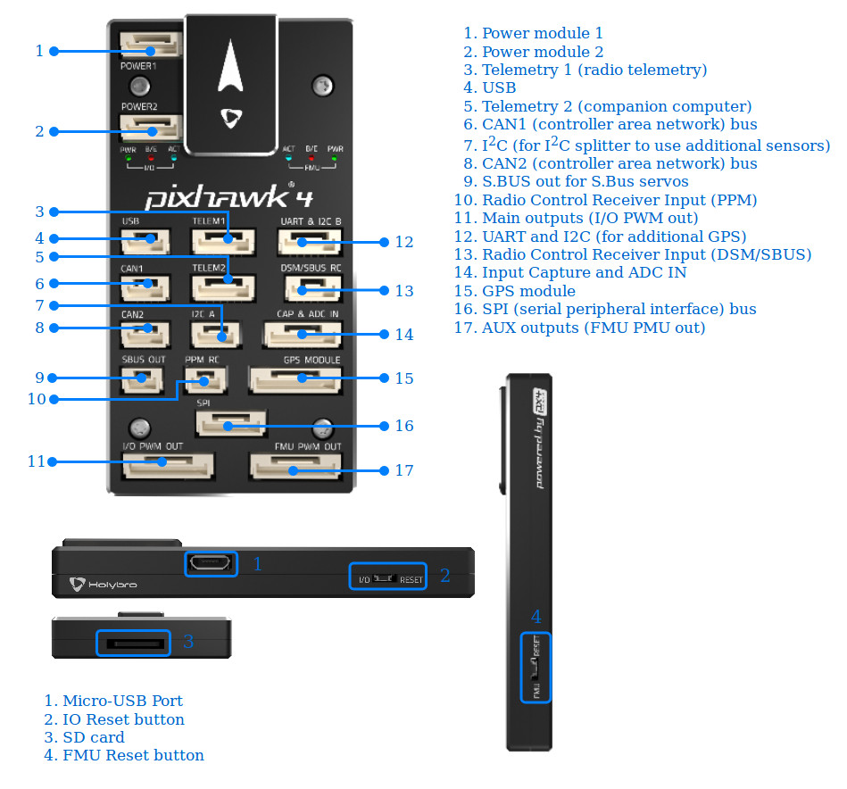

# Pixhawk 4 - Pinouts 

  

## Pinouts

Download Pixhawk&reg; 4 pinouts from [here.](https://github.com/PX4/Hardware/blob/master/FMUv5/Pixhawk4-Pinouts.pdf)

## Connectors
> **Note** The SBUS RC and PPM RC ports are for RC receivers only and provide power. NEVER connect any servos, power supplies or batteries to it 
or to the receiver connected to it.

## Voltage Ratings

Pixhawk 4 can be triple-redundant on the power supply if three power sources are supplied. The three rails are: Power module inputs 1 and 2 and 
USB input.

**Normal Operation Maximum Ratings**

Under these conditions all power sources will be used in this order to power the system:
1. Power module inputs 1 and 2  (4.9V to 5.5V)
1. USB power input (4.75V to 5.25V)

> **Note** **FMU PWM OUT** and **I/O PWM OUT** (0V to 36V) input voltage does not power autopilot, autopilot will be unpowered if power module input is not present.

**Absolute Maximum Ratings**

Under these conditions the system will not draw any power (will not be operational), but will remain intact.
1. Power module inputs 1 and 2 (operational range 4.1V to 5.7V, 0V to 10V undamaged)
1. USB power input (operational range 4.1V to 5.7V, 0V to 6V undamaged)
1. Servo input: VDD_SERVO pin of FMU PWM OUT and I/O PWM OUT (0V to 42V undamaged)

### Debug Port

The system's serial console and SWD interface runs on the **FMU Debug** port, while the I/O console and SWD interface can be accessed via **I/O Debug** port.  In order to access these ports, the user has to remove the Pixhawk 4 casing. Both ports have standard serial pinout and can be connected to a standard FTDI cable (3.3V, but its 5V tolerant) or a [Dronecode probe](https://kb.zubax.com/display/MAINKB/Dronecode+Probe+documentation). The pinout is following the Dronecode debug connector pinout. Please refer to the [wiring](https://dev.px4.io/en/debug/system_console.html) page for details of how to wire up this port.

## Peripherals

* [Digital Airspeed Sensor](https://drotek.com/shop/en/home/848-sdp3x-airspeed-sensor-kit-sdp33.html)
* [Telemetry Radio Modules](https://docs.px4.io/en/telemetry/)
* [Rangefinders/Distance sensors](https://docs.px4.io/en/sensor/rangefinders.html)

## Supported Platforms / Airframes

Any multicopter / airplane / rover or boat that can be controlled with normal RC servos or Futaba S-Bus servos. The complete set of supported configurations can be seen in the [Airframes Reference](../airframes/airframe_reference.md).

