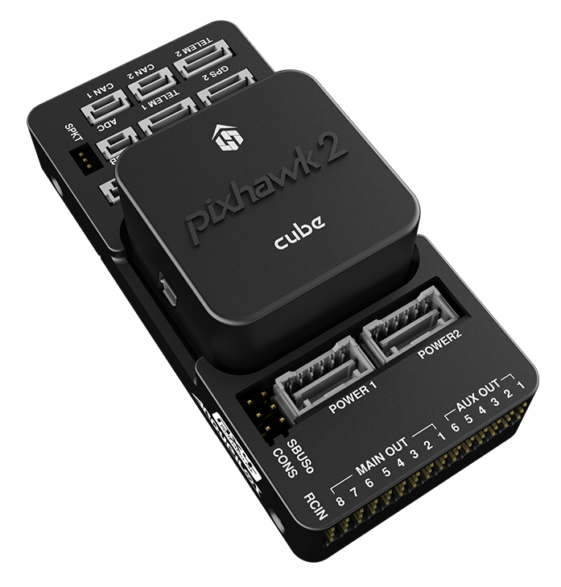

# Pixhawk Series

[Pixhawk](https://pixhawk.org/) is an independent open-hardware project providing readily-available, low-cost, and high-end, *autopilot 
hardware designs* to the academic, hobby and industrial communities. 

A number of companies have created products based on the Pixhawk designs, 
which all share the common architecture and have the same connections, outputs, functions, etc. 
The products differ in that they have form-factors that better meet certain use-cases.

> **Note** *Any* flight controller that is based on a Pixhawk project hardware design 
  is a "Pixhawk".
>
>  That said, the name "Pixhawk" is very overloaded. It is also commonly used to 
  refer to 3DR's "Pixhawk" flight controller (based on the *Pixhawk project*'s 
  FMUv2 architecture). 

The project delivers regular iterations of the flight controller architecture. The original
specification was FMUv1. At time of writing controllers are being built using FMUv4, 
with new evolutions already being planned.

The following section lists the project architectures (in reverse order) and some of the associated 
products.

## FMUv4

- [Pixhawk Mini](pixhawk_mini.md)

  

- [PixRacer](pixracer.md) v1

  

## FMUv3

- [Pixhawk 2](https://pixhawk.org/modules/pixhawk2) ("The Cube")

  

## FMUv2

> **Note** At time of writing this is the most popular Pixhawk architecture.

- 3DR [Pixhawk](pixhawk.md)

  
  
- Fixfalcon

  

- HKPilot32

  

- AUAV-X2

  
  

## FMUv1 (first generation)

The first architecture had a two components: PX4FMU+PX4IO. 

> **Caution** This is no longer available for purchase.

- PX4FMU

   

- PX4IO

   

