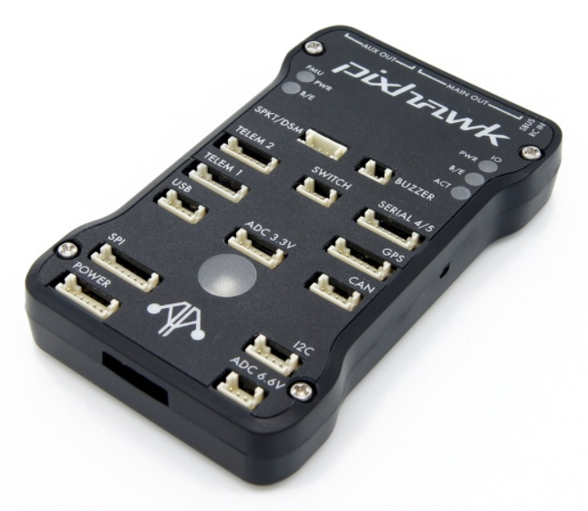
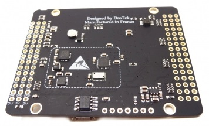

# Pixhawk Series

[Pixhawk](https://pixhawk.org/) is an independent open-hardware project providing readily-available, low-cost, and high-end, *autopilot 
hardware designs* to the academic, hobby and industrial communities. "Pixhawk-series" boards run PX4 on the [NuttX](http://nuttx.org) OS. 

Manufacturers have created many different boards based on the open designs, with form factors that are well suited to applications from cargo carrying though to first person view (FPV) racers.

> **Tip** For computationally intensive tasks (e.g. computer vision) you will need a separate companion computer (e.g. [Raspberry Pi 2/3 Navio2](../flight_controller/raspberry_pi_navio2.md)) or a platform with an integrated companion solution (e.g. [Intel® Aero Ready to Fly Drone](../flight_controller/intel_aero.md), [Qualcomm Snapdragon Flight](../flight_controller/snapdragon_flight.md)).

## Recommended boards

The following products in the series are recommended/regularly tested with PX4:

* [mRo Pixhawk](../flight_controller/mro_pixhawk.md) (FMUv3)
* [HKPilot32](../flight_controller/HKPilot32.md) (FMUv2)
* [Pixfalcon](../flight_controller/pixfalcon.md) (FMUv2)
* [DroPix](../flight_controller/dropix.md) (FMUv2)
* [Pixracer](../flight_controller/pixracer.md) (FMUv2)
* [MindPX](../flight_controller/mindpx.md) (FMUv2)
  * [MindRacer](../flight_controller/mindracer.md) (FMUv2)
* [Pixhawk 2](../flight_controller/pixhawk-2.md) (FMUv3)
* [Pixhawk Mini](../flight_controller/pixhawk_mini.md) (FMUv4)
* [Pixhawk 3 Pro](../flight_controller/pixhawk3_pro.md) (FMUv4-PRO)

> **Note** This list is not exhaustive! In particular it does not include devices that have used hardware designs without complying with the open source license, or cloned product designs without licensing them.

<!-- 

        

-->

The remainder topic explains a bit more about the series, but is not required reading.

## Background

The [Pixhawk project](https://pixhawk.org/) creates open designs, in the form of schematics that define the connections, wiring, CPU, sensors, etc. The project has created a number of different open designs. 

Manufacturers are encouraged to take the open designs and create products that are best suited to a particular market or use case (the physical layout/form factor not part of the open specification).  Boards based on the same design are binary compatible.

> **Note** While a physical connector standard is not mandated, newer products generally follow the [Dronecode Autopilot Connector Standard](https://wiki.dronecode.org/workgroup/connectors/start)).

Product schematics must be open-sourced under the terms of the open-hardware license, but remain the property of the owner (clones should not be created without permission). Similarly, the brand name of a product may be trademarked and should not be used without permission of the owner.

> **Note** Pixhawk is a trademarked "brand" name.

## FMU Versions

Open design versions are named using the designation: FMUvX (e.g.: FMUv1, FMUv2, FMUv3, FMUv4, etc.). 

PX4 *users* generally do not need to know very much about FMU versions:
- *QGroundControl* automatically downloads the correct firmware for a connected autopilot (based on its FMU version "under the hood").
- FMU versions are of limited use when choosing an autopilot. This is because different versions can be almost identical, differing only in connector wiring. 

> **Tip** PX4 developers need to know the FMU version of their board, as this is required to build custom hardware. 

At very high level, the main differences are:

* FMUv2: This design has been widely used in other products. It was the first architecture used in *Pixhawk* branded product ([Pixhawk 1](../flight_controller/pixhawk.md))
* FMUv3: This added support for additional RAM (that wasn't addressable, even if physically present, in FMUv2)
* FMUv4: 
* FMUv4-PRO:
* FMUv5:

