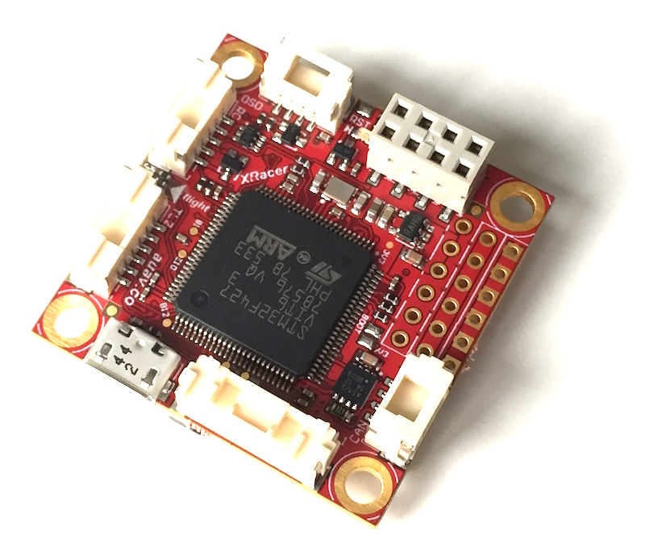

# Pixracer

The Pixhawk XRacer board family is optimized for small racing quads and planes. In contrast to [Pixfalcon](../flight_controller/pixfalcon.md) and [Pixhawk](../flight_controller/pixhawk.md) it has in-built Wifi, new sensors, convenient full servo headers, CAN and supports 2M flash.

> **Note** The main hardware documentation is here: https://pixhawk.org/modules/pixracer

 

## Quick Summary

* Main System-on-Chip: [STM32F427VIT6 rev.3](http://www.st.com/web/en/catalog/mmc/FM141/SC1169/SS1577/LN1789)
  * CPU: 180 MHz ARM Cortex M4 with single-precision FPU
  * RAM: 256 KB SRAM (L1)
* Standard FPV form factor: 36x36 mm with standard 30.5 mm hole pattern
* Wifi telemetry and software upgrade
* Invensense ICM-20608 Accel / Gyro (4 KHz) / MPU9250 Accel / Gyro / Mag (4 KHz)
* HMC5983 magnetometer with temperature compensation
* Measurement Specialties MS5611 barometer
* JST GH connectors
* microSD (logging)
* S.BUS / Spektrum / SUMD / PPM input
* FrSky telemetry port
* OneShot PWM out (configurable)
* Optional: Safety switch and buzzer
* Availability:
  * [AUAV Pixracer](http://www.auav.co/product-p/xr-v1.htm)
* Accessories:
  * [Digital airspeed sensor](http://www.hobbyking.com/hobbyking/store/__62752__HKPilot_32_Digital_Air_Speed_Sensor_And_Pitot_Tube_Set.html)
  * [Hobbyking OSD + US Telemetry (915 MHz)](http://www.hobbyking.com/hobbyking/store/__74651__Micro_HKPilot_Telemetry_Radio_Module_with_On_Screen_Display_OSD_unit_915MHz_.html)
  * [Hobbyking OSD + EU Telemetry (433 MHz)](http://www.hobbyking.com/hobbyking/store/__74650__Micro_HKPilot_Telemetry_Radio_Module_with_On_Screen_Display_OSD_unit_433MHz_.html)

## Kit

The Pixracer is designed to use a separate avionics power supply. This is necessary to avoid current surges from motors or ESCs to flow back to the flight controller and disturb its delicate sensors.

* Power module (with voltage and current sensing)
* I2C splitter (supporting AUAV, Hobbyking and 3DR peripherals)
* Cable kit for all common peripherals

## Wifi (no USB required)

One of the main features of the board is its ability to use Wifi for flashing new firmware, system setup and in-flight telemetry. This frees it of the need of any desktop system.

> **Todo** Setup and telemetry are already available, firmware upgrade is already supported by the default bootloader but not yet enabled

* [ESP8266 Documentation and Flash Instructions](https://pixhawk.org/peripherals/8266)
* [Custom ESP8266 MAVLink firmware](https://github.com/dogmaphobic/mavesp8266)

## Wiring Diagrams

