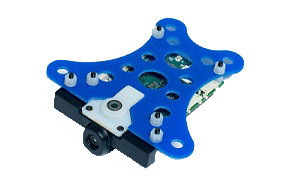
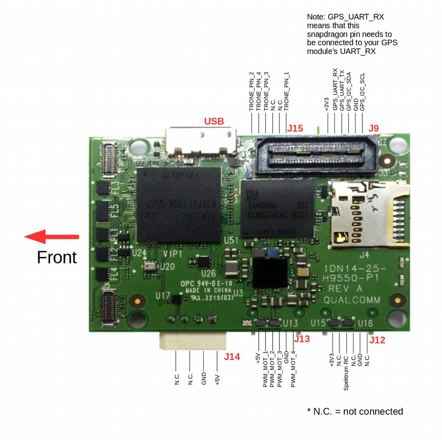
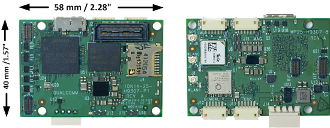

# Snapdragon Flight Autopilot (Discontinued)

> **Warning** This flight controller has been [discontinued](../flight_controller/autopilot_experimental.md) and is no longer commercially available.

The *Qualcomm Snapdragon Flight* platform is a high-end autopilot / onboard computer which runs the PX4 Flight Stack on the DSP on the QuRT real time operating system using the [DSPAL API](https://github.com/ATLFlight/dspal) for POSIX compatibility. 
In comparison to [Pixhawk](../flight_controller/pixhawk.md) it adds a camera and WiFi and high-end processing power, and different IO.

More information about the Snapdragon Flight platform is in the official [Qualcomm® Snapdragon™ Flight Kit](https://www.intrinsyc.com/qualcomm-snapdragon-flight-details/) documentation. 



## Quick Summary

* System-on-Chip: [Snapdragon 801](https://www.qualcomm.com/products/snapdragon/processors/801)
  * CPU: Quad-core 2.26 GHz Krait
  * DSP: Hexagon DSP (QDSP6 V5A) – 801 MHz+256KL2 (running the flight code)
  * GPU: Qualcomm® Adreno™ 330 GPU
  * RAM: 2GB LPDDR3 PoP @931 MHz
* Storage: 32GB eMMC Flash
* Video: Sony IMX135 on Liteon Module 12P1BAD11
  * 4k@30fps 3840×2160 video capture to SD card with H.264 @ 100Mbits (1080p/60 with parallel FPV), 720p FPV
* Optic Flow: Omnivision OV7251 on Sunny Module MD102A-200
  * 640x480 @ 30/60/90 fps
* Wifi: Qualcomm® VIVE™ 1-stream 802.11n/ac with MU-MIMO † Integrated digital core
* BT/WiFi: BT 4.0 and 2G/5G WiFi via QCA6234
  * 802.11n, 2×2 MIMO with 2 uCOAX connectors on-board for connection to external antenna
* GPS: Telit Jupiter SE868 V2 module (use of an external u-Blox module is recommended by PX4 instead)
  * uCOAX connector on-board for connection to external GPS patch antenna
  * CSR SiRFstarV @ 5Hz via UART
* Accelerometer / Gyro / Mag: Invensense MPU-9250 9-Axis Sensor, 3x3mm QFN, on bus SPI1
* Baro: Bosch BMP280 barometric pressure sensor, on bus I2C3
* Power: 5VDC via external 2S-6S battery regulated down to 5V via APM adapter
* Availability: *No longer available*


## Connectivity

* One USB 3.0 OTG port (micro-A/B)
* Micro SD card slot
* Gimbal connector (PWB/GND/BLSP)
* ESC connector (2W UART)
* I2C
* 60-pin high speed Samtec QSH-030-01-L-D-A-K expansion connector
  * 2x BLSP ([BAM Low Speed Peripheral](http://www.inforcecomputing.com/public_docs/BLSPs_on_Inforce_6540_6501_Snapdragon_805.pdf))
  * USB

## Recommended Wiring



## Pinouts

> **Warning** Although the Snapdragon uses DF13 connectors, the pinout is different from Pixhawk.

Detailed pinout information can be found here: [Qualcomm Developer Network](https://developer.qualcomm.com/hardware/snapdragon-flight/board-pin-outs).

### WiFi

* WLAN0, WLAN1 (+BT 4.0): U.FL connector: [Taoglas adhesive antenna (DigiKey)](https://www.digikey.com/products/en?keywords=FXP840.07.0055B)


### Connectors

The default mapping of the serial ports is as follows:

| Device           | Description                           |
| ---------------- | ------------------------------------- |
| ```/dev/tty-1``` | J15 (next to USB)                     |
| ```/dev/tty-2``` | J13 (next to power module connector)  |
| ```/dev/tty-3``` | J12 (next to J13)                     |
| ```/dev/tty-4``` | J9 (next to J15)                      |

For a custom UART to BAM mapping, create a file called **blsp.config** and *adb* push it to **/usr/share/data/adsp**. 
For example, to keep the default mapping, your **blsp.config** should look as follows:
```
tty-1 bam-9 2-wire
tty-2 bam-6 2-wire
tty-3 bam-8 2-wire
tty-4 bam-2 2-wire
```

Be sure to include the text "2-wire" at the end of each line to allow the UART to use only the TX and RX pins specified in the tables below.
If 2-wire is not specified (or if the file is not present on the target) the UART will default to using 4-wire mode and will require an additional two pins for RTS/CTS flow control.  
This will cause a problem for any other type of I/O on the same connector, since the pins will be configured as RTS and CTS signals.
If, for example, J9 (described below) was being used to connect to both a UART and an I2C device, the I2C signals on pin 4 and pin 6 would be configured as RTS and CTS signals, overriding the I2C SDA and SCL signals.

#### J9 / GPS

| Pin | 2-wire UART + I2C | 4-wire UART | SPI | Comment |
| -- | -- | -- | -- | -- |
| 1 | 3.3V | 3.3V | 3.3V | |
| 2 | UART2_TX | UART2_TX | SPI2_MOSI | Output (3.3V) |
| 3 | UART2_RX | UART2_RX | SPI2_MISO | Input (3.3V) |
| 4 | I2C2_SDA | UART2_RTS | SPI2_CS | (3.3V) |
| 5 | GND | GND | GND | |
| 6 | I2C2_SCL | UART2_CTS | SPI2_CLK | (3.3V) |

#### J12 / Gimbal bus

| Pin | 2-wire UART + GPIO | 4-wire UART | SPI | Comment |
| -- | -- | -- | -- | -- |
| 1 | 3.3V | 3.3V | 3.3V | |
| 2 | UART8_TX | UART8_TX | SPI8_MOSI | Output (3.3V) |
| 3 | UART8_RX | UART8_RX | SPI8_MISO | Input (3.3V) |
| 4 | APQ_GPIO_47 | UART8_RTS | SPI8_CS | (3.3V) |
| 5 | GND | GND | GND | |
| 6 | APQ_GPIO_48 | UART8_CTS | SPI8_CLK | (3.3V) |

#### J13 / ESC bus

| Pin | 2-wire UART + GPIO | 4-wire UART | SPI | Comment |
| -- | -- | -- | -- | -- |
| 1 | 5V | 5V | 5V | |
| 2 | UART6_TX | UART6_TX | SPI6_MOSI | Output (5V) |
| 3 | UART6_RX | UART6_RX | SPI6_MISO |Input (5V) |
| 4 | APQ_GPIO_29 | UART6_RTS | SPI6_CS | (5V) |
| 5 | GND | GND | GND | |
| 6 | APQ_GPIO_30 | UART6_CTS | SPI6_CLK | (5V) |

#### J14 / Power

| Pin | Signal | Comment |
| -- | -- | -- |
| 1 | 5V DC | Power input |
| 2 | GND | |
| 3 | I2C3_SCL | (5V) |
| 4 | I2C3_SDA | (5V) |

#### J15 / Radio Receiver / Sensors

| Pin | 2-wire UART + I2C | 4-wire UART | SPI | Comment |
| -- | -- | -- | -- | -- |
| 1 | 3.3V | 3.3V | 3.3V | |
| 2 | UART9_TX | UART9_TX | SPI9_MOSI | Output |
| 3 | UART9_RX | UART9_RX | SPI9_MISO | Input |
| 4 | I2C9_SDA | UART9_RTS | SPI9_CS | |
| 5 | GND | GND | GND | |
| 6 | I2C9_SCL | UART9_CTS | SPI9_CLK | |


## Dimensions


