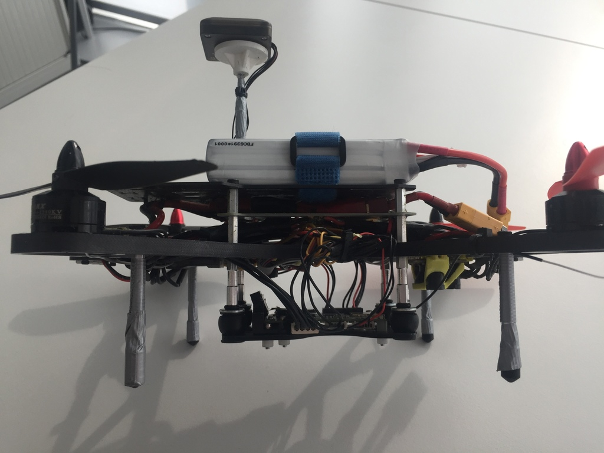
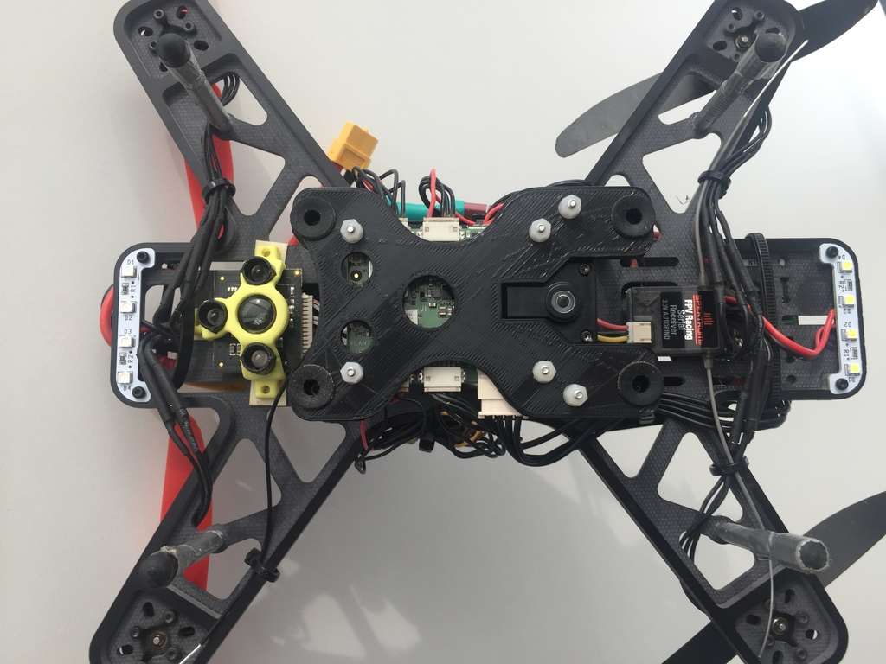
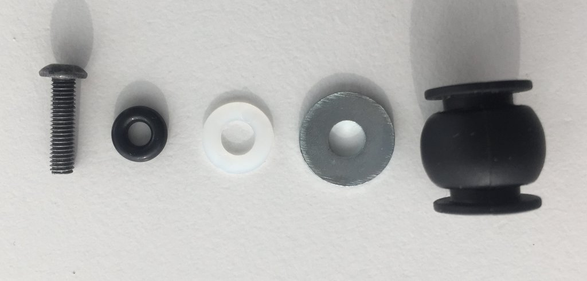
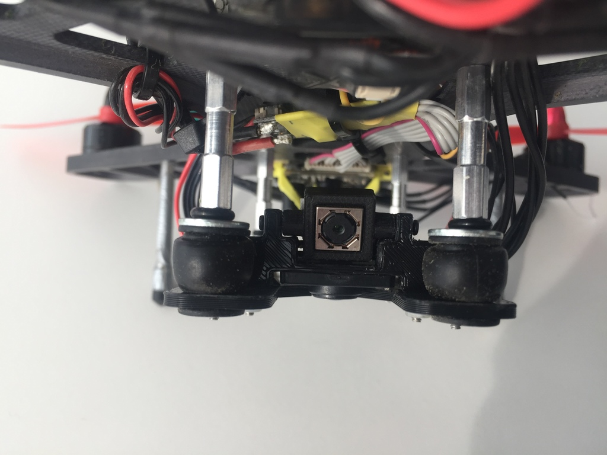

# Snapdragon Flight Autopilot

The Snapdragon Flight platform is a high-end autopilot / onboard computer which runs the PX4 Flight Stack on the DSP on the QuRT real time operating system using the [DSPAL API](https://github.com/ATLFlight/dspal) for POSIX compatibility. In comparison to [Pixhawk](../flight_controller/pixhawk.md) it adds a camera and WiFi and high-end processing power, and different IO.

More information about the Snapdragon Flight platform is at [Snapdragon-Flight-Details](https://www.intrinsyc.com/qualcomm-snapdragon-flight-details/)


## Quick Summary

* System-on-Chip: [Snapdragon 801](https://www.qualcomm.com/products/snapdragon/processors/801)
  * CPU: Quad-core 2.26 GHz Krait
  * DSP: Hexagon DSP (QDSP6 V5A) – 801 MHz+256KL2 (running the flight code)
  * GPU: Qualcomm® Adreno™ 330 GPU
  * RAM: 2GB LPDDR3 PoP @931 MHz
* Storage: 32GB eMMC Flash
* Video: Sony IMX135 on Liteon Module 12P1BAD11
  * 4k@30fps 3840×2160 video capture to SD card with H.264 @ 100Mbits (1080p/60 with parallel FPV), 720p FPV
* Optic Flow: Omnivision OV7251 on Sunny Module MD102A-200
  * 640x480 @ 30/60/90 fps
* Wifi: Qualcomm® VIVE™ 1-stream 802.11n/ac with MU-MIMO † Integrated digital core
* BT/WiFi: BT 4.0 and 2G/5G WiFi via QCA6234
  * 802.11n, 2×2 MIMO with 2 uCOAX connectors on-board for connection to external antenna
* GPS: Telit Jupiter SE868 V2 module (use of an external u-Blox module is recommended by PX4 instead)
  * uCOAX connector on-board for connection to external GPS patch antenna
  * CSR SiRFstarV @ 5Hz via UART
* Accelerometer / Gyro / Mag: Invensense MPU-9250 9-Axis Sensor, 3x3mm QFN, on bus SPI1
* Baro: Bosch BMP280 barometric pressure sensor, on bus I2C3
* Power: 5VDC via external 2S-6S battery regulated down to 5V via APM adapter
* Availability: [Intrinsyc Store](http://shop.intrinsyc.com/products/snapdragon-flight-dev-kit)

## Recommended setup

We suggest using the Snapdragon Flight with the following racer frame (250) and our custom hardware mounts. This setup uses a conventional PWM ESC board and therefore needs to be built with the `eagle_default` make target (see our instructions [here](https://dev.px4.io/en/setup/building_px4.html)). If you use the [Qualcomm ESC board](http://shop.intrinsyc.com/products/qualcomm-electronic-speed-control-board), please follow their instructions [here](https://github.com/ATLFlight/ATLFlightDocs/blob/master/PX4.md).




#### Components
* [Quantum Falcon 250](http://readme.dronesmith.io/docs/ql25) (includes ESCs and motors)
* 3DR PIXHAWK MINI GPS
* Trone range finder
* Spektrum DXe and FPV Racing Serial Receiver (3.3V Autobind)

Details on wiring can be found below.

In order to mount the Snapdragon Flight, our custom board and camera mounts can be used (the optical flow camera mount is not needed for newer generation boards):
* [Board mounting plate, for  5mm dampers](https://drive.google.com/open?id=0B2piootk_fIKZ3YyRXQzR1A0ejQ)
* [Board mounting plate, for  7mm dampers](https://drive.google.com/open?id=0B2piootk_fIKUUYzMEd6WWxmNnM)
* [Hires camera mount, part 1](https://drive.google.com/open?id=0B2piootk_fIKdTlkX2c5c2IyNGM)
* [Hires camera mount, part 2](https://drive.google.com/open?id=0B2piootk_fIKbkcxZndrQjFrc0E)
* [Optical flow camera mount](https://drive.google.com/open?id=0B2piootk_fIKcXJRRW9ZT3hDTlk)

To assemble the hires camera mount, additional screws (M2x6 or M1.6x6 should fit) have to be used.

This particular setup uses vibration dampers with a 7mm mounting diameter which are similar to [these](https://hobbyking.com/en_us/vibration-damping-ball-50gram-8-pcs-bag.html). In addition, the following things are needed:
* Screws, M3x12
* O-rings, 3mm inner diameter
* M3 washers, ~9mm for the inside
* M3 washers, ~12mm for the outside





## Connectivity

* One USB 3.0 OTG port (micro-A/B)
* Micro SD card slot
* Gimbal connector (PWB/GND/BLSP)
* ESC connector (2W UART)
* I2C
* 60-pin high speed Samtec QSH-030-01-L-D-A-K expansion connector
  * 2x BLSP ([BAM Low Speed Peripheral](http://www.inforcecomputing.com/public_docs/BLSPs_on_Inforce_6540_6501_Snapdragon_805.pdf))
  * USB

## Pinouts

> **Warning** Although the Snapdragon uses DF13 connectors, the pinout is different from Pixhawk.

Detailed pinout information can be found here: [Qualcomm Developer Network](https://developer.qualcomm.com/hardware/snapdragon-flight/board-pin-outs).

### WiFi

* WLAN0, WLAN1 (+BT 4.0): U.FL connector: [Taoglas adhesive antenna (DigiKey)](http://www.digikey.com/product-detail/en/FXP840.07.0055B/931-1222-ND/3877414)


### Connectors

The default mapping of the serial ports is as follows:

| Device           | Description                           |
| ---------------- | ------------------------------------- |
| ```/dev/tty-1``` | J15 (next to USB)                     |
| ```/dev/tty-2``` | J13 (next to power module connector)  |
| ```/dev/tty-3``` | J12 (next to J13)                     |
| ```/dev/tty-4``` | J9 (next to J15)                      |

For a custom UART to BAM mapping, create a file called "blsp.config" and adb push it to ```/usr/share/data/adsp```. E.g., to keep the default mapping, your "blsp.config" should look as follows:

tty-1 bam-9 2-wire  
tty-2 bam-6 2-wire  
tty-3 bam-8 2-wire  
tty-4 bam-2 2-wire  

Be sure to include the text "2-wire" at the end of each line to allow the UART to use only the TX and RX pins specified in the tables below.  If 2-wire is not specified (or if the file is not present on the target) the UART will default to using 4-wire mode and will require an additional two pins for RTS/CTS flow control.  This will cause a problem for any other type of I/O on the same connector, since the pins will be configured as RTS and CTS signals. If, for example, J9 (described below) was being used to connect to both a UART and an I2C device, the I2C signals on pin 4 and pin 6 would be configured as RTS and CTS signals, overriding the I2C SDA and SCL signals.

#### J9 / GPS

| Pin | 2-wire UART + I2C | 4-wire UART | SPI | Comment |
| -- | -- | -- | -- | -- |
| 1 | 3.3V | 3.3V | 3.3V | |
| 2 | UART2_TX | UART2_TX | SPI2_MOSI | Output (3.3V) |
| 3 | UART2_RX | UART2_RX | SPI2_MISO | Input (3.3V) |
| 4 | I2C2_SDA | UART2_RTS | SPI2_CS | (3.3V) |
| 5 | GND | GND | GND | |
| 6 | I2C2_SCL | UART2_CTS | SPI2_CLK | (3.3V) |

#### J12 / Gimbal bus

| Pin | 2-wire UART + GPIO | 4-wire UART | SPI | Comment |
| -- | -- | -- | -- | -- |
| 1 | 3.3V | 3.3V | 3.3V | |
| 2 | UART8_TX | UART8_TX | SPI8_MOSI | Output (3.3V) |
| 3 | UART8_RX | UART8_RX | SPI8_MISO | Input (3.3V) |
| 4 | APQ_GPIO_47 | UART8_RTS | SPI8_CS | (3.3V) |
| 5 | GND | GND | GND | |
| 6 | APQ_GPIO_48 | UART8_CTS | SPI8_CLK | (3.3V) |

#### J13 / ESC bus

| Pin | 2-wire UART + GPIO | 4-wire UART | SPI | Comment |
| -- | -- | -- | -- | -- |
| 1 | 5V | 5V | 5V | |
| 2 | UART6_TX | UART6_TX | SPI6_MOSI | Output (5V) |
| 3 | UART6_RX | UART6_RX | SPI6_MISO |Input (5V) |
| 4 | APQ_GPIO_29 | UART6_RTS | SPI6_CS | (5V) |
| 5 | GND | GND | GND | |
| 6 | APQ_GPIO_30 | UART6_CTS | SPI6_CLK | (5V) |

#### J14 / Power

| Pin | Signal | Comment |
| -- | -- | -- |
| 1 | 5V DC | Power input |
| 2 | GND | |
| 3 | I2C3_SCL | (5V) |
| 4 | I2C3_SDA | (5V) |

#### J15 / Radio Receiver / Sensors

| Pin | 2-wire UART + I2C | 4-wire UART | SPI | Comment |
| -- | -- | -- | -- | -- |
| 1 | 3.3V | 3.3V | 3.3V | |
| 2 | UART9_TX | UART9_TX | SPI9_MOSI | Output |
| 3 | UART9_RX | UART9_RX | SPI9_MISO | Input |
| 4 | I2C9_SDA | UART9_RTS | SPI9_CS | |
| 5 | GND | GND | GND | |
| 6 | I2C9_SCL | UART9_CTS | SPI9_CLK | |

## Peripherals

### GPS Wiring

Even though the 3DR GPS is described to have a 5v input, operation with 3.3V seems to work fine. (The built-in regulator MIC5205 has a minimum operating voltage of 2.5v.)

| Snapdragon J9 Pin | Signal   | Comment       | 3DR GPS 6pin/4pin  | Pixfalcon GPS pin | 3DR PIXHAWK MINI GPS |
| ----------------- | ---------| ------------- | ------------------ | ----------------- | -------------------  |
| 1                 | 3.3V     | (3.3V)        | 1                  | 4                 |3 (5V)                |
| 2                 | UART2_TX | Output (3.3V) | 2/-                | 3                 |4                     |
| 3                 | UART2_RX | Input (3.3V)  | 3/-                | 2                 |5                     |
| 4                 | I2C2_SDA | (3.3V)        | -/3                | 5                 |2                     |
| 5                 | GND      |               | 6/-                | 1                 |6                     |
| 6                 | I2C2_SCL | (3.3V)        | -/2                | 6                 |1                     |

### PWM ESC Wiring

For controlling the motors, PWM ESCs can be used. Use connector J13 (next to power module connector) and the following wiring. ESC numbering is according to [here](../airframes/airframe_reference.md#quadrotor-x). The ESCs are powered using the ESC power distribution board that comes with the frame.

| Snapdragon J13 Pin | ESC | Comment                   |
| ------------------ | --- | ------------------------  |
| 1                  | -   | They already have voltage |
| 2                  | 1   | Signal (orange)           |
| 3                  | 2   | Signal (orange)           |
| 4                  | 3   | Signal (orange)           |
| 5                  | GND | GND from all ESCs         |
| 6                  | 4   | Signal (orange)           |

### RC Wiring

| Snapdragon J12 Pin | Spektrum receiver (3 pins) |
| ------------------ | -------------------------- |
| 1                  | 3.3 V                      |
| 2                  | -                          |
| 3                  | Signal                     |
| 4                  | -                          |
| 5                  | GND                        |
| 6                  | -                          |

### Trone Range Finder Wiring

| Snapdragon J15 Pin | Trone (4 pins) |
| ------------------ | -------------- |
| 1                  | 1              |
| 2                  | -              |
| 3                  | -              |
| 4                  | 3              |
| 5                  | 4              |
| 6                  | 2              |

Details can be found [here](../flight_controller/snapdragon_flight_camera.md)

### UART to Pixracer / Pixfalcon Wiring

This interface is used to leverage the Pixracer / Pixfalcon as I/O interface board. Connect to `TELEM1` Pixfalcon and to `TELEM2` on Pixracer.

| Snapdragon J13 Pin | Signal | Comment | Pixfalcon / Pixracer Pin |
| -- | -- | -- | -- |
| 1 | 5V | Power for autopilot | 5V |
| 2 | UART6_TX | Output (5V) TX -> RX | 3 |
| 3 | UART6_RX | Input (5V) RX -> TX | 2 |
| 4 | APQ_GPIO_29 | (5V) | Not connected |
| 5 | GND | | 6 |
| 6 | APQ_GPIO_30 | (5V) | Not connected |

## Dimensions


