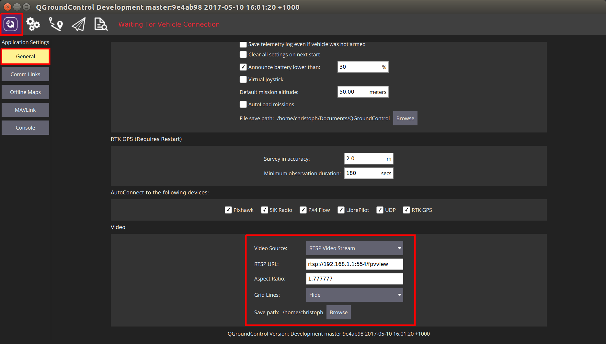

# Snapdragon Advanced

> **Note** The *Qualcomm Snapdragon Flight* is discontinued (it has been superseded but PX4 does not yet support the newer version).
  This documentation is provided for existing users, but will be removed in a future release.

This page is a collection of useful commands and instructions which might come in handy when working with the Snapdragon platform.

## Connect to Snapdragon

### Over FTDI

The kit comes with a breakout board with three pins to access the console.
Connect the bundled FTDI cable to the supplied header and the breakout board to the expansion connector.

On Linux, open a console using:

```
screen /dev/ttyUSB0 115200
```

Change USB0 to whatever it happens to be. Check `/dev/` or `/dev/serial/by-id`.


### Over ADB (Android Debug Bridge)

Connect the Snapdragon over USB2.0 and power it up using the power module.
When the Snapdragon is running the, the LED will be slowly blinking (breathing) in blue.

Make sure the board can be found using *adb*:
```
adb devices
```

If you cannot see the device, it is most likely a USB device permission issue. Follow the instructions

To get a shell, do:

```
adb shell
```

### DSP Debug Monitor/Console

When you are connected to your Snapdragon board via USB you have access to the PX4 shell on the DSP (POSIX).
The interaction with the DSP side (QuRT) is enabled with the `qshell` posix app and its QuRT companion.

With the Snapdragon connected via USB, open the mini-dm to see the output of the DSP:
```
${HEXAGON_SDK_ROOT}/tools/debug/mini-dm/Linux_Debug/mini-dm
```

> **Note** Alternatively, especially on Mac, you can also use [nano-dm](https://github.com/kevinmehall/nano-dm).

Run the main app on the linaro side:
```sh
cd /home/linaro
./px4 -s px4.config
```

You can now use all apps loaded on the DSP from the linaro shell with the following syntax:
```sh
pxh> qshell command [args ...]
```

For example, to see the available QuRT apps:
```sh
pxh> qshell list_tasks
```

The output of the executed command is displayed on the minidm.

## Serial ports

Not all POSIX calls are currently supported on QURT. 
Therefore, some custom ioctl are needed.

The APIs to set up and use the UART are described in [dspal](https://github.com/PX4/dspal/blob/master/include/dev_fs_lib_serial.h).

## Wi-Fi settings

> **Todo** These are notes for advanced developers.

Connect to the Linux shell (see [console instructions](https://dev.px4.io/master/en/debug/system_console.html#snapdragon-flight-wiring-the-console)).

### Access point mode

If you want the Snapdragon to be a wifi access point (AP mode), edit the file: **/etc/hostapd.conf** and set:
```
ssid=EnterYourSSID
wpa_passphrase=EnterYourPassphrase
```

> **Note** The passphrase must be at least 8 characters

Then configure AP mode:

```
/usr/local/qr-linux/wificonfig.sh -s softap
reboot
```

### Station mode

If you want the Snapdragon to connect to your existing wifi, edit the file: **/etc/wpa_supplicant/wpa_supplicant.conf** and add your network settings:

```
network={
    ssid="my existing network ssid"
    psk="my existing password"
}
```

Then configure station mode:

```
/usr/local/qr-linux/wificonfig.sh -s station
reboot
```

## Using the cameras on the Snapdragon Flight

The Snapdragon Flight board has a downward facing gray-scale camera which can be used for optical flow based position stabilization and a forward facing RGB camera. 
The [snap_cam](https://github.com/PX4/snap_cam) repo offers a way to run and stream the different cameras and calculate the optical flow.

Besides a camera, optical flow requires a downward facing distance sensor. Here, the use of the TeraRanger One is discussed.

### Optical Flow

The optical flow is computed on the application processor and sent to PX4 through MAVLink.
Clone and compile the [snap_cam](https://github.com/PX4/snap_cam) repo according to the instructions in its README.

Run the optical flow application (90 frames per second and auto exposure) as root:
```
./optical_flow -f 90 -a
```

The optical flow application requires IMU MAVLink messages from PX4. You may have to add an additional MAVLink instance to PX4 by adding the following to your **mainapp.config**:
```
mavlink start -u 14557 -r 1000000 -t 127.0.0.1 -o 14558
mavlink stream -u 14557 -s HIGHRES_IMU -r 250
```

### TeraRanger One Setup

To connect the TeraRanger One (TROne) to the Snapdragon Flight, the TROne I2C adapter must be used. 
The TROne must be flashed with the I2C firmware by the vendor.

The TROne is connected to the Snapdragon Flight through a custom DF13 4-to-6 pin cable. 
We recommend using connector J15 (next to USB), as all others are already in use (RC, ESCs, GPS). 
The wiring is as follows:

| 4 pin | <-> | 6 pin |
| -- | -- | -- |
| 1 |  | 1 |
| 2 |  | 6 |
| 3 |  | 4 |
| 4 |  | 5 |

The TROne must be powered with 10 - 20V.

### Camera Streaming in QGroundControl

To watch the live stream of either camera `qcamvid` can be used. 
Run the following command on the Snapdragon Flight to stream the hires camera for 10 minutes without recording with a 720p resolution.
```
qcamvid -c hires -r 720p -s -t 600
```
Use `qcamvid -h` to have a look at all the options.

To watch the live stream in QGroundControl, it has to be built with gstreamer (see [here](https://dev.qgroundcontrol.com/en/getting_started/#video-streaming)).

Once installed and conneted to the Snapdragon Flight's network, the following changes have to be made in *QGroundControl*.



## Accessing I/O Data

Low level bus data can be accessed from code running on the aDSP, using a POSIX-like API called DSPAL.  
The header files for this API are maintained on [github](https://github.com/ATLFlight/dspal) and are commented with Doxygen formatted documentation in each header file.
A description of the API's supported and links to the applicable header files is provided below.

### API Overview

* [Serial:](https://github.com/ATLFlight/dspal/blob/master/include/dev_fs_lib_serial.h)
* [I2C:](https://github.com/ATLFlight/dspal/blob/master/include/dev_fs_lib_i2c.h)
* [SPI:](https://github.com/ATLFlight/dspal/blob/master/include/dev_fs_lib_spi.h)
* [GPIO:](https://github.com/ATLFlight/dspal/blob/master/include/dev_fs_lib_gpio.h)
* Timers: [qurt_timer.h](https://developer.qualcomm.com/software/hexagon-dsp-sdk/tools)
* Power Control: [HAP_power.h](https://developer.qualcomm.com/software/hexagon-dsp-sdk/tools)

### Sample Source Code

The unit test code to verify each DSPAL function also represent good examples for how to call the functions.  
This code is also on [github](https://github.com/ATLFlight/dspal/tree/master/test/dspal_tester)

### Setting the Serial Data Rate

The serial API does not conform to the termios convention for setting data rate through the `tcsetattr()` function.  IOCTL codes are used instead and are
described in the header file linked above.

### Timers

Additional functions for more advanced aDSP operations are available with the prefix `qurt_`.
Timer functions, for example, are available with the `qurt_timer` prefix and are documented in the **qurt_timer.h** header file included with the [Hexagon SDK](https://developer.qualcomm.com/software/hexagon-dsp-sdk/tools).

### Setting the Power Level

Using the HAP functions provided by the Hexagon SDK, it is possible to set the power level of the aDSP.
This will often lead to reduced I/O latencies.
More information on these API's is available in the **HAP_power.h** header file available in the [Hexagon SDK](https://developer.qualcomm.com/software/hexagon-dsp-sdk/tools).


## Troubleshooting

### adb does not work

- Check [permissions](#usb-permissions)
- Make sure you are using a working Micro-USB cable.
- Try a USB 2.0 port.
- Try front and back ports of your computer.


### USB permissions

1. Create a new permissions file
   ```
   sudo -i gedit /etc/udev/rules.d/51-android.rules
   ```

1. Paste this content, which enables most known devices for ADB access:
   ```
   SUBSYSTEM=="usb", ATTRS{idVendor}=="0bb4", MODE="0666", GROUP="plugdev"
   SUBSYSTEM=="usb", ATTRS{idVendor}=="0e79", MODE="0666", GROUP="plugdev"
   SUBSYSTEM=="usb", ATTRS{idVendor}=="0502", MODE="0666", GROUP="plugdev"
   SUBSYSTEM=="usb", ATTRS{idVendor}=="0b05", MODE="0666", GROUP="plugdev"
   SUBSYSTEM=="usb", ATTRS{idVendor}=="413c", MODE="0666", GROUP="plugdev"
   SUBSYSTEM=="usb", ATTRS{idVendor}=="0489", MODE="0666", GROUP="plugdev"
   SUBSYSTEM=="usb", ATTRS{idVendor}=="091e", MODE="0666", GROUP="plugdev"
   SUBSYSTEM=="usb", ATTRS{idVendor}=="18d1", MODE="0666", GROUP="plugdev"
   SUBSYSTEM=="usb", ATTRS{idVendor}=="0bb4", MODE="0666", GROUP="plugdev"
   SUBSYSTEM=="usb", ATTRS{idVendor}=="12d1", MODE="0666", GROUP="plugdev"
   SUBSYSTEM=="usb", ATTRS{idVendor}=="24e3", MODE="0666", GROUP="plugdev"
   SUBSYSTEM=="usb", ATTRS{idVendor}=="2116", MODE="0666", GROUP="plugdev"
   SUBSYSTEM=="usb", ATTRS{idVendor}=="0482", MODE="0666", GROUP="plugdev"
   SUBSYSTEM=="usb", ATTRS{idVendor}=="17ef", MODE="0666", GROUP="plugdev"
   SUBSYSTEM=="usb", ATTRS{idVendor}=="1004", MODE="0666", GROUP="plugdev"
   SUBSYSTEM=="usb", ATTRS{idVendor}=="22b8", MODE="0666", GROUP="plugdev"
   SUBSYSTEM=="usb", ATTRS{idVendor}=="0409", MODE="0666", GROUP="plugdev"
   SUBSYSTEM=="usb", ATTRS{idVendor}=="2080", MODE="0666", GROUP="plugdev"
   SUBSYSTEM=="usb", ATTRS{idVendor}=="0955", MODE="0666", GROUP="plugdev"
   SUBSYSTEM=="usb", ATTRS{idVendor}=="2257", MODE="0666", GROUP="plugdev"
   SUBSYSTEM=="usb", ATTRS{idVendor}=="10a9", MODE="0666", GROUP="plugdev"
   SUBSYSTEM=="usb", ATTRS{idVendor}=="1d4d", MODE="0666", GROUP="plugdev"
   SUBSYSTEM=="usb", ATTRS{idVendor}=="0471", MODE="0666", GROUP="plugdev"
   SUBSYSTEM=="usb", ATTRS{idVendor}=="04da", MODE="0666", GROUP="plugdev"
   SUBSYSTEM=="usb", ATTRS{idVendor}=="05c6", MODE="0666", GROUP="plugdev"
   SUBSYSTEM=="usb", ATTRS{idVendor}=="1f53", MODE="0666", GROUP="plugdev"
   SUBSYSTEM=="usb", ATTRS{idVendor}=="04e8", MODE="0666", GROUP="plugdev"
   SUBSYSTEM=="usb", ATTRS{idVendor}=="04dd", MODE="0666", GROUP="plugdev"
   SUBSYSTEM=="usb", ATTRS{idVendor}=="0fce", MODE="0666", GROUP="plugdev"
   SUBSYSTEM=="usb", ATTRS{idVendor}=="0930", MODE="0666", GROUP="plugdev"
   SUBSYSTEM=="usb", ATTRS{idVendor}=="19d2", MODE="0666", GROUP="plugdev"
   ```

1. Set up the right permissions for the file:
   ```
   sudo chmod a+r /etc/udev/rules.d/51-android.rules
   ```

1. Restart the daemon
   ```
   sudo udevadm control --reload-rules
   sudo service udev restart
   sudo udevadm trigger
   ```

If it still doesn't work, check [this answer on StackOverflow](http://askubuntu.com/questions/461729/ubuntu-is-not-detecting-my-android-device#answer-644222).


### Board doesn't start / is boot-looping / is bricked

If you can still connect to the board using the serial console and get to a prompt such as:

```
root@linaro-developer:~#
```

You can get into fastboot (bootloader) mode by entering:

```
reboot2fastboot
```

If the serial console is not possible, you can try to connect the Micro USB cable, and enter:

```
adb wait-for-device && adb reboot bootloader
```

Then power cycle the board. If you're lucky, *adb* manages to connect briefly and can send the board into fastboot.

To check if it's in fastboot mode, use:

```
fastboot devices
```

Once you managed to get into fastboot mode, you can try [updating the Android/Linux image](../flight_controller/snapdragon_flight_software_installation.md#update-linux-image).

If you happen to have a [P2 board](#do-i-have-a-p1-or-p2-board), you should be able to reset the Snapdragon to the recovery image by starting up the Snapdragon while shorting the two pins next to where J3 is written (The two rectangular pins in-between the corner hole and the MicroSD card slot almost at the edge of the board.

If everything fails, you probably need to request help from intrinsyc.


### No space left on device

Sometimes `make atlflight_eagle_default upload` fails to upload:

```
failed to copy 'px4' to '/home/linaro/px4': No space left on device
```

This can happen if ramdumps fill up the disk. To clean up, do:

```
rm -rf /var/log/ramdump/*
```

Also, the logs might have filled the space. To delete them, do:

```
rm -rf /root/log/*
```

### Undefined PLT symbol

#### _FDtest

If you see the following output on mini-dm when trying to start the px4 program, it means that you need to [update the ADSP firmware](../flight_controller/snapdragon_flight_software_installation.md#update-dsp-processor-firmware):

```
[08500/03]  05:10.960  HAP:45:undefined PLT symbol _FDtest (689) /libpx4muorb_skel.so  0303  symbol.c
```

#### Something Else

If you have changed the source, presumably added functions and you see `undefined PLT symbol ...` it means that the linking has failed.

- Do the declaration and definition of your function match one to one?
- Is your code actually getting compiled?
Is the module listed in the [cmake config](https://github.com/PX4/Firmware/blob/master/boards/atlflight/eagle/qurt-default.cmake)
- Is the (added) file included in the `CMakeLists.txt`?
- Try adding it to the POSIX build and running the compilation. The POSIX linker will inform you about linking errors at compile/linking time.

### krait update param XXX failed on startup

```
ERROR [platforms__posix__px4_layer] krait update param 297 failed
ERROR [platforms__posix__px4_layer] krait update param 646 failed

px4 starting.
ERROR [muorb] Initialize Error calling the uorb fastrpc initalize method..
ERROR [muorb] ERROR: FastRpcWrapper Not Initialized
```

If you get errors like the above when starting px4, try
- [upgrading the Linux image](../flight_controller/snapdragon_flight_software_installation.md#update-linux-image)
- and [updating the ADSP firmware](../flight_controller/snapdragon_flight_software_installation.md#update-dsp-processor-firmware).
  Also try to do this from a native Linux installation instead of a virtual machine.
  There have been [reports](https://github.com/PX4/Firmware/issues/5303) where it didn't seem to work when done in a virtual machine.
- then [rebuild the px4 software](https://dev.px4.io/master/en/setup/building_px4.html), by first completely deleting your existing Firmware repo and then re-cloning it [as described here](https://dev.px4.io/master/en/setup/building_px4.html#get_px4_code)
- and finally [rebuild and re-run it](https://dev.px4.io/master/en/setup/building_px4.html#qurt--snapdragon-based-boards)
- make sure the executable bit of `/usr/local/qr-linux/q6-admin.sh` is set:
  ```
  adb shell chmod +x /usr/local/qr-linux/q6-admin.sh
  ```

### ADSP restarts

If the mini-dm console suddenly shows a whole lot of INIT output, the ADSP side has crashed.
The reasons for it are not obvious, e.g. it can be some segmentation fault, null pointer exception, etc.

The mini-dm console output typically looks like this:

```
[08500/02]  20:32.332  Process Sensor launched with ID=1   0130  main.c
[08500/02]  20:32.337  mmpm_register: MMPM client for USM ADSP core 12  0117  UltrasoundStreamMgr_Mmpm.cpp
[08500/02]  20:32.338  ADSP License DB: License validation function with id 164678 stored.  0280  adsp_license_db.cpp
[08500/02]  20:32.338  AvsCoreSvc: StartSvcHandler Enter  0518  AdspCoreSvc.cpp
[08500/02]  20:32.338  AdspCoreSvc: Started successfully  0534  AdspCoreSvc.cpp
[08500/02]  20:32.342  DSPS INIT  0191  sns_init_dsps.c
[08500/02]  20:32.342  INIT DONE  0224  sns_init_dsps.c
[08500/02]  20:32.342  Sensors Init : waiting(1)  0160  sns_init_dsps.c
[08500/02]  20:32.342  INIT DONE  0224  sns_init_dsps.c
[08500/02]  20:32.342  THRD CREATE: Thread=0x39 Name(Hex)= 53, 4e, 53, 5f, 53, 4d, 47, 52  0186  qurt_elite_thread.cpp
[08500/02]  20:32.343  THRD CREATE: Thread=0x38 Name(Hex)= 53, 4e, 53, 5f, 53, 41, 4d, 0  0186  qurt_elite_thread.cpp
[08500/02]  20:32.343  THRD CREATE: Thread=0x37 Name(Hex)= 53, 4e, 53, 5f, 53, 43, 4d, 0  0186  qurt_elite_thread.cpp
[08500/02]  20:32.343  THRD CREATE: Thread=0x35 Name(Hex)= 53, 4e, 53, 5f, 50, 4d, 0, 0  0186  qurt_elite_thread.cpp
[08500/02]  20:32.343  THRD CREATE: Thread=0x34 Name(Hex)= 53, 4e, 53, 5f, 53, 53, 4d, 0  0186  qurt_elite_thread.cpp
[08500/02]  20:32.343  THRD CREATE: Thread=0x33 Name(Hex)= 53, 4e, 53, 5f, 44, 45, 42, 55  0186  qurt_elite_thread.cpp
[08500/02]  20:32.343  Sensors Init : ///////////init once completed///////////  0169  sns_init_dsps.c
[08500/02]  20:32.342  loading BLSP configuration  0189  blsp_config.c
[08500/02]  20:32.343  Sensors DIAG F3 Trace Buffer Initialized  0260  sns_init_dsps.c
[08500/02]  20:32.345  INIT DONE  0224  sns_init_dsps.c
[00053/03]  20:32.345  Unsupported algorithm service id 0  0953  sns_scm_ext.c
[08500/02]  20:32.346  INIT DONE  0224  sns_init_dsps.c
[08500/02]  20:32.347  INIT DONE  0224  sns_init_dsps.c
[08500/02]  20:32.347  INIT DONE  0224  sns_init_dsps.c
[08500/02]  20:32.546  HAP:159:unable to open the specified file path  0167  file.c
[08500/04]  20:32.546  failed to open /usr/share/data/adsp/blsp.config  0204  blsp_config.c
[08500/04]  20:32.546  QDSP6 Main.c: blsp_config_load() failed  0261  main.c
[08500/02]  20:32.546  Loaded default UART-BAM mapping  0035  blsp_config.c
[08500/02]  20:32.546  UART tty-1: BAM-9  0043  blsp_config.c
[08500/02]  20:32.546  UART tty-2: BAM-6  0043  blsp_config.c
[08500/02]  20:32.546  UART tty-3: BAM-8  0043  blsp_config.c
[08500/02]  20:32.546  UART tty-4: BAM-2  0043  blsp_config.c
[08500/02]  20:32.546  UART tty-5: BAM N/A  0048  blsp_config.c
[08500/02]  20:32.546  UART tty-6: BAM N/A  0048  blsp_config.c
[08500/02]  20:32.547  HAP:111:cannot find /oemconfig.so  0141  load.c
[08500/03]  20:32.547  HAP:4211::error: -1: 0 == dynconfig_init(&conf, "security")   0696  sigverify.c
[08500/02]  20:32.548  HAP:76:cannot find /voiceproc_tx.so  0141  load.c
[08500/02]  20:32.550  HAP:76:cannot find /voiceproc_rx.so  0141  load.c
```

### Do I have a P1 or P2 Board?

The silkscreen on the Snapdragon reads something like:

```
1DN14-25-
H9550-P1
REV A
QUALCOMM
```

If you see **H9550**, it means you have a P2 board!

**Please ignore that it says -P1.**

Presumably P1 boards don't have a factory partition/image and therefore can't be restored to factory state.
