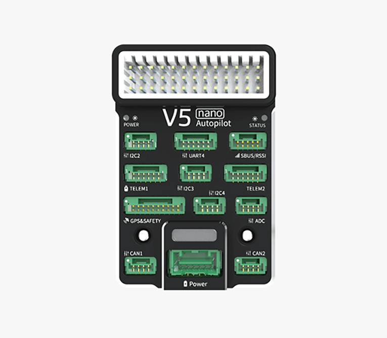
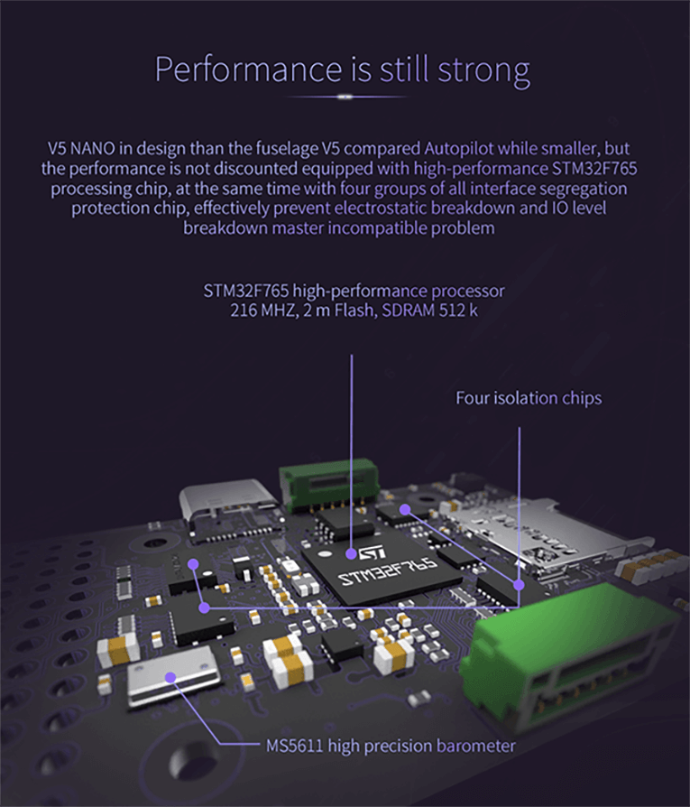
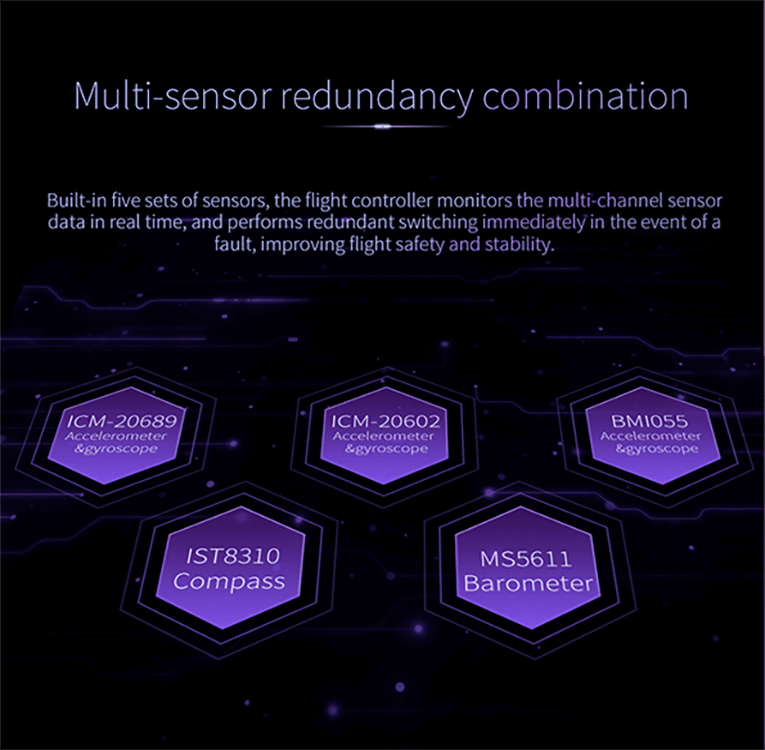
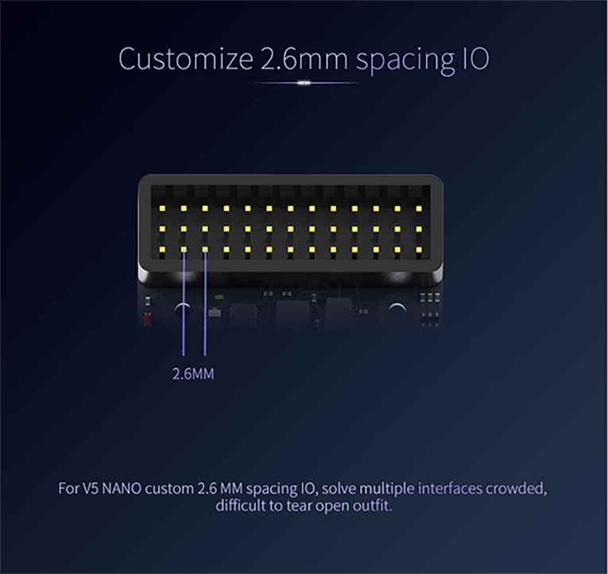
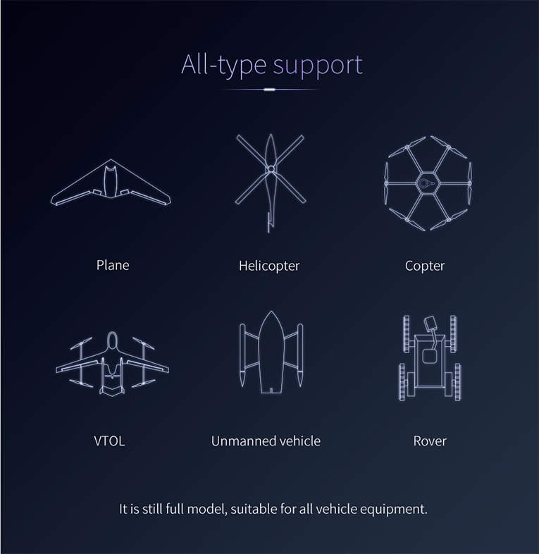

# V5 nano AutoPilot

**V5 nano**<sup>&reg;</sup> is an autopilot for space-constraint applications designed by CUAV<sup>&reg;</sup> in collaboration with the PX4 team.
It is based on the Pixhawk **FMUv5** design standard and is optimized to run [PX4](http://px4-travis.s3.amazonaws.com/Firmware/master/px4fmu-v5_default.px4) firmware.
The autopilot has mini size and powerful features, can be used not only in ordinary drones, also used in 220mm racing drones.







### Quick Summary

Main FMU Processor: STM32F765◦32 Bit Arm® Cortex®-M7, 216MHz, 2MB memory, 512KB RAM

* On-board sensors:
* Accel/Gyro: ICM-20689
* Accel/Gyro: ICM-20602
* Accel/Gyro: BMI055
* Magnetometer: IST8310
* Barometer: MS5611

* Interfaces: 8 PWM outputs
* 4 dedicated PWM/Capture inputs on FMU
* Dedicated R/C input for CPPM
* Dedicated R/C input for Spektrum / DSM and S.Bus 
* analog / PWM RSSI input
* 4 general purpose serial ports
* 4 I2C ports
* 4 SPI buses
* 2 CANBuses 
* Analog inputs for voltage / current of battery
* 2 additional analog input

* Power System:◦Power Brick Input: 4.75~5.5V
* USB Power Input: 4.75~5.25V
* Servo Rail Input: 0~36V

* Weight and Dimensions:
  * Dimensions: 60\*40\*14mm
* Other Characteristics:
  * Operating temperature: -20 ~ 85°c（Measured value）


## Purchase

[CUAV Store](https://store.cuav.net/index.php?id_product=95&id_product_attribute=0&rewrite=cuav-new-pixhack-v5-autopilot-m8n-gps-for-fpv-rc-drone-quadcopter-helicopter-flight-simulator-free-shipping-whole-sale&controller=product&id_lang=1)

[CUAV Aliexpress (for international users)](https://www.aliexpress.com/item/33050770314.html?storeId=3257035&spm=2114.12010612.8148356.9.dbe6790bjW2hpH)

[CUAV Taobao(for China Mainland users)](https://item.taobao.com/item.htm?spm=a230r.1.14.8.26ab5258veQJRu&id=569404317857&ns=1&abbucket=13#detail).

## Connection{#connection}

* [V5 nano Wiring Quickstart](../assembly/quick_start_v5_nano.md)

## Pinouts{#pinouts}

Download **V5 nano** pinouts from [here](http://manual.cuav.net/V5-Plus.pdf).


## Building Firmware

> **Tip** Most users will not need to build this firmware!
  It is pre-built and automatically installed by *QGroundControl* when appropriate hardware is connected.

To [build PX4](https://dev.px4.io/en/setup/building_px4.html) for this target:
```
make px4_fmu-v5_default
```

## Voltage Ratings

*V5 NANO* can be Two-fold redundancy on the power supply if two power sources are supplied. The three power rails are: **POWER1**and **USB**.

> **Note** The output power rails **FMU PWM OUT** and **I/O PWM OUT** (0V to 36V) do not power the flight controller board (and are not powered by it). You must supply power to one of **POWER1**or **USB** or the board will be unpowered. The PM2 connector only works with Ardupilot firmware and can only detect battery voltage and current, not powering V5 nano.

## Peripherals {#Optional-hardware}

* [Digital Airspeed Sensor](https://item.taobao.com/item.htm?spm=a1z10.3-c-s.w4002-16371268452.37.6d9f48afsFgGZI&id=9512463037)
* [Telemetry Radio Modules](https://cuav.taobao.com/category-158480951.htm?spm=2013.1.w5002-16371268426.4.410b7a821qYbBq&search=y&catName=%CA%FD%B4%AB%B5%E7%CC%A8)
* [Rangefinders/Distance sensors](https://docs.px4.io/en/sensor/rangefinders.html)

## Supported Platforms / Airframes

Any multicopter / airplane / rover or boat that can be controlled with normal RC servos or Futaba S-Bus servos. The complete set of supported configurations can be seen in the [Airframes Reference](../airframes/airframe_reference.md).

## Further info


* [V5 nano manual](http://manual.cuav.net/V5-nano.pdf)
* [FMUv5 reference design pinout](https://docs.google.com/spreadsheets/d/1-n0__BYDedQrc_2NHqBenG1DNepAgnHpSGglke-QQwY/edit#gid=912976165). 
* [CUAV Github](https://github.com/cuav) 

