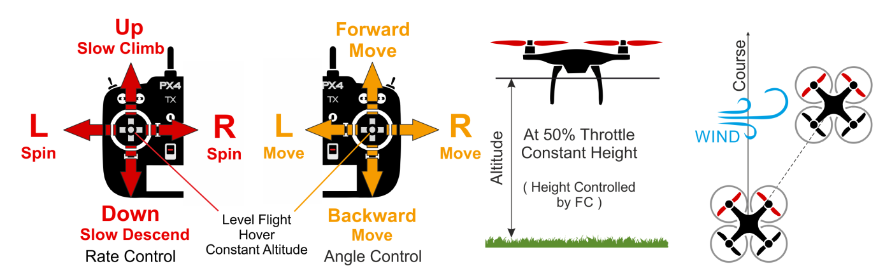

# Altitude Flight Mode

The *Altitude* flight mode makes it easier for users to control vehicle altitude, and in particular to reach and maintain a fixed altitude. TThe mode does not use GPS, and hence will not attempt to hold the vehicle x and y position or course against wind.

The flight mode has specific characteristics based on the type of vehicle, as discussed in the sections below.

> **Tip** This mode is recommended for beginners because it is easy to return a vehicle to predictable flight.

> **Note**
>  * This mode is *assisted*. The autopilot makes it easier for users to control the vehicle. 
>  * Manual input is required (RC controller, or gamepad/thumbsticks through MAVLink).
>  * The altitude is normally measured using a barometer, which may become inaccurate in extreme weather conditions. Vehicles that include a LIDAR/range sensor will be able to control altitude with greater reliability and accuracy. 

## Multi-copter (MC)

When the throttle input is centered (~50% throttle) the aircraft will *hover* at its current altitude (subject to wind). Roll, pitch and yaw inputs are fully controlled by the user (as in *Manual* mode).

The throttle input has a large deadzone in the centre. Outside of the centre the throttle controls the *rate* of ascent/descent (i.e. the vehicle moves faster proportional to distance from the stick centre).

The diagram below shows the mode behaviour visually (for a [mode 2 transmitter](../getting_started/rc_transmitter_receiver.md#transmitters-for-aircraft)).

The mode is affected by the following parameters:

Parameter | Description
--- | ---
[MPC_Z_VEL_MAX_UP](../advanced_config/parameter_reference.md#MPC_Z_VEL_MAX_UP) | Maximum vertical ascent velocity. Default: 3 m/s.
[MPC_Z_VEL_MAX_DN](../advanced_config/parameter_reference.md#MPC_Z_VEL_MAX_DN) | Maximum vertical descent velocity. Default: 1 m/s.
`RCX_DZ` | RC dead zone for channel X. The value of X for throttle will depend on the value of [RC_MAP_THROTTLE](../advanced_config/parameter_reference.md#RC_MAP_THROTTLE). For example, if the throttle is channel 4 then  [RC4_DZ](../advanced_config/parameter_reference.md#RC4_DZ) specifies the deadzone.
`MPC_XXXX` | Most of the MPC_xxx parameters affect flight behaviour in this mode (at least to some extent). For example, [MPC_THR_HOVER](../advanced_config/parameter_reference.md#MPC_THR_HOVER) defines the thrust at which a vehicle will hover.

## Fixed Wing (FW)

The climb/descent rate is controlled via the pitch/elevator stick. Once centered the autopilot latches onto the current altitude and will maintain it during yaw/roll, and at any airspeed. The throttle input controls airspeed. 

> **Tip** When all remote control inputs are centered (no roll, pitch, yaw, and ~50% throttle) the aircraft will return to straight, level flight (subject to wind) and keep its current altitude.

The diagram below shows the mode behaviour visually (for a [mode 2 transmitter](../getting_started/rc_transmitter_receiver.md#transmitters-for-aircraft)).

The mode is affected by the following parameters:

Parameter | Description
--- | ---
[FW_AIRSPD_MIN](../advanced_config/parameter_reference.md#FW_AIRSPD_MIN) | Min airspeed/throttle. Default: 10 m/s.
[FW_AIRSPD_MAX](../advanced_config/parameter_reference.md#FW_AIRSPD_MAX) | Max airspeed/throttle. Default: 20 m/s.
[FW_AIRSPD_TRIM](../advanced_config/parameter_reference.md#FW_AIRSPD_TRIM) | Cruise speed. Default: 15 m/s.
[FW L1 Control](../advanced_config/parameter_reference.md#fw-l1-control) | The roll/yaw needed to maintain the commanded altitude and airspeed are also affected by the FW L1 Control parameters. 

<!-- 
FW notes: 
FW position controller is basically 2 independent pieces
* L1 is for navigation - determines the roll and yaw needed to achieve the desired waypoint (or loiter)
* TECS is for speed and height control - determines throttle and elevator position needed to achieve the commanded altitude and airspeed
Overall that gives you an attitude setpoint (roll, pitch, yaw) and throttle which is sent off to the attitude controller
-->

## VTOL

A VTOL follows the behavior and parameters of [Fixed Wing](#fixed-wing-fw) when in FW mode, and of [Multicopter](#multi-copter-mc) when in MC mode.

<!-- this mode maps to ALTCTL in the state machine -->
