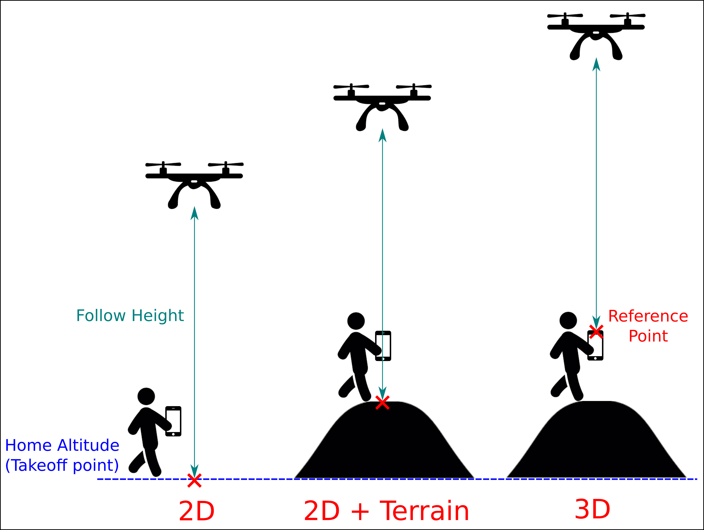

# Follow-Me Mode

*Follow Me* mode allows a multicopter to autonomously hold position and altitude relative to another system that is broadcasting its position (and optionally velocity) using the [FOLLOW_TARGET](https://mavlink.io/en/messages/common.html#FOLLOW_TARGET) MAVLink message.

The vehicle will automatically yaw to face and follow the target from a specified [relative angle](#NAV_FT_FA), [distance](#NAV_FT_DST) and [height](#NAV_FT_HT) and altitude, depending on the [altitude control mode](#NAV_FT_ALT_M).

By default it will follow from directly behind the target at a distance of 8 meters, and a height of 8 meters above the home (arming) position.

User has an option to control the follow angle, height and distance by :
- _Follow Height_ is controlled using the `up-down` input ("Throttle"). Center the stick to keep follow height constant, increase or decrease to adjust height
- _Follow Distance_ is controlled using the `forward-back` input ("Pitch"). Pushing the stick forward increases the follow distance, pulling it back decreases the distance.
- _Follow Angle_ is controlled using the `left-right` input ("Roll"). The movement is from the user's perspective, so if you face the drone and move the stick left, it will move to your left. From above if you move the stick left the drone will move counter-clockwise.

:::note
If you want to reset the RC-adjusted behavior, you need to either switch off from Follow-Me mode and activate again, or change the according [parameter](#parameters) to a different value.
:::

Follow Angle is defined as increasing in clockwise direction relative to the target's heading (which is 0 degrees)

The mode is supported by *QGroundControl* on Android devices with a GPS module, and [MAVSDK](https://mavsdk.mavlink.io/develop/en/api_reference/classmavsdk_1_1_follow_me.html).

:::note
* This mode requires GPS.
* This mode is currently only supported on multicopter.
* The follow target must also be able to supply position information.
* *QGroundControl* only supports this mode on Android devices that have GPS.
:::

Demo video:

@[youtube](https://www.youtube.com/watch?v=myPFVJJkm04)

## Safety Precautions

:::warning
**Follow-me mode** does not implement any type of obstacle avoidance.
Special care must be taken when this mode is used.
:::

The following flight precautions should be observed:
- Follow me mode should only be used in wide open areas that are unobstructed by trees, power lines, houses, etc.
  - Set the [follow-me height](#NAV_MIN_FT_HT) to a value that is well above any surrounding obstructions.
    By *default* this is 8 metres above the home (arming) position.
- It is *safer* to manually fly to a safe height before engaging follow-me mode than to engage follow-me mode when landed (even though the mode implements auto take off).
- Give your vehicle sufficient room to stop, especially when it is moving fast.
- Be ready to switch back to Position mode, etc, if something goes wrong when using follow me mode for the first time.
- You can't switch off of follow-me mode using RC stick movements (as that will adjust the properties). You either need to have a GroundStation that can send flight mode switch signals or a flight mode switch configured in your RC transmitter!

## How to use Follow Me using QGroundControl

*Follow Me* mode is supported by *QGroundControl* on ground station hardware that has a GPS module.
The recommended configuration is a USB OTG-capable Android device with two telemetry radios.

To setup *Follow Me* mode:
- Connect a telemetry radio to your ground station device and another to the vehicle (this allows positioning information to be relayed between the two radios).
- Disable sleep-mode on your Android device:
  - This setting can usually be found under: **Settings \> Display**.
  - It is important that you set your Android device to not go to sleep as this could cause the GPS signal to cease being emitted at regular intervals.
- Takeoff to a height of at least 2-3 metres (recommended even though auto-takeoff is supported).
  - Set the vehicle on the ground, press the safety switch and step back at least 10 meters.
  - Arm the vehicle and takeoff.
- Switch into follow me mode.
  - The copter will first ascend to minimum safety altitude of 1 meters above the ground or home, depending on the presence of a distance sensor.
  - It will ascend until it is 3 meters within the [follow height](#FLW_TGT_HT) to avoid potential collisions before moving horizontally.
  - Copter will always adjust it's heading to face the target

At this point you can start moving, and the drone will be following you.

The mode has been tested on the following Android devices:
- Galaxy S10
- Nexus 7 Tablet

## Using MAVSDK to use Follow Me
MAVSDK supports [Follow Me](https://mavsdk.mavlink.io/main/en/cpp/guide/follow_me.html). However it currently has a bug where a same message is getting sent twice occasionally, which can mess with the target position and velocity estimator.

Therefore using MAVSDK for a Follow Me isn't covered here for now.

## Configuration

### Tips on how to make your Follow-Me behave much better!
1. Set the [follow distance](#NAV_FT_DST) to minimum 8 meters, but preferably higher than 12 meters.

There is an inherent position bias (3 ~ 5 meters) between the target and the drone's GPS sensor.
Which makes the drone follow a 'ghost target' that is certain distance away from you. You will notice this significantly if you set the follow distance to 1 ~ 2 meters.
Therefore, it is preferred to set the distance long enough so that the GPS bias won't be so significant.

2. If the drone is moving around you in the arc too slow, increase the [maximum tangential velocity](#FLW_TGT_MAX_VEL) setting.

By experimenting, it showed that around `5 m/s` achieves a relaxed, slow movement around the target and around `10 m/s` achieves a more dynamic movement around the target.

### Altitude Control Mode

The default [altitude mode](#FLW_TGT_ALT_M), `2D tracking`, keeps drone's altitude constant unless user adjusts them via parameter or RC stick input. This means that if you are going up on a hill, drone wouldn't know about this and would assume that you are at a constant altitude.

The `2D + Terrain` mode can compensate for the terrain's altitude change using a distance sensor. However if your drone doesn't have the distance sensor, it would behave exactly the same as 2D tracking mode. However this can make drone very jumpy as distance sensors aren't always accurate. Also since it's assuming that the ground under the drone is at the same level as you (the target), if the field isn't flat enough it can lead to drone flying at the wrong altitude.

The `3D tracking` mode will take your GPS altitude into account, therefore adapting to the altitude changes, e.g. You walking up hill. BUT as mentioned above in the beginning, due to the bug in QGC, using this mode without checking the altitude output of the ground station can lead to a faulty altitude being sent to the drone, making it think that you are either high up in the sky or deep underneath the earth.

The drone would likely not crash into the ground due to the built in minimum safety altitude limit (1 meter), but it may fly high up into the sky. If the drone's altitude is way off, assume that the ground station's altitude output is wrong and use 2D tracking.

### Parameters
:::warning
Do not set the **Altitude mode ([FLW_TGT_ALT_M](#FLW_TGT_ALT_M)**) to `3D Tracking` before checking the altitude value being sent in the FOLLOW_TARGET message!
The MAVLink [FOLLOW_TARGET](https://mavlink.io/en/messages/common.html#FOLLOW_TARGET) message definition requires the Altitude above Mean Sea Level (AMSL) for the target altitude. Testing of QGC on Android phone however showed that it's reporting Altitude above Ellipsoid (which can differ as much as 200 meters!), which is a bug in QGC right now.
Therefore it's not recommended to turn on 3D tracking mode
:::

The follow-me behavior can be configured using the following parameters:

Parameter | Description
--- | ---
[FLW_TGT_HT](../advanced_config/parameter_reference.md#FLW_TGT_HT) | [m] Vehicle follow-me height. Note that this height is fixed *relative to the home/arming position* (not the target vehicle). Default and minimum height is 8 meters (about 26 ft)
[FLW_TGT_DST](../advanced_config/parameter_reference.md#FLW_TGT_DST) | m] Vehicle/ground station separation in the *horizontal* (x,y) plane. Minimum allowed separation is 1 meter. Default distance is 8 meters (about 26 ft).
[FLW_TGT_FA](../advanced_config/parameter_reference.md#FLW_TGT_FA) | [deg] Follow angle relative to the target's heading. If a value out of the range [`-180.0`, `+180.0`] is entered, it will get automatically wrapped and applied (e.g. `480.0` will be converted to `120.0`)
[FLW_TGT_ALT_M](../advanced_config/parameter_reference.md#FLW_TGT_ALT_M) | Altitude control mode.  - `0` = 2D Tracking (Altitude Fixed)  - `1` = 2D Tracking + Terrain Following  - `2` = 3D Tracking of the target's GPS altitude
[FLW_TGT_MAX_VEL](../advanced_config/parameter_reference.md#FLW_TGT_MAX_VEL) | [m/s] Maximum relative velocity for orbital motion around the target. - 10 m/s has proven to be a sweet spot for aggressiveness vs smoothness. - Setting it to higher value means the orbit trajectory around the target will move faster, but if the drone is physically not capable of achieving that speed, it leads to an aggressive behavior.
[FLW_TGT_RS](../advanced_config/parameter_reference.md#FLW_TGT_RS) | Dynamic filtering algorithm responsiveness that filters incoming target location. - `0.0` = Very sensitive to movements and noisy estimates of position, velocity and acceleration. - `1.0` = Very stable but not responsive filter

## Known Issues

- The SiK 915 Mhz [telemetry radio](../telemetry/sik_radio.md) is known to interfere with the GPS signal being received by some Android devices.
  Keep the radio and Android device as far apart as possible when using the follow target mode to avoid interference.