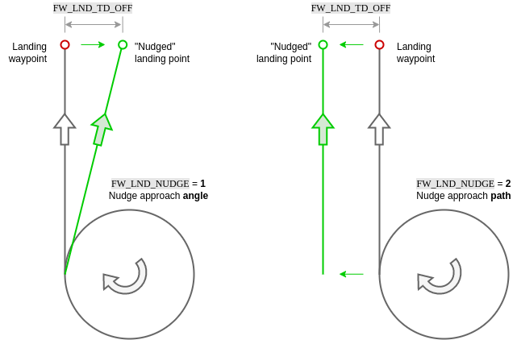

# Land Mode

The *Land* flight mode causes the vehicle to land at the position where the mode was engaged.
After landing, vehicles will disarm after a short timeout (by default).

:::note
* This mode requires a valid position estimate unless the mode is entered due to a failsafe, in which case only altitude is required (typically a barometer is built into the flight controller).
* This mode is automatic - no user intervention is *required* to control the vehicle.
* RC control switches can be used to change flight modes on any vehicle.
* RC stick movement in a multicopter (or VTOL in multicopter mode) will [by default](#COM_RC_OVERRIDE) change the vehicle to [Position mode](../flight_modes/position_mc.md) unless handling a critical battery failsafe.
:::

The specific behaviour for each vehicle type is described below.

## Multi-Copter (MC)

The vehicle will land at the location at which the mode was engaged.
The vehicle descends at the rate specified in [MPC_LAND_SPEED](#MPC_LAND_SPEED) and will disarm after landing (by [default](#COM_DISARM_LAND)).

RC stick movement will change the vehicle to [Position mode](../flight_modes/position_mc.md) (by [default](#COM_RC_OVERRIDE)).

Landing is affected by the following parameters:

Parameter | Description
--- | ---
[MPC_LAND_SPEED](../advanced_config/parameter_reference.md#MPC_LAND_SPEED) | The rate of descent during landing. This should be kept fairly low as the ground conditions are not known.
[COM_DISARM_LAND](../advanced_config/parameter_reference.md#COM_DISARM_LAND) | Time-out for auto disarm after landing, in seconds. If set to -1 the vehicle will not disarm on landing.
[COM_RC_OVERRIDE](../advanced_config/parameter_reference.md#COM_RC_OVERRIDE) | Controls whether stick movement on a multicopter (or VTOL in MC mode) causes a mode change to [Position mode](../flight_modes/position_mc.md). This can be separately enabled for auto modes and for offboard mode, and is enabled in auto modes by default.
[COM_RC_STICK_OV](../advanced_config/parameter_reference.md#COM_RC_STICK_OV) | The amount of stick movement that causes a transition to [Position mode](../flight_modes/position_mc.md) (if [COM_RC_OVERRIDE](#COM_RC_OVERRIDE) is enabled).

## Fixed-wing (FW)

Fixed-wing landing via mav command is currently not supported.
The landing mode is only accessible in missions.
Please see QGroundControl docs for more information on [planning a fixed-wing landing pattern mission item](https://docs.qgroundcontrol.com/master/en/PlanView/pattern_fixed_wing_landing.html).

### Landing Sequence

The fixed-wing landing pattern has three components: a **landing descent orbit**, a **landing waypoint**, and a **landing approach slope**.

On engaging a landing pattern, the following sequence is initiated:

1. **Fly to landing location**: The aircraft flies at the current altitude to the landing descent orbit.
2. **Descend to approach altitude**: On reaching the orbit, the vehicle will descend to the approach altitude.
   Once reaching the approach altitude, the airframe will continue on the orbit until reaching the final approach exit (tangential exit towards landing waypoint).
4. **Final approach**: The aircraft will follow the landing approach slope until the flare altitude is reached.
5. **Flare**: The vehicle flares until touching down.

### Landing Approach

The vehicle tracks the landing slope (generally at a slower speed than cruise) until reaching the flare altitude.

Parameter | Description
--- | ---
[FW_LND_ANG](../advanced_config/parameter_reference.md#FW_LND_ANG) | The maximum achievable landing approach slope angle. Note that smaller angles may still be commanded via the landing pattern mission item.
[FW_LND_EARLYCFG](../advanced_config/parameter_reference.md#FW_LND_EARLYCFG) | Optionally deploy landing configuration during the landing descent orbit (e.g. flaps, spoilers, landing airspeed).
[FW_LND_AIRSPD](../advanced_config/parameter_reference.md#FW_LND_AIRSPD) | Calibrated airspeed setpoint during landing.
[FW_FLAPS_LND_SCL](../advanced_config/parameter_reference.md#FW_FLAPS_LND_SCL) | Flaps setting during landing.
[FW_LND_THRTC_SC](../advanced_config/parameter_reference.md#FW_LND_THRTC_SC) | Altitude time constant factor for landing (overrides default [TECS tuning](../config_fw/advanced_tuning_guide_fixedwing.md)).

### Flaring / Roll-out

Flaring consists of a switch from altitude tracking to a shallow sink rate setpoint and constraints on the commandable throttle, resulting in nose up manuevering to slow the descent and produce a softer touchdown.

The flaring altitude is calculated during the final approach via "time-to-impact" ([FW_LND_FL_TIME](#FW_LND_FL_TIME)) and the approach descent rate.
An additional safety parameter [FW_LND_FLALT](#FW_LND_FLALT) sets the minimum altitude at which the vehicle will flare (if the time based altitude is too low to allow a safe flare maneuver).

If belly landing, the vehicle will continue in the flaring state until touchdown, land detection, and subsequent disarm. For runway landings, [FW_LND_TD_TIME](#FW_LND_TD_TIME) enables setting the time post flare start to pitch down the nose (e.g. consider tricycle gear) onto the runway ([RWTO_PSP](#RWTO_PSP)) and avoid bouncing. This time roughly corresponds to the touchdown post flare, and should be tuned for a given airframe during test flights only after the flare has been tuned.

Parameter | Description
--- | ---
[FW_LND_FL_TIME](../advanced_config/parameter_reference.md#FW_LND_FL_TIME) | Time before impact (at current descent rate) at which the vehicle should flare. 
[FW_LND_FL_SINK](../advanced_config/parameter_reference.md#FW_LND_FL_SINK) | A shallow sink rate the aircraft will track during the flare.
[FW_LND_FLALT](../advanced_config/parameter_reference.md#FW_LND_FLALT) | Minimum altitude above ground the aircraft must flare. This is only used when the time-based flare altitude is too low.
[FW_LND_FL_PMAX](../advanced_config/parameter_reference.md#FW_LND_FL_PMAX) | Maximum allowed pitch during the flare.
[FW_LND_FL_PMIN](../advanced_config/parameter_reference.md#FW_LND_FL_PMIN) | Minimum allowed pitch during the flare (often necessary to avoid negative pitch angles commanded to increase airspeed, as the throttle is reduced to idle setting.)
[FW_LND_TD_TIME](../advanced_config/parameter_reference.md#FW_LND_TD_TIME) | The time after flare start when the vehicle should pitch the nose down.
[RWTO_PSP](../advanced_config/parameter_reference.md#RWTO_PSP) | Pitch setpoint while on the runway. For tricycle gear, typically near zero. For tail draggers, positive.
[FW_THR_IDLE](../advanced_config/parameter_reference.md#FW_THR_IDLE) | Idle throttle setting. The vehicle will retain this setting throughout the flare and roll out.

### Abort

#### Operator Abort

The landing may be aborted by the operator at any point during the final approach using the [MAV_CMD_DO_GO_AROUND](https://mavlink.io/en/messages/common.html#MAV_CMD_DO_GO_AROUND) command.
On _QGroundControl_ a popup button appears during landing to enable this.

Aborting the landing results in a climb out to an orbit pattern centered above the land waypoint.
The maximum of the aircraft's current altitude and [MIS_LND_ABRT_ALT](#MIS_LND_ABRT_ALT) is set as the abort orbit altitude height relative to (above) the landing waypoint.
Landing configuration (e.g. flaps, spoilers, landing airspeed) is disabled during abort and the aicraft flies in cruise conditions.

The abort command is disabled during the flare for safety.
Operators may still manually abort the landing by switching to any manual mode, such as [Stabilized mode](../flight_modes/stabilized_fw.md)), though it should be noted that this is risky!

#### Automatic Abort

Automatic abort logic is additionally available for several conditions, if configured.
Available automatic abort criteria may be enabled via bitmask parameter [FW_LND_ABORT](#FW_LND_ABORT).
One example of an automatic abort criteria is the absence of a valid range measurement from a distance sensor.

:::warning
Landing without a distance sensor is **strongly** discouraged.
Disabling terrain estimation with [FW_LND_USETER](#FW_LND_USETER) and select bits of [FW_LND_ABORT](#FW_LND_ABORT) will remove the default distance sensor requirement, but consequently falls back to GNSS altitude to determine the flaring altitude, which may be several meters too high or too low, potentially resulting in damage to the airframe.
:::

Parameter | Description
--- | ---
[MIS_LND_ABRT_ALT](../advanced_config/parameter_reference.md#MIS_LND_ABRT_ALT) | The minimum altitude above the land point an abort orbit can be commanded.
[FW_LND_ABORT](../advanced_config/parameter_reference.md#FW_LND_ABORT) | Determines which automatic abort criteria are enabled.
[FW_LND_USETER](../advanced_config/parameter_reference.md#FW_LND_USETER) | Enables use of the distance sensor during the final approach.

### Nudging

In the case of minor GNSS or map discrepancies causing an offset approach, small manual adjustments to the landing approach and roll out can be made by the operator (via yaw stick) when [FW_LND_NUDGE](../advanced_config/parameter_reference.md#FW_LND_NUDGE) is enabled.
Options include either nudging the approach angle or the full approach path.

In both cases, the vehicle remains in full auto mode, tracking the shifted approach vector.
[FW_LND_TD_OFF](../advanced_config/parameter_reference.md#FW_LND_TD_OFF) allows determination of how far to the left or right of the landing waypoint the projected touchdown point may be nudged.
Yaw stick input corresponds to a nudge "rate".
Once the stick is released (zero rate), the approach path or angle will stop moving.

Approach path nudging is frozen once the flare starts.
If conducting a runway landing with steerable nose wheel, the yaw stick command passes directly to the nose wheel from flare start, during roll out, until disarm.
Note that if the wheel controller is enabled ([FW_W_EN](#FW_W_EN)), the controller will actively attempt to steer the vehicle to the approach path, i.e. "fighting" operator yaw stick inputs.

:::note
Nudging should not be used to supplement poor position control tuning.
If the vehicle is regularly showing poor tracking peformance on a defined path, please refer to the [fixed-wing control tuning guide](../flight_modes/position_fw.md) for instruction.
:::

Parameter | Description
--- | ---
[FW_LND_NUDGE](../advanced_config/parameter_reference.md#FW_LND_NUDGE) | Enable nudging behavior for fixed-wing landing.
[FW_LND_TD_OFF](../advanced_config/parameter_reference.md#FW_LND_TD_OFF) | Configure the allowable touchdown lateral offset from the commanded landing point.
[FW_W_EN](../advanced_config/parameter_reference.md#FW_W_EN) | Enable the nose wheel steering controller.

### Near Ground Safety Constraints

In landing mode, the distance sensor is used to determine proximity to the ground, and the airframe's geometry is used to calculate roll contraints to prevent wing strike.

Parameter | Description
--- | ---
[FW_WING_SPAN](../advanced_config/parameter_reference.md#FW_WING_SPAN) | Wing span of the airframe.
[FW_WING_HEIGHT](../advanced_config/parameter_reference.md#FW_WING_HEIGHT) | Height of wing from bottom of gear (or belly if no gear).

## VTOL

A VTOL follows the LAND behavior and parameters of [Fixed Wing](#fixed-wing-fw) when in FW mode, and of [Multicopter](#multi-copter-mc) when in MC mode.
When [NAV_FORCE_VT](../advanced_config/parameter_reference.md#NAV_FORCE_VT) is set (default: on) a VTOL in FW mode will transition back to MC just before landing.
